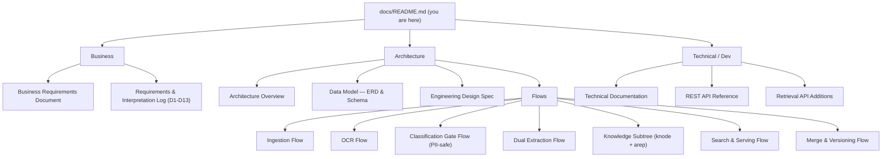

# Document Intelligence — Documentation

> **Status:** Living index · **Last updated:** 2026-06-24

This is the documentation landing page for the **Document Intelligence** platform — the service
that turns a bank client's KYC documents (PDF, DOCX, JPEG, PNG, plain text) into a **versioned,
per-client knowledge tree** and serves it to downstream services for search, single-document Q&A,
and structured fact retrieval — **PII-safe throughout**.

If you are new here, start with the audience-specific entry points:

- **Business / product** → [Business Requirements Document](#business)
- **Architects / new engineers** → [Architecture Overview](#architecture)
- **Developers / integrators** → [Technical Documentation](#technicaldev) and the [API Reference](#technicaldev)

Every document below is grounded in committed code under `di/` and traces back to the locked
decisions (D1–D13) in the [requirements & interpretation log](../reports/requirements-and-interpretation.md).

---

## Documentation map

---

## Business

For product owners, compliance stakeholders, and anyone asking *what the platform does and why*.

| Document | What it covers |
|---|---|
| [Business Requirements Document — Document Intelligence Platform](brd/business-requirements.md) | The business need: PII-safe processing, the per-client knowledge tree, multi-tenant isolation, supported geographies/languages. Every requirement traces to a locked decision (D1–D13). |
| [Requirements & Interpretation Log (decisions D1–D13)](../reports/requirements-and-interpretation.md) | Append-only record of what the product owner asked for, how it was interpreted, and the design that followed. The source of truth for *why* each choice was made. |

---

## Architecture

For architects and engineers who need the system-level map: how a document travels from upload to
knowledge tree, the data model behind it, and each stage in detail.

### Overview & design

| Document | What it covers |
|---|---|
| [Document Intelligence — Architecture Overview](architecture/overview.md) | The system-level map: end-to-end document journey, FastAPI app structure, the two external systems (retrieval gateway, mock OCR), and the index-many / return-parent knowledge subtree at the center. Start here. |
| [Data Model — Entity Relationship & Schema Reference](architecture/data-model/erd.md) | The Postgres 16 + pgvector + ltree schema: seven tables, HASH partitioning by `client_id`, RLS isolation, and the ERD. Grounded in `di/migrations/` and `di/store.py`. |
| [Engineering Design Spec](specs/2026-06-24-document-intelligence-design.md) | The *how it is built* companion to the BRD: design decisions, module layout, and data model rationale. |

### Flows (`architecture/flows/`)

Each stage of the pipeline and the read side, documented against the code that implements it.

| Flow | What it covers |
|---|---|
| [Ingestion Flow](architecture/flows/ingestion-flow.md) | End-to-end: how one uploaded document becomes a versioned subtree, and the SSE stages the caller observes. |
| [OCR Flow](architecture/flows/ocr-flow.md) | Turning raw bytes into an `OcrResult` (text + per-line geometry/confidence) via `extract_pages` — Azure Read v3.2 plus fallbacks. |
| [Classification Gate Flow (PII-safe)](architecture/flows/classification-gate-flow.md) | The fail-safe, fully-offline chokepoint that produces the egress decision (`SEND_TO_LLM` / `REDACT_THEN_SEND` / `DETERMINISTIC_ONLY`). |
| [Dual Extraction Flow](architecture/flows/extraction-flow.md) | The deterministic path (always) and the LLM path (only when the gate clears egress), both yielding `ExtractedField` lists. |
| [The Knowledge Subtree — `knode` + `arep`](architecture/flows/knowledge-subtree-flow.md) | The two-table index-many / return-parent design and how the four properties (semantic, logical, contextual, accessibility) are realised. |
| [Search & Serving Flow](architecture/flows/search-serving-flow.md) | The read side: hybrid scoped search, tree/fact/provenance endpoints, the capabilities manifest, and the access-aware masking projection. |
| [Cross-Document Merge & Versioning Flow](architecture/flows/merge-versioning-flow.md) | Confidence-weighted consolidation into `client_merged_fact`, plus copy-on-write versioning with content-hash dedup and the version delta feed. |

---

## Technical / Dev

For engineers building, running, integrating with, or extending the platform.

| Document | What it covers |
|---|---|
| [Document Intelligence — Technical Documentation](technical/technical-documentation.md) | Reference for building, running, and integrating: the FastAPI app's three concerns (ingestion, storage, serving), delegated model access, graceful degradation, and optional dependencies. |
| [Document Intelligence — REST API Reference](technical/api-reference.md) | The complete REST surface: ingestion (SSE), per-client tree traversal, hybrid search, provenance, capabilities, masked projections, and health probes. Tenant scoping and error envelope conventions included. |
| [Retrieval Framework — API Additions Required by Document Intelligence](../reports/retrieval-api-requirements.md) | Endpoints the external `retrieval` service must expose so this platform can delegate all model access (embed / LLM / rerank). Additive and backward-compatible; hand to the retrieval-repo team. |

---

## Conventions across these docs

- **Tenancy:** every row, query, and API call is scoped to one `client_id` (supplied with the
  document; no entity resolution). RLS enforces isolation.
- **PII-safe by default:** the classification gate decides per document whether content may leave
  the local deterministic path. When in doubt, nothing leaves.
- **No model credentials live here:** embeddings, LLM completion, and reranking are delegated to
  the external `retrieval` service over HTTP; a deterministic stub keeps the pipeline runnable
  offline.
- **Grounded in code:** each doc cites the `di/` modules it describes. If a doc and the code
  disagree, the code wins — file a fix.
