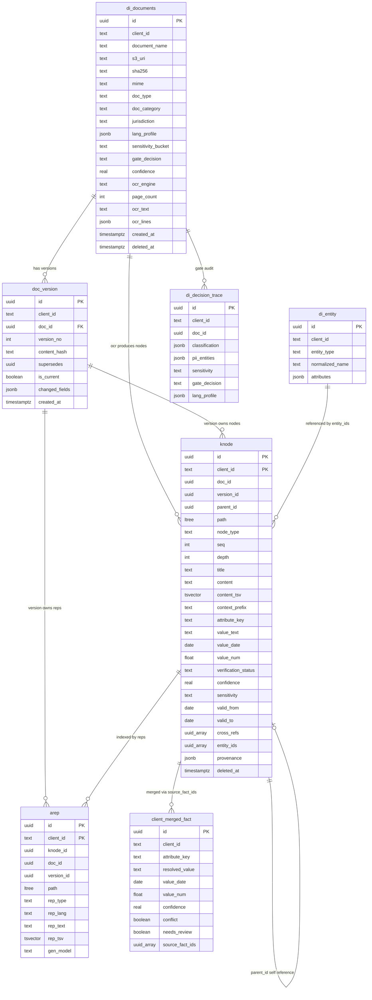

# Data Model — Entity Relationship & Schema Reference

> **Status:** Living document · **Last updated:** 2026-06-24

This document describes the Postgres 16 + pgvector + ltree schema that backs the
**document_intelligence** platform: one versioned, per-client knowledge tree per KYC document,
consolidated into a client-level merged-fact view. It is grounded in the committed migrations
(`di/migrations/`), the runtime DDL in `di/db.py`, the domain models in `di/models.py`, and the
repository SQL in `di/store.py`.

**Related docs**

- Design spec: [`../../specs/2026-06-24-document-intelligence-design.md`](../../specs/2026-06-24-document-intelligence-design.md) (§4 Data model)
- Requirements & decisions (D1–D13): [`../../../reports/requirements-and-interpretation.md`](../../../reports/requirements-and-interpretation.md)
- Migrations: [`../../../di/migrations/`](../../../di/migrations/)

---

## 1. Overview

The schema has **seven tables** living in a single configurable schema (`__SCHEMA__`, rewritten at
runtime by `di/db.py:run_migrations()`):

| Table | Role | Volume | Partitioned |
|---|---|---|---|
| `di_documents` | One row per ingested source file | Low | No |
| `doc_version` | Immutable version chain per document | Low | No |
| `di_entity` | People / orgs / addresses within a client | Low | No |
| `client_merged_fact` | Client-level consolidated knowledge view | Low | No |
| `di_decision_trace` | Per-document PII-gate audit trail | Low | No |
| `knode` | **Knowledge nodes returned to consumers** | High | HASH by `client_id` |
| `arep` | **Accessibility representations (searched)** | High | HASH by `client_id` |

The two high-volume tables — `knode` and `arep` — implement the platform's core "index-many /
return-parent" knowledge subtree (§5). They are HASH-partitioned by `client_id`. The five
low-volume tables are non-partitioned but carry `client_id` and the same Row-Level Security
isolation.

Every table carries a `client_id text` column and is isolated by RLS (§6). The primary tenant key
arrives with the document — there is no entity-resolution step to discover it (a v1 non-goal).

---

## 2. Entity-Relationship diagram

The diagram shows key columns and the logical relationships between the tables. Note that most of
these relationships are **application-enforced** rather than declared as database foreign keys — see
§7 for why.



> Diagram notes: Mermaid `erDiagram` has no native array type, so `uuid[]` columns are shown as
> `uuid_array` and `double precision` as `float`. `knode` and `arep` have a composite primary key
> `(client_id, id)` — both columns are marked `PK`. Relationship lines reflect logical joins, not
> declared FK constraints (only `doc_version.doc_id` is a real FK).

### How the tables connect

- **`di_documents` → `doc_version`** (one-to-many): each logical document accumulates an immutable
  chain of versions. This is the **only hard foreign key** in the schema
  (`doc_version.doc_id REFERENCES di_documents(id) ON DELETE CASCADE`).
- **`doc_version` / `di_documents` → `knode` and `arep`**: every knowledge node and representation
  carries the tuple `(client_id, doc_id, version_id)`. A subtree is the set of `knode` rows sharing
  one `(client_id, doc_id, version_id)`. These joins are application-enforced, indexed by
  `knode_client_doc_ver` / `arep_client_knode`.
- **`knode` → `arep`** (one-to-many): each `arep` row points back to its parent node via
  `knode_id` and copies that node's `path`, `doc_id`, and `version_id`. Reps are what searches hit;
  results are mapped back to the parent `knode` (the "index-many / return-parent" pattern in
  `di/store.py:hybrid_search`).
- **`knode` → `knode`** (self-reference): `parent_id` links each node to its parent in the tree
  (document → section → chunk/table/figure → fact). The `ltree` `path` column encodes the same
  hierarchy redundantly for fast subtree queries.
- **`di_entity` → `knode`**: a node's `entity_ids uuid[]` references the people/orgs/addresses it
  mentions. Many-to-many, array-valued, application-enforced.
- **`knode` (fact nodes) → `client_merged_fact`**: the merge step groups `fact` nodes by
  `attribute_key` and writes one consolidated row per `(client_id, attribute_key)`. The contributing
  fact-node ids are retained in `source_fact_ids uuid[]`, giving a provenance fan-out from each
  merged fact back to every source fact (`di/subtree/merge.py`).
- **`di_documents` → `di_decision_trace`**: one gate-decision audit row per ingested document
  (`doc_id` is nullable so a trace can be recorded even before the document row is committed).

---

## 3. The ltree path scheme

Every `knode` (and the `arep` rows that mirror it) carries an `ltree` `path` that encodes the tree
position as a dot-separated label chain. The scheme is:

```
client_<id>.doctype_<type>.v<n>.<section>.<chunk-or-fact>
```

- The **root document node** path is built by `di/pipeline.py:_base_path()`:
  `client_<client_id>.doctype_<doc_type>.v<version_no>` (e.g. `client_42.doctype_us_passport.v1`).
  An unknown doc type falls back to `doctype_unknown`.
- **Child labels** are appended by `di/subtree/build.py`: sections are `s0`, `s1`, … (one per OCR
  page, or a single `body`/`facts` section); chunks under a section are `c0`, `c1`, …; facts under
  the synthetic `facts` section are `f0`, `f1`, ….
- A full chunk path therefore looks like
  `client_42.doctype_us_passport.v1.s0.c2` and a fact like
  `client_42.doctype_us_passport.v1.s1.f0`.

**Label sanitisation** (`build.sanitize_label`): every label is lowercased, any run of characters
outside `[A-Za-z0-9_]` is collapsed to a single `_`, repeated underscores are merged, and
leading/trailing underscores are stripped. An empty or all-unsafe label falls back to `x`, so the
result is always a valid, non-empty ltree label. `depth` is stored alongside the path and equals the
ltree `nlevel` (count of dot-separated labels).

**Why ltree.** The path gives three things cheaply: (1) ancestor/descendant containment queries via
the GiST index (`path <@ '<prefix>'::ltree`, used for scoped search and `fetch_subtree`); (2) a
stable, human-readable address for any node; and (3) the "logical" property of the knowledge
subtree (`di/store.py` scopes searches by `scope_path`). The `parent_id` self-reference and the
`path` are deliberately redundant — `parent_id` is the source of truth for tree linkage, `path`
optimises range/containment reads.

---

## 4. Partitioning, RLS, runtime columns & full-text — cross-cutting features

### 4.1 HASH partitioning by client_id

`knode` and `arep` are declared `PARTITION BY HASH (client_id)`. The partitions themselves are
created **programmatically** at startup by `di/db.py:_create_hash_partitions()`, which creates
`<table>_p0 … <table>_p{N-1}` with `FOR VALUES WITH (MODULUS N, REMAINDER i)`, where `N` is
`settings.pg_hash_partitions` (the design spec suggests a fixed count such as 64). Indexes declared
on the partitioned parent propagate to all current and future partitions.

This keeps each tenant's high-volume rows physically grouped, bounds the size of any one B-tree /
GiST / GIN / HNSW index, and pairs naturally with the `client_id`-leading composite primary key
`(client_id, id)` — the partition key must be part of the primary key.

### 4.2 Row-Level Security — tenant isolation

`di/migrations/004_rls.sql` runs a `DO` block over **all seven tables** that, for each, enables and
`FORCE`s Row-Level Security and creates a `tenant_isolation` policy:

```sql
USING      (client_id = current_setting('app.current_client_id', true))
WITH CHECK (client_id = current_setting('app.current_client_id', true))
```

The per-connection GUC `app.current_client_id` is bound on every pool checkout by
`di/db.py:acquire(client_id=...)` and reset to empty on release. `FORCE` means even the table owner
is filtered. Caveat (documented in the migration): superusers and `BYPASSRLS` roles bypass RLS even
with `FORCE`; in production the app connects as a non-superuser role, while local dev may run as a
superuser, in which case isolation relies on the application always passing `client_id`.

### 4.3 Runtime-added pgvector embedding columns + HNSW

The base extensions migration (`001_extensions.sql`) creates only `ltree` and `pgcrypto`. The
`vector` type, the embedding columns, and the HNSW indexes are **intentionally not** in the
migrations — they are added at runtime by `di/db.py:_ensure_vector_columns()` once the live
embedding dimension is known (typically discovered from the retrieval service's `/api/models`):

- `ALTER TABLE knode ADD COLUMN content_embedding vector(D)`
- `ALTER TABLE arep  ADD COLUMN rep_embedding     vector(D)`
- one HNSW index **per partition** (`<table>_p{i}_<col>_hnsw`) using `vector_cosine_ops`, because
  pgvector cannot build an HNSW index directly on a partitioned parent.

When pgvector is absent (e.g. local dev without the extension), these steps are skipped cleanly and
the system degrades to full-text-only search. The repository (`di/store.py`) checks
`pgvector_available()` at insert and query time and only includes the embedding columns/legs when
the extension is present.

### 4.4 Generated full-text columns

Both high-volume tables carry a `GENERATED ALWAYS AS ... STORED` `tsvector` column for full-text
search, each backed by a GIN index:

- `knode.content_tsv = to_tsvector('simple', coalesce(title,'') || ' ' || coalesce(content,''))`
- `arep.rep_tsv     = to_tsvector('simple', coalesce(rep_text,''))`

The `simple` configuration is used deliberately (no stemming / stop-word removal) so the same
index serves English and Spanish content. Lexical search uses `websearch_to_tsquery('simple', …)`
ranked by `ts_rank`, fused with the vector legs via Reciprocal Rank Fusion in `hybrid_search`.

### 4.5 Soft delete

`di_documents` and `knode` carry a nullable `deleted_at timestamptz`. Deletion is logical: rows are
stamped, not removed, and every read filters `deleted_at IS NULL` (the `di_documents_client*` and
search/subtree queries do this). Partial indexes (`WHERE deleted_at IS NULL`) keep the live working
set lean. Soft delete preserves provenance and the audit trail for compliance (design spec §9).

---

## 5. Data dictionary

Types and notes are read directly from the migrations. `__SCHEMA__` is the configured schema.

### 5.1 `di_documents` — source files (`002_core_tables.sql`)

One row per source file ingested for a client. UPSERTed by `(client_id, document_name)`.

| Column | Type | Notes |
|---|---|---|
| `id` | `uuid` PK | `DEFAULT gen_random_uuid()` |
| `client_id` | `text` NOT NULL | Tenant key; RLS filter |
| `document_name` | `text` NOT NULL | Unique within client (`UNIQUE (client_id, document_name)`) |
| `s3_uri` | `text` | Source-file location (S3 / MinIO) |
| `sha256` | `text` | File hash; basis for re-upload dedup |
| `mime` | `text` | Detected MIME type |
| `doc_type` | `text` | Classifier output, e.g. `US_PASSPORT` |
| `doc_category` | `text` | identity / address / income / tax / corporate / bank_form |
| `subject` | `text` | Free-text subject of the document |
| `jurisdiction` | `text` | US / CA / MX |
| `lang_profile` | `jsonb` NOT NULL `DEFAULT '{}'` | Dominant + per-span languages |
| `sensitivity_bucket` | `text` NOT NULL `DEFAULT 'LOW'` | LOW / MEDIUM / HIGH / CRITICAL |
| `gate_decision` | `text` | SEND_TO_LLM / REDACT_THEN_SEND / DETERMINISTIC_ONLY |
| `confidence` | `real` NOT NULL `DEFAULT 0` | Classification confidence |
| `ocr_engine` | `text` | Engine used (Azure Read / fallback) |
| `page_count` | `int` | Pages processed |
| `ocr_text` | `text` | Full concatenated OCR text |
| `ocr_lines` | `jsonb` NOT NULL `DEFAULT '[]'` | Per-line text + bbox + confidence (feeds deterministic extraction) |
| `classification_signals` | `jsonb` NOT NULL `DEFAULT '[]'` | Anchor/classifier evidence strings |
| `created_at` | `timestamptz` NOT NULL `DEFAULT now()` | |
| `updated_at` | `timestamptz` NOT NULL `DEFAULT now()` | Bumped on UPSERT |
| `deleted_at` | `timestamptz` | Soft delete; `NULL` = live |

Indexes: `di_documents_client (client_id) WHERE deleted_at IS NULL`,
`di_documents_client_type (client_id, doc_type) WHERE deleted_at IS NULL`.

### 5.2 `doc_version` — immutable version chain (`002_core_tables.sql`)

| Column | Type | Notes |
|---|---|---|
| `id` | `uuid` PK | `DEFAULT gen_random_uuid()` |
| `client_id` | `text` NOT NULL | Tenant key |
| `doc_id` | `uuid` NOT NULL | **FK** → `di_documents(id) ON DELETE CASCADE` |
| `version_no` | `int` NOT NULL | Monotonic per document, starting at 1 |
| `content_hash` | `text` NOT NULL | Dedup key; identical re-upload is a no-op |
| `supersedes` | `uuid` | Previous version's id (chain pointer) |
| `is_current` | `boolean` NOT NULL `DEFAULT true` | Exactly one current per doc |
| `changed_fields` | `jsonb` NOT NULL `DEFAULT '[]'` | Diff vs prior version |
| `created_at` | `timestamptz` NOT NULL `DEFAULT now()` | |
| `created_by` | `text` | Actor that created the version |

Indexes: partial unique `doc_version_one_current (client_id, doc_id) WHERE is_current` (enforces a
single current version per document), `doc_version_doc (client_id, doc_id)`.

### 5.3 `di_entity` — entities (`002_core_tables.sql`)

Referenced by `knode.entity_ids`. People / orgs / addresses within a client.

| Column | Type | Notes |
|---|---|---|
| `id` | `uuid` PK | `DEFAULT gen_random_uuid()` |
| `client_id` | `text` NOT NULL | Tenant key |
| `entity_type` | `text` NOT NULL | person / org / address / … |
| `normalized_name` | `text` | Canonicalised name |
| `attributes` | `jsonb` NOT NULL `DEFAULT '{}'` | Flexible per-type payload |
| `created_at` | `timestamptz` NOT NULL `DEFAULT now()` | |

Index: `di_entity_client (client_id, entity_type)`.

### 5.4 `client_merged_fact` — client-level merged view (`002_core_tables.sql`)

Intra-client consolidation of `fact` knodes; confidence-weighted (highest-confidence source wins,
disagreements flagged). UPSERTed by `(client_id, attribute_key)`. Rebuildable from `knode` facts.

| Column | Type | Notes |
|---|---|---|
| `id` | `uuid` PK | `DEFAULT gen_random_uuid()` |
| `client_id` | `text` NOT NULL | Tenant key |
| `attribute_key` | `text` NOT NULL | Canonical key, e.g. `identity.date_of_birth` (`di/ontology.py`) |
| `resolved_value` | `text` | Winning value (string form) |
| `value_date` | `date` | Winning date value |
| `value_num` | `double precision` | Winning numeric value |
| `confidence` | `real` NOT NULL `DEFAULT 0` | Winner's confidence |
| `conflict` | `boolean` NOT NULL `DEFAULT false` | Sources disagree on a non-empty value |
| `needs_review` | `boolean` NOT NULL `DEFAULT false` | Human-review flag (set on conflict) |
| `source_fact_ids` | `uuid[]` NOT NULL `DEFAULT '{}'` | All contributing `knode` fact ids (provenance fan-out) |
| `updated_at` | `timestamptz` NOT NULL `DEFAULT now()` | Bumped on UPSERT |

Constraint: `UNIQUE (client_id, attribute_key)`. Index: `client_merged_fact_client (client_id)`.

### 5.5 `di_decision_trace` — gate audit (`002_core_tables.sql`)

One row per document gate decision, for compliance.

| Column | Type | Notes |
|---|---|---|
| `id` | `uuid` PK | `DEFAULT gen_random_uuid()` |
| `client_id` | `text` NOT NULL | Tenant key |
| `doc_id` | `uuid` | Nullable (trace may precede the doc row) |
| `classification` | `jsonb` NOT NULL `DEFAULT '{}'` | Classifier output + confidence |
| `pii_entities` | `jsonb` NOT NULL `DEFAULT '[]'` | Detected PII entities + scores |
| `sensitivity` | `text` | LOW … CRITICAL |
| `gate_decision` | `text` | SEND_TO_LLM / REDACT_THEN_SEND / DETERMINISTIC_ONLY |
| `lang_profile` | `jsonb` NOT NULL `DEFAULT '{}'` | Language detection result |
| `created_at` | `timestamptz` NOT NULL `DEFAULT now()` | |

Index: `di_decision_trace_client (client_id, created_at DESC)`.

### 5.6 `knode` — knowledge nodes returned to consumers (`003_knode_arep.sql`)

HASH-partitioned by `client_id`. Composite primary key `(client_id, id)`. These are the canonical,
returnable logical & content nodes of the knowledge subtree.

| Column | Type | Notes |
|---|---|---|
| `id` | `uuid` NOT NULL | `DEFAULT gen_random_uuid()`; part of composite PK |
| `client_id` | `text` NOT NULL | Tenant key; partition key; part of composite PK |
| `doc_id` | `uuid` NOT NULL | Owning document |
| `version_id` | `uuid` NOT NULL | Owning version |
| `parent_id` | `uuid` | Self-reference to parent node (`NULL` for the document root) |
| `path` | `ltree` NOT NULL | Hierarchical path (§3) |
| `node_type` | `text` NOT NULL | document / section / chunk / table / figure / fact / summary |
| `seq` | `int` NOT NULL `DEFAULT 0` | Sibling order |
| `depth` | `int` NOT NULL `DEFAULT 0` | Equals `nlevel(path)` |
| `title` | `text` | Node title / fact attribute label |
| `content` | `text` | Node text content |
| `content_tsv` | `tsvector` GENERATED STORED | FTS over `title || content` (`simple`) |
| `context_prefix` | `text` | Contextual lead-in (the "contextual" property) |
| `attribute_key` | `text` | Canonical key for `fact` nodes |
| `value_text` | `text` | Fact value (string) |
| `value_date` | `date` | Fact value (date) |
| `value_num` | `double precision` | Fact value (numeric) |
| `verification_status` | `text` NOT NULL `DEFAULT 'unverified'` | checksum_verified / gov_verified / llm_unverified / unverified |
| `confidence` | `real` NOT NULL `DEFAULT 0` | Extraction confidence |
| `sensitivity` | `text` NOT NULL `DEFAULT 'LOW'` | Per-node PII level (drives masking) |
| `valid_from` | `date` | Real-world fact validity start (time-travel) |
| `valid_to` | `date` | Real-world fact validity end (time-travel) |
| `cross_refs` | `uuid[]` NOT NULL `DEFAULT '{}'` | DAG cross-references to other nodes |
| `entity_ids` | `uuid[]` NOT NULL `DEFAULT '{}'` | References `di_entity` rows |
| `provenance` | `jsonb` NOT NULL `DEFAULT '{}'` | page / bbox / char-span / extractor / model |
| `token_count` | `int` | Estimated tokens |
| `created_at` | `timestamptz` NOT NULL `DEFAULT now()` | |
| `deleted_at` | `timestamptz` | Soft delete |
| `content_embedding` | `vector(D)` | **Added at runtime** by `di/db.py` when pgvector present |

Indexes: `knode_path_gist` GiST(`path`), `knode_tsv_gin` GIN(`content_tsv`),
`knode_client_path (client_id, path)`, `knode_client_doc_ver (client_id, doc_id, version_id)`,
`knode_client_type (client_id, node_type)`, partial `knode_attr (client_id, attribute_key) WHERE
node_type = 'fact'`, plus per-partition `..._content_embedding_hnsw` (runtime, when pgvector
present).

### 5.7 `arep` — accessibility representations (`003_knode_arep.sql`)

HASH-partitioned by `client_id`. Composite primary key `(client_id, id)`. The "searched" side of
the index-many / return-parent pattern: each rep maps back to its parent `knode` via `knode_id`.

| Column | Type | Notes |
|---|---|---|
| `id` | `uuid` NOT NULL | `DEFAULT gen_random_uuid()`; part of composite PK |
| `knode_id` | `uuid` NOT NULL | Parent node this rep represents |
| `client_id` | `text` NOT NULL | Tenant key; partition key; part of composite PK |
| `doc_id` | `uuid` NOT NULL | Copied from the parent node |
| `version_id` | `uuid` NOT NULL | Copied from the parent node |
| `path` | `ltree` NOT NULL | Copied from the parent node |
| `rep_type` | `text` NOT NULL | hypothetical_q / proposition / summary / alt_phrasing / synonym_expansion / table_desc / figure_desc / keyword_set / translation |
| `rep_lang` | `text` NOT NULL `DEFAULT 'en'` | Representation language (enables cross-lingual EN↔ES) |
| `rep_text` | `text` NOT NULL | The representation text |
| `rep_tsv` | `tsvector` GENERATED STORED | FTS over `rep_text` (`simple`) |
| `gen_model` | `text` | Model that produced the rep |
| `created_at` | `timestamptz` NOT NULL `DEFAULT now()` | |
| `rep_embedding` | `vector(D)` | **Added at runtime** by `di/db.py` when pgvector present |

Indexes: `arep_path_gist` GiST(`path`), `arep_tsv_gin` GIN(`rep_tsv`),
`arep_client_knode (client_id, knode_id)`, `arep_client_type (client_id, rep_type)`, plus
per-partition `..._rep_embedding_hnsw` (runtime, when pgvector present).

---

## 6. Relationship integrity model — why so few hard FKs

Only one declared foreign key exists in the schema: `doc_version.doc_id → di_documents(id)`. Every
other relationship (`knode.parent_id`, `knode`/`arep` → version/document, `knode.entity_ids[]`,
`arep.knode_id`, `client_merged_fact.source_fact_ids[]`) is **application-enforced**. This is
deliberate:

- **Partitioning constraints.** `knode` and `arep` are HASH-partitioned by `client_id`. A foreign
  key referencing a partitioned table must include the full partition key, and Postgres support for
  FKs *referencing* partitioned tables is limited. A self-referential FK on `knode.parent_id` would
  also need to span partitions. The cost of these constraints on high-volume insert paths is not
  worth it.
- **Array-valued links.** `entity_ids[]`, `cross_refs[]`, and `source_fact_ids[]` are arrays —
  Postgres cannot express a foreign key over array elements. The application is responsible for
  populating them with valid ids.
- **RLS already scopes every join.** Because each tenant is isolated by RLS and every query is
  filtered to one `client_id`, dangling references cannot cross tenants and the join surface is
  small.
- **Ordering / decoupling during ingest.** A `di_decision_trace` may be written before the
  `di_documents` row exists (`doc_id` is nullable), so a hard FK there would be a liability.

The trade-off is that referential integrity for these links is the ingestion code's responsibility
(`di/subtree/*`, `di/store.py`). In exchange the high-volume write paths stay fast and partition-
friendly. Reads are kept consistent by always scoping to `(client_id, …)` and, for the live view,
filtering to the current version via the `is_current` predicate (`di/store.py:_current_clause`).

---

## 7. Version lifecycle (how rows are produced)

1. **Ingest** (`di/pipeline.py:ingest_document`) UPSERTs a `di_documents` row, then plans a version
   (`di/subtree/versioning.py`): identical `content_hash` ⇒ no-op; otherwise
   `version_no = previous + 1`, the prior current version's `is_current` flips to `false`, and a new
   `doc_version` row is inserted (`is_current = true`).
2. The subtree (`di/subtree/build.py`) is assembled with the version's `base_path` and persisted as
   `knode` rows; representations become `arep` rows.
3. Fact nodes are merged (`di/subtree/merge.py`) into `client_merged_fact`, retaining all source
   fact ids.
4. Soft-deleted documents/nodes (`deleted_at`) are excluded from all reads but retained for audit.

This keeps the "as-of" and "what-changed" capabilities (design spec §6) backed purely by the
version chain plus the per-fact `valid_from` / `valid_to` columns.
