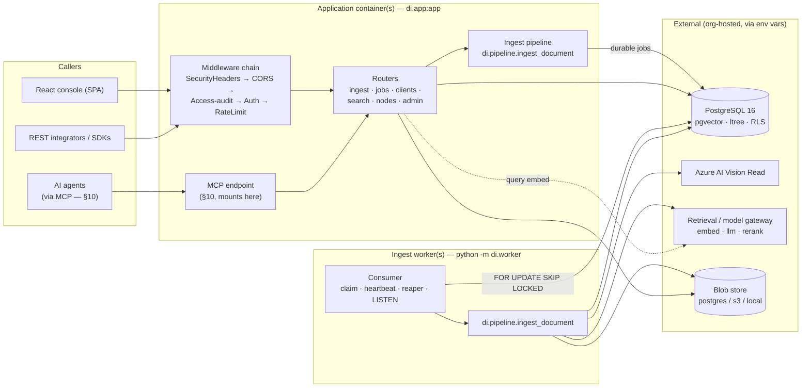
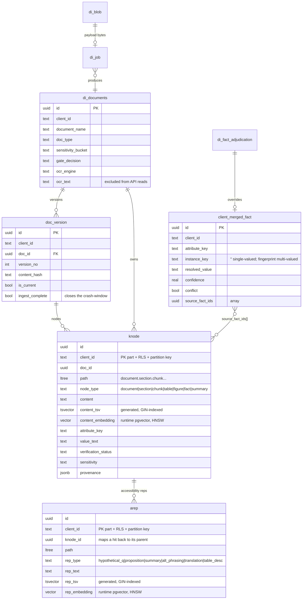
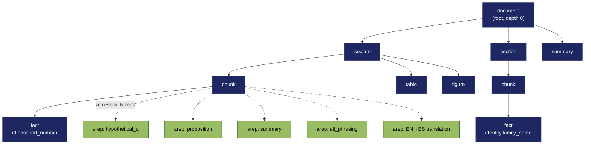
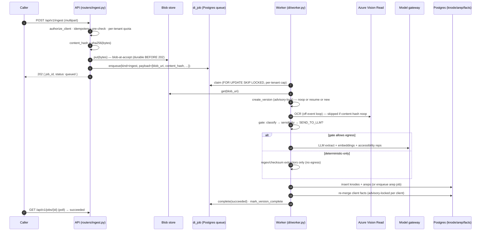
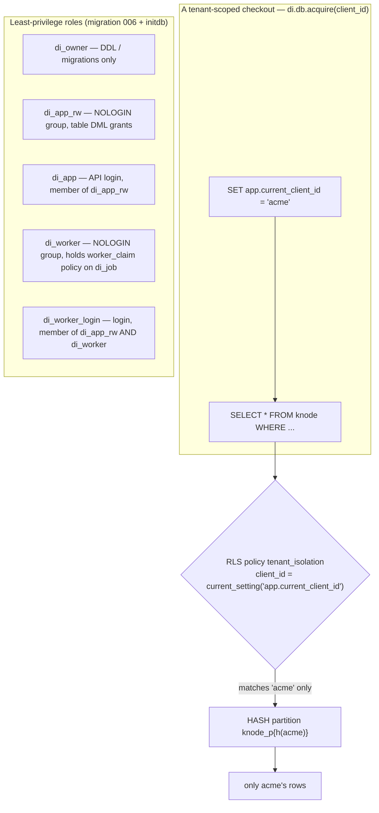
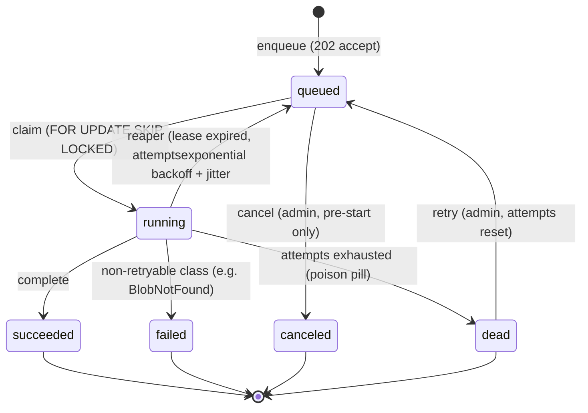
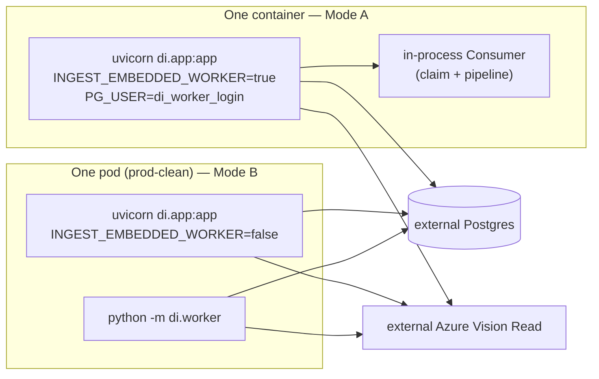
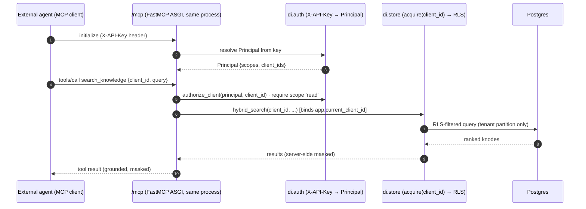

# Document Intelligence — Architecture & Design

**A per-client KYC knowledge-tree platform: PII-safe, provenance-tracked, horizontally scalable.**

| | |
|---|---|
| **Version** | 0.2.0 (post enterprise scale-out, migrations 001–011) |
| **Date** | 2026-07-17 |
| **Scope of this document** | Current architecture · performance model · single-pod deployment · MCP endpoint design |
| **Audience** | Platform engineers, SREs, integrators, and agent developers |

> Diagrams use [Mermaid](https://mermaid.js.org/) fenced blocks. They render natively on GitHub, in VS Code (with the Markdown Preview Mermaid extension), Obsidian, Typora, and most modern Markdown viewers. If your viewer shows raw code blocks, open the file in one of those.

---

## 1. What this system is

Document Intelligence ingests KYC documents (passports, national-ID cards, tax forms, incorporation papers, …) for **millions of independent client tenants** and turns each into a **queryable knowledge tree** with cell-level provenance, PII-safe masking, and a cross-document merged "current view" of each client's facts.

It is built for three hard requirements a bank imposes:

1. **Tenant isolation at scale** — one Postgres cluster, millions of `client_id`s, no tenant can ever see another's data (enforced in the database, not just the app).
2. **PII safety** — a local classifier gate decides, per document, whether any content may leave the perimeter to an LLM; sensitive values are masked by default on the way out.
3. **Provenance & auditability** — every extracted fact traces to a source document / page / bounding box / extractor / model, every read of tenant PII is logged, and every reviewer decision survives re-ingestion.

**Jurisdictions:** US / CA / MX. **Languages:** English / Spanish.

### External dependencies (provided by your org, injected via env vars)

| Dependency | Role | How it's configured |
|---|---|---|
| **PostgreSQL 16 + pgvector + ltree** | System of record: documents, the knowledge tree, merged facts, the durable job queue, audit log | `PG_HOST`, `PG_PORT`, `PG_USER`, `PG_PASSWORD`, `PG_DATABASE`, `PG_SCHEMA` |
| **Azure AI Vision Read (OCR)** | Optical character recognition for scanned images / non-digital PDFs | `AZURE_VISION_ENDPOINT`, `AZURE_VISION_KEY` |
| **Retrieval / model gateway** | Embeddings + LLM completion + rerank (the platform never calls a model vendor directly) | `RETRIEVAL_BASE_URL`, `RETRIEVAL_API_KEY` (or `DI_RETRIEVAL_STUB=true` offline) |
| **Blob store** | Raw uploaded bytes (`postgres` bytea / `s3` / `local` volume / `none`) | `BLOB_BACKEND` + backend-specific vars |

Postgres and Azure Vision Read are **separate services already hosted in your org** — the application container connects to them purely through the environment variables above. Everything else (API, ingest workers, migrations, the future MCP endpoint) is *application code* that can run in a **single container/pod** (see §9).

---

## 2. High-level architecture



**Two roles, one codebase.** The FastAPI **API** accepts uploads and serves reads; the **worker** drains the durable queue and runs the ingest pipeline. Both import the *same* `di.pipeline.ingest_document`. In a scaled deployment they are separate processes; in a single-pod deployment they collapse into one (§9). The **MCP endpoint** (§10) mounts onto the same FastAPI app so it ships in the same container.

### Request/middleware order (di/app.py)

```
Security headers → CORS → Access-audit middleware → Auth (X-API-Key) → Rate limit → Route
```

- `GET /health` — pure liveness (di/app.py:349).
- `GET /readyz` — per-dependency truth (db, migrations, RLS posture, pgvector, blob, ocr, auth, audit, queue); returns **503** if any *required* component is down (di/app.py:354).
- `GET /metrics` — Prometheus exposition (di/app.py:367).

---

## 3. Data model

The heart of the system is the **knowledge subtree**: two tables implementing an *index-many / return-parent* retrieval pattern.



### The knowledge subtree, visually



- **`knode`** rows (blue) are what consumers *get back*. Node types form a tree via an `ltree` `path`: `document → section → chunk|table|figure → fact → summary`.
- **`arep`** rows (green) are *never returned directly* — they are extra "surfaces" of a chunk (a hypothetical question it answers, a one-sentence proposition, a paraphrase, an EN↔ES translation). Search matches an `arep`, then **returns its parent `knode`**. This is the *index-many / return-parent* pattern: many searchable representations, one canonical answer.

### Key schema facts (evidence)

- `knode` and `arep` are **HASH-partitioned by `client_id`** (`di/migrations/003_knode_arep.sql:39,63`), `PRIMARY KEY (client_id, id)`.
- `content_tsv` / `rep_tsv` are **generated `tsvector` columns**, GIN-indexed (`003:20-21,42,59,66`).
- `path` carries a **GiST index** for subtree containment (`003:41,65`).
- `content_embedding` / `rep_embedding` (`vector`) columns + **per-partition HNSW indexes** are added at runtime when pgvector is present (`di/db.py:550-572`).
- Every tenant table has **`FORCE ROW LEVEL SECURITY`** with a `tenant_isolation` policy keyed on `current_setting('app.current_client_id')` (`di/migrations/004_rls.sql`).

---

## 4. The ingest pipeline

A document flows accept → durable job → OCR → gate → extract → subtree → accessibility-reps → merge → done. The accept path returns **`202 Accepted` + a `job_id`** immediately; a worker does the heavy work.



### Stage detail

1. **Accept** (`di/routers/ingest.py`): `authorize_client` → **idempotency pre-check before quota** (a retry of an already-accepted submit must never `429`) → per-tenant admission quota → `content_hash` → **blob-at-accept** (bytes are made durable *before* the 202 and *before* the job row, so a crash between accept and claim can never lose the payload the bank was told was accepted) → `jobs.enqueue`. `BLOB_BACKEND=none` **rejects** async ingest with `503`.
2. **Claim** (`di/worker.py`): the worker claims with `FOR UPDATE SKIP LOCKED` under a per-tenant running cap (§6).
3. **Version decision** (`di/store.py:create_version`): under a **per-document advisory lock**, decide *new version* / *noop* (identical content already complete) / *resume* (identical content but a previous attempt crashed mid-pipeline → rebuild). Returns a `VersionResult` that is the single source of version identity for everything downstream.
4. **OCR** (`di/ocr/vision.py`): engine resolution — **Azure Vision Read** for images/scanned PDFs when configured; **pypdf** text-layer for digital PDFs (free, offline); **tesseract** fallback; **docx** extraction; else empty. OCR **never raises** (degrades). It runs **off the event loop** (`anyio.to_thread`) so a ~60s Azure round-trip never blocks concurrent reads.
5. **Gate** (`di/gate/`): language profile → classifier (doc type + confidence) → PII sweep → **routing**: `SEND_TO_LLM` (low-sensitivity, confident, gate open) / `REDACT_THEN_SEND` (inactive in v1) / `DETERMINISTIC_ONLY` (anything sensitive or low-confidence). This is the **egress control**: only `SEND_TO_LLM` documents ever reach the model gateway.
6. **Extract**: deterministic ID extractors always run (passport MRZ, US SSN/EIN/ITIN, CA SIN/BN, MX CURP/RFC/INE — via `python-stdnum` checksums); LLM extraction runs **only** when the gate allowed egress.
7. **Subtree**: build `knode` rows (sections/chunks/tables/facts/summary), embed content.
8. **Accessibility reps**: when `AREP_ASYNC=true`, arep generation (5 rep types × N content nodes, each an LLM call) is deferred to a separate **`arep` queue job** (idempotent per version) instead of blocking the ingest job.
9. **Merge**: recompute the client's cross-document merged facts (confidence-weighted, multi-valued via `instance_key`), under a **per-client advisory lock** so two workers finishing different docs for one client can't publish a stale merged view.
10. **Done**: `mark_version_complete` (flips `ingest_complete=true`) then the terminal `done` event.

---

## 5. Multi-tenancy & the RLS role split

Isolation is enforced **in Postgres**, not merely in the app. Every tenant-scoped query runs on a connection that has bound the tenant GUC; the RLS policy filters rows the query never even names.



- **`app.current_client_id`** is bound per checkout in `di.db.acquire(client_id)`; the `tenant_isolation` policy (`004_rls.sql`) uses it in both `USING` and `WITH CHECK`. `FORCE ROW LEVEL SECURITY` means even the table owner is filtered.
- **Role split** (`006_roles_and_grants.sql`, `docker/initdb/01_roles.sql`):
  - `di_owner` — runs migrations (DDL); `NOSUPERUSER NOBYPASSRLS`.
  - `di_app_rw` — NOLOGIN group role holding explicit per-table DML grants (never `ALL TABLES`, so hash partitions get *zero* direct grants — closing the "`SELECT * FROM knode_p3`" bypass by construction).
  - `di_app` — the API login role, member of `di_app_rw`.
  - `di_worker` — NOLOGIN group role that holds the **`worker_claim`** permissive policy on `di_job` (`TO di_worker USING(true)`), letting a worker claim cross-tenant *without* a GUC-trust hack.
  - `di_worker_login` — the worker login role, **member of both `di_app_rw` and `di_worker`** (`initdb/01_roles.sql:25`). This dual membership is why a **single-process deployment connects as `di_worker_login`**: it can do tenant-scoped pipeline writes *and* cross-tenant queue claims (see §9).
- The production **posture guard** (`di/posture.py`) verifies at runtime that the connected role is neither `rolsuper` nor `rolbypassrls`, that `tenant_isolation` exists on every tenant table, and that no partition has a leaked direct grant (`di/db.py:assert_rls_posture`).

---

## 6. The durable job queue & workers

A Postgres-native queue (no external broker) with lease/heartbeat/reaper semantics.



- **Claim** (`di/jobs.py:claim`): a two-level query — a window-function CTE selects cap-aware candidates per tenant (`row_number() OVER (PARTITION BY client_id ...)` bounded by `ingest_tenant_max_running`), feeding an inner `FOR UPDATE SKIP LOCKED` re-check. (Two levels because Postgres forbids combining window functions with `FOR UPDATE` in one query level.) Ordering is global FIFO `(priority, run_after, created_at, id)`.
- **Per-tenant running cap** is *hard*, enforced inside a single claim call (a 250k-document backfill for one tenant cannot starve the fleet).
- **Lease / heartbeat / reaper**: a claimed job has a lease (`job_lease_seconds`, default 300s), renewed at `lease/4`. A worker that dies stops heartbeating; the **reaper** (run by every worker, jittered) requeues expired-lease jobs with exponential backoff, or dead-letters those past `max_attempts`.
- **Fenced worker writes**: `heartbeat` / `complete` / `append_event` / `set_status` all filter `WHERE locked_by = $worker AND status = 'running'`. A zombie worker whose job was reclaimed writes zero rows and cancels its local task — it can never resurrect a job another worker now owns.
- **Unified terminal taxonomy**: attempts-exhausted **always** ends `dead` (the page-worthy `di_jobs_dead_total` alert); `failed` is reserved for non-retryable exception classes (e.g. `BlobNotFound`); `canceled` is a pre-start cancel (no preemption of running work).
- **`arep` job kind**: deferred accessibility-rep generation is a real queued job, idempotent per `version_id`.
- **Wake latency**: `LISTEN/NOTIFY` on `di_job_new` (dedicated non-pool connection) wakes an idle worker instantly; a `job_poll_interval_seconds` fallback covers a missed NOTIFY. Correctness never depends on NOTIFY.
- **Graceful drain**: SIGTERM → stop claiming → wait `job_drain_timeout_seconds` → release stragglers → exit 0.

> **Note on `blob_gc`:** `di/config.py` carries a `dead_blob_retention_days` setting and a comment referencing a `di.tools.blob_gc` sweep / `enqueue(kind="blob_gc")`. That scheduled GC job kind is **documented future work, not yet implemented** — right-to-erasure for job-payload blobs is already covered today by `purge_client`'s tenant-prefix `BlobStore.delete_client()` sweep (content-addressed keys are tenant-prefixed). Treat the comment as a forward reference.

---

## 7. What makes it fast

The user-visible latencies that matter are (a) how quickly an upload is *accepted*, (b) how quickly a document becomes *queryable*, and (c) how quickly reads return at *millions-of-tenants* scale. Each is addressed by a specific, in-code mechanism.

### 7.1 OCR & ingest latency avoidance

| Mechanism | How it works | Evidence | Impact |
|---|---|---|---|
| **Non-blocking accept** | The upload is persisted to the blob store and a `di_job` row is written, then `202` returns. OCR/LLM/embedding happen later on a worker. | `di/routers/ingest.py` (blob-put → `enqueue` → 202) | The caller's request returns in **~blob-write time**, not ~OCR time (tens of seconds for a scanned multi-page PDF). |
| **Content-hash noop *before* OCR** | `content_hash = sha256(bytes)`; if the current version already has that hash **and** `ingest_complete`, the pipeline emits `done{noop}` and returns *before* calling OCR. | `di/pipeline.py` pre-OCR noop check; `di/store.py:create_version` | An unchanged re-upload skips the entire OCR + LLM + embedding cost — the single most expensive path — and completes in **milliseconds**. |
| **OCR off the event loop** | OCR (Azure Read polling / pdf2image / tesseract / pypdf) runs via `anyio.to_thread.run_sync`. | `di/pipeline.py` OCR stage | A slow OCR call never blocks the process's other concurrent ingests or reads. |
| **Gate minimizes LLM egress** | Only `SEND_TO_LLM` documents call the model gateway; everything sensitive or low-confidence stays `DETERMINISTIC_ONLY` (regex + checksums). | `di/gate/routing.py` | The costly LLM round-trip is *skipped entirely* for the majority of sensitive KYC docs — faster and cheaper, and PII-safe. |
| **Async accessibility reps** | With `AREP_ASYNC=true`, arep generation (5 rep types × N content nodes, each an LLM call) is a separate queue job, not inline. | `di/pipeline.py` arep branch; `di/worker.py:_run_arep` | The primary ingest job reaches `succeeded` without waiting on rep generation; reps land shortly after, decoupled. |

### 7.2 Read & query speed

| Mechanism | How it works | Evidence | Impact |
|---|---|---|---|
| **ltree GiST subtree fetch** | A document / path subtree is a single `path <@ $prefix::ltree` range scan on a GiST index, not a recursive CTE. | `knode_path_gist` (`003:41`); `di/store.py:fetch_subtree`, `hybrid_search` `_scope` | Fetching a document's tree or a scoped branch is an **index range scan**, independent of total tree size. |
| **pgvector HNSW ANN** | Semantic search is `ORDER BY embedding <=> $query::vector LIMIT n` over an HNSW index (per partition). | `di/db.py:550-572`; `di/store.py:hybrid_search` vector legs | Approximate-nearest-neighbor in **sub-linear** time vs. a brute-force full scan. |
| **Hybrid RRF (lexical + vector)** | Four ranked legs — `knode.content_tsv`, `arep.rep_tsv`, `knode.content_embedding`, `arep.rep_embedding` — fused by Reciprocal Rank Fusion, then parent `knode` rows fetched by id. | `di/store.py:hybrid_search`, `_rrf` | Recall of both keyword and semantic matches without a re-ranker in the hot path; each leg is index-served and `LIMIT`-bounded (`pool_n = max(top_k*5, 50)`). |
| **Generated `tsvector` + GIN** | Full-text vectors are computed on write (`GENERATED ALWAYS AS ... STORED`) and GIN-indexed. | `003:20-21,42,59,66` | Lexical search is a GIN lookup; no per-query `to_tsvector` cost on the corpus. |
| **Index-many / return-parent** | Many searchable `arep` surfaces per chunk; a hit maps back to one canonical `knode` via `arep_client_knode`. | `arep_client_knode` (`003:67`); `hybrid_search` arep legs | High recall (a chunk is findable by question, paraphrase, or translation) without duplicating returned content. |

### 7.3 Client-level access & isolation at scale

| Mechanism | How it works | Evidence | Impact |
|---|---|---|---|
| **HASH partitioning by `client_id`** | `knode` / `arep` are `PARTITION BY HASH (client_id)` into `PG_HASH_PARTITIONS` partitions (default 64). Every tenant query includes `client_id`, so the planner **prunes to one partition**. | `003:39,63`; `di/db.py:_create_hash_partitions` | Per-tenant scan/index cost is bounded by *one partition's* size, not the whole corpus — the key to millions-of-tenants scale. |
| **RLS predicate pushdown** | The `tenant_isolation` policy predicate is ANDed into every plan; combined with partition pruning, a tenant only ever touches its own slice. | `004_rls.sql` | Isolation is *free* at query time (a predicate the planner already uses for pruning) and impossible to forget in app code. |
| **Per-client partial & composite indexes** | `di_documents_client` (partial `WHERE deleted_at IS NULL`), `knode_client_doc_ver`, `knode_attr` (partial `WHERE node_type='fact'`), `client_merged_fact_client`, etc. | `002`, `003` | Client-scoped list/lookup queries hit narrow, tenant-leading indexes. |
| **Keyset (cursor) pagination** | Document / job / change-feed / access-log listings page by `(created_at, id) < cursor`, not `OFFSET`. | `di/store.py:list_documents`, `fetch_access_log`; `di/jobs.py` cursor codec | Page *N* costs the same as page 1 — no growing `OFFSET` scan. |
| **Merged-fact "current view"** | Client-level answers read `client_merged_fact` (one row per attribute/instance) instead of re-aggregating `knode` facts across documents at query time. | `002:62-76`; `di/store.py:fetch_merged_facts` | "What is this client's current passport number?" is a single indexed row read. |

### 7.4 Write / ingest throughput

| Mechanism | How it works | Evidence | Impact |
|---|---|---|---|
| **`FOR UPDATE SKIP LOCKED` queue** | Workers claim without blocking each other; contention shrinks the batch harmlessly instead of serializing. | `di/jobs.py:claim` | Near-linear scaling as workers are added (`--scale worker=N`). |
| **Partial claim/lease indexes** | `di_job_claim` (`WHERE status='queued'`) and `di_job_lease` (`WHERE status='running'`) keep the hot scans tiny regardless of table size. | `010_job_queue.sql` | Claim and reaper stay fast even with millions of terminal rows. |
| **Per-tenant fairness cap** | The window-function claim bounds any one tenant's share of fleet concurrency. | `di/jobs.py:claim`; `ingest_tenant_max_running` | A giant single-tenant backfill can't starve everyone else. |
| **HOT-update tuning on `di_job`** | `fillfactor=70` + aggressive autovacuum thresholds for the high-churn status/heartbeat updates. | `010_job_queue.sql` | Status flips and heartbeats stay HOT (on-page), reducing bloat and index churn. |

---

## 8. API surface (reference)

All routes are under `/api/v1`, authenticated by `X-API-Key`, and authorized to the path/argument `client_id`. Masking defaults to the server-side policy (`MASK_BY_DEFAULT`).

| Method & path | Scope | Purpose |
|---|---|---|
| `POST /ingest` | `ingest` | Accept a document → `202` + `job_id` (or SSE stream with `?stream=true`) |
| `GET /jobs` | `read` | List a client's ingest jobs (keyset paginated) |
| `GET /jobs/{id}` | `read` | Poll one job: status, stage events, error |
| `POST /jobs/{id}/retry` | `admin` | Requeue a `dead` job (attempts reset) |
| `POST /jobs/{id}/cancel` | `admin` | Cancel a `queued` job (no preemption) |
| `GET /clients/{id}/tree` | `read` | Nested knowledge subtree (doc/path scoped) |
| `GET /clients/{id}/facts` | `read` | Merged client facts (`verified_only`, multi-valued `instance_key`) |
| `GET /clients/{id}/documents` | `read` | List documents (keyset; excludes raw OCR text) |
| `GET /clients/{id}/changes` | `read` | Version change feed (monotonic `after_seq` cursor) |
| `GET /clients/{id}/docs/{doc}/manifest` | `read` | What a document can answer, and how |
| `GET /clients/{id}/docs/{doc}/answerable` | `read` | Questions derived from a doc's accessibility reps |
| `POST /clients/{id}/search` | `read` | Hybrid (lexical + vector) search, grounded in sources |
| `GET /nodes/{id}/provenance` | `read` | Trace a node to source doc/page/bbox/extractor/model |
| `POST /admin/clients/{id}/adjudicate` | `admin` | Reviewer verdict on a fact / instance (survives re-merge) |
| `GET/DELETE /admin/clients/{id}/adjudications[/history]` | `admin` | Live verdicts, append-only history, clear a verdict |
| `DELETE /admin/clients/{id}/documents/{doc}` | `admin` | Hard-delete a document + re-merge |
| `POST /admin/clients/{id}/purge` | `admin` | Tenant off-boarding / right-to-erasure |
| `GET/POST/DELETE /admin/keys[...]`, `.../rotate` | `admin` | API key lifecycle (create/list/revoke/rotate) |
| `GET/PUT /admin/tenants/{id}/policy` | `admin` | Per-tenant ingest-quota overrides |
| `GET /admin/access-log` | `admin` | "Who read this client's data?" (append-only audit) |
| `GET /health` · `/readyz` · `/metrics` | — | Liveness · readiness · Prometheus |

---

## 9. Running everything in one container / pod

> **Requirement:** run *all application components* (API + ingest worker + migrations) in a single container/pod, with **Postgres and Azure Vision Read as external services** reached purely via env vars.

**This is already supported.** The app lifespan (`di/app.py:279-284`) starts an in-process worker `Consumer` when `INGEST_EMBEDDED_WORKER=true`, and migrations run inside the same startup (`MIGRATIONS_MODE=auto`). There are two clean ways to satisfy "one pod", with an honest trade-off between them.



### Mode A — single process, embedded worker (simplest)

One `uvicorn di.app:app` process is the API *and* the worker *and* runs migrations at startup. Best for **dev, demo, single-tenant, and low/medium volume**.

**Crucial detail:** connect as **`di_worker_login`**. That role is a member of *both* `di_app_rw` (tenant-scoped pipeline writes) *and* `di_worker` (cross-tenant queue claims via the `worker_claim` RLS policy) — `docker/initdb/01_roles.sql:25`. `di_app` alone cannot claim; `di_owner` alone cannot claim (not a `di_worker` member). One process doing both jobs needs the one role that spans both groups.

```bash
docker run --rm -p 8080:8080 \
  -e DI_ENV=local \
  -e INGEST_EMBEDDED_WORKER=true \
  -e MIGRATIONS_MODE=auto \
  -e RLS_ENABLED=true \
  -e PG_HOST=<org-postgres-host>  -e PG_PORT=5432 \
  -e PG_DATABASE=document_intelligence -e PG_SCHEMA=di \
  -e PG_USER=di_worker_login -e PG_PASSWORD=<secret> \
  -e PG_MIGRATION_USER=di_owner -e PG_MIGRATION_PASSWORD=<secret> \
  -e PG_HASH_PARTITIONS=64 \
  -e AZURE_VISION_ENDPOINT=<org-azure-read-endpoint> \
  -e AZURE_VISION_KEY=<secret> \
  -e RETRIEVAL_BASE_URL=<org-model-gateway> -e RETRIEVAL_API_KEY=<secret> \
  -e BLOB_BACKEND=postgres \
  -e DI_BOOTSTRAP_API_KEY=<first-key-or-unset-and-mint> \
  document-intelligence:latest
```

### Mode B — two processes, one pod (production-posture-clean)

Run `uvicorn` (API, `INGEST_EMBEDDED_WORKER=false`) **and** `python -m di.worker` **side by side in the same pod/container**. In Kubernetes this is the idiomatic "one Pod, two containers"; in a literal single Docker container it's a tiny supervisor/entrypoint that launches both. This keeps the OCR/CPU-heavy worker off the API's event loop while still being one deployable unit.

**Why this exists — the honest trade-off:** the production posture guard (`di/posture.py`) **refuses to boot** when `INGEST_EMBEDDED_WORKER=true` *and* `DI_ENV ∈ {staging, prod, production}`. That is deliberate: embedding the worker couples OCR/LLM CPU spikes to API tail latency, the exact coupling the durable-queue upgrade removed. So:

- **Mode A in production** would require lowering `DI_ENV` to a non-prod value, which *also* disables every other prod guard (RLS check, auth requirement, strict audit). **Don't** do that to get a single process.
- **Mode B** keeps `INGEST_EMBEDDED_WORKER=false`, so the guard passes and every prod protection stays on — while still being **one pod**. This is the recommended single-pod *production* topology.

**Small addition Mode B needs (literal single container):** a supervisor entrypoint that runs both processes and forwards SIGTERM to each for graceful drain. A `di.migrate` init step (or `MIGRATIONS_MODE=verify` + a migration init-container) runs the schema once. In k8s, prefer two containers in one Pod + an init-container for migrations — no new code required.

### Required / notable environment variables

| Variable | Purpose | Example |
|---|---|---|
| `PG_HOST` / `PG_PORT` / `PG_DATABASE` / `PG_SCHEMA` | External Postgres | `pg.internal` / `5432` / `document_intelligence` / `di` |
| `PG_USER` / `PG_PASSWORD` | Runtime role — **`di_worker_login`** for Mode A; `di_app` for the API in Mode B | `di_worker_login` |
| `PG_WORKER_USER` / `PG_WORKER_PASSWORD` | Worker-pool role (Mode B worker, or leave unset in Mode A to reuse `PG_USER`) | `di_worker_login` |
| `PG_MIGRATION_USER` / `PG_MIGRATION_PASSWORD` | Owner role for DDL (`MIGRATIONS_MODE=auto`/`di.migrate`) | `di_owner` |
| `PG_HASH_PARTITIONS` | Partition count — **must match the value the DB was first initialized with** | `64` |
| `MIGRATIONS_MODE` | `auto` (apply in-process) / `verify` (assert only) / `off` | `auto` |
| `RLS_ENABLED` | Keep `true` everywhere holding real data | `true` |
| `INGEST_EMBEDDED_WORKER` | `true` = Mode A; `false` = Mode B / scaled | `true` |
| `AZURE_VISION_ENDPOINT` / `AZURE_VISION_KEY` | External OCR | `https://…cognitiveservices.azure.com/` |
| `RETRIEVAL_BASE_URL` / `RETRIEVAL_API_KEY` | External model gateway (or `DI_RETRIEVAL_STUB=true`) | `https://gateway.internal` |
| `BLOB_BACKEND` (+ `S3_*`) | `postgres` (single backup domain) / `s3` / `local` | `postgres` |
| `DI_ENV` | `local`/`dev` (guards off) vs `staging`/`prod` (guards on) | `prod` |
| `DI_BOOTSTRAP_API_KEY` | Seeds a first key (unset in prod; mint via `python -m di.tools.keys`) | *(unset in prod)* |
| `INSTANCE_FINGERPRINT_HMAC_KEY` | Salts multi-valued-fact fingerprints (required in prod) | *(secret)* |

### Verification (once the container is up)

1. `GET /health` → `200 {status: ok}`.
2. `GET /readyz` → `ready: true`; the **`queue`** component reports `embedded_worker: true` (Mode A) or `false` (Mode B), `depth: 0`.
3. `POST /api/v1/ingest` a small document → `202 {job_id}`.
4. `GET /api/v1/jobs/{job_id}` poll → `succeeded`, with `ocr → gate → extract → subtree → merge → done` stage events. In Mode A this proves one process did API **and** worker **and** pipeline.
5. `GET /metrics` → `di_queue_depth`, `di_jobs_inflight`, `di_jobs_claimed_total` present.

---

## 10. MCP endpoint — design (for agents to use the platform)

> **Goal:** expose the platform's capabilities over the **Model Context Protocol** so other AI agents can search a client's knowledge, read facts and provenance, submit ingests, and poll jobs — **inside the same single container**, reusing the exact same auth and per-tenant RLS as the REST API, with zero new isolation surface.

> **Status: implemented and live-verified.** The endpoint ships in `di/mcp/` and mounts at `/mcp` on the same app/container. It was verified end-to-end over the real MCP streamable-HTTP transport: tool discovery, `X-API-KEY` auth (good/bad/missing key), the per-tenant RLS boundary (a tenant-scoped key is refused another tenant), and a full ingest round-trip (submit → poll → succeeded → facts/search) through the embedded worker. See "Implementation" below.

### 10.1 Shape & transport

- **Transport:** **Streamable HTTP** (the modern MCP HTTP transport), served by the **official Python MCP SDK** (`mcp`, which bundles `FastMCP`). FastMCP produces an **ASGI app** that mounts onto the existing FastAPI app — so it runs **in the same process and container** as the API and (in Mode A) the embedded worker. No second port, no second deployable.
- **Mount point:** `app.mount("/mcp", mcp_server.streamable_http_app())` in `di/app.py:create_app()`, after the routers. The FastMCP server is built with `streamable_http_path="/"` so the mount point *is* the full path, and an explicit `/mcp` → `/mcp/` 307 redirect is registered ahead of the SPA catch-all so agents can point at either `/mcp` or `/mcp/`. The streamable-HTTP session manager is started from the parent app's lifespan (`async with app.state.mcp.session_manager.run(): yield`) because Starlette does not run a mounted sub-app's own lifespan. Agents connect to `https://<host>/mcp`.



### 10.2 Auth & tenant scoping (identical guarantees to REST)

- **Authentication:** the MCP client sends the **same `X-API-Key`** (as an HTTP header on the streamable-HTTP connection). An ASGI middleware in front of the MCP app resolves it to a `Principal` exactly as the REST middleware does — **one auth code path, no parallel auth to keep in sync**.
- **Tenant scoping:** every tool takes **`client_id`** as an argument and calls **`authorize_client(principal, client_id)`** + the tool's required scope *before* touching data. Every DB read still goes through **`di.store` → `acquire(client_id)`**, which binds `app.current_client_id`, so **RLS is preserved unchanged** — an MCP caller cannot reach another tenant any more than a REST caller can.
- **Masking:** tool results use the same server-side `serving.project_*` masking projection (`MASK_BY_DEFAULT`), so sensitive values are redacted by default over MCP too.
- **Rate limiting & audit:** the MCP mount sits behind the same middleware chain, so per-key rate limiting and the read-side access audit apply to MCP calls as well.

### 10.3 Proposed tools

| MCP tool | Scope | Wraps | Input | Output |
|---|---|---|---|---|
| `search_knowledge` | `read` | `store.hybrid_search` + `serving.project_nodes` | `client_id, query, top_k?, scope_path?, doc_id?, mask?` | Ranked, grounded knode hits |
| `get_client_facts` | `read` | `store.fetch_merged_facts` + `serving.project_facts` | `client_id, attribute_key?, verified_only?, mask?` | Merged facts (multi-valued aware) |
| `get_document_tree` | `read` | `store.fetch_subtree` + `serving.nest_tree` | `client_id, doc_id?, path?, max_depth?, mask?` | Nested knowledge subtree |
| `list_documents` | `read` | `store.list_documents` | `client_id, cursor?, limit?` | Document summaries (no raw OCR text) |
| `get_document_manifest` | `read` | `serving.build_manifest` / `answerable_questions` | `client_id, doc_id` | What the doc can answer |
| `get_node_provenance` | `read` | `store.fetch_node` | `client_id, node_id` | Source doc/page/bbox/extractor/model |
| `submit_ingest` | `ingest` | `jobs.enqueue` (+ blob-at-accept) | `client_id, filename, content(base64), mime?, idempotency_key?` | `{ job_id, status }` |
| `get_job_status` | `read` | `jobs.get_job` | `client_id, job_id` | Status + stage events + error |

**Admin-scoped tools** (`adjudicate`, `purge_client`, key management) are intentionally **excluded from the default MCP surface** — destructive/irreversible tenant operations should not be one agent tool-call away. They can be added behind an explicit `admin`-scoped, separately-gated MCP server if a workflow genuinely needs them.

### 10.4 Resources

MCP **resources** (read-only, addressable context) complement the tools:

- `di://clients/{client_id}/facts` — the merged fact sheet as a resource an agent can attach as context.
- `di://clients/{client_id}/documents/{doc_id}/manifest` — a document's answerable-questions manifest.
- `di://clients/{client_id}/documents` — the document index.

(Resources are the natural fit for "load this client's current state into my context"; tools are the fit for search/actions.)

### 10.5 Mounting so "one container" still holds

Because FastMCP is mounted as an ASGI sub-app on the existing FastAPI app, the MCP endpoint ships in the **same image and same process** as the API. In **Mode A** (embedded worker) a single `uvicorn di.app:app` process then serves **API + MCP + ingest worker** together — literally all components in one container. In **Mode B** the MCP endpoint rides with the API process; the worker stays separate but in the same pod.

### 10.6 Implementation (shipped)

| File | Purpose | Status |
|---|---|---|
| `di/mcp/__init__.py` | Package + `build_mcp` export | ✅ |
| `di/mcp/server.py` | `build_mcp()` — constructs the `FastMCP` server (stateless, JSON responses), registers the 9 tools above, each delegating to `di.store` / `di.jobs` / `di.serving` under `mcp_auth.require` (auth + scope + tenant) | ✅ |
| `di/mcp/auth.py` | `authenticate` / `authorize` / `require` — resolves `X-API-KEY` from `ctx.request_context.request` via `di.auth.resolve_principal` (the one shared key path), enforces scope + `client_id`, applies the per-key rate-limit backstop | ✅ |
| `di/app.py` (edit) | Mounts `/mcp` (`_maybe_mount_mcp`, fail-open), the `/mcp`→`/mcp/` redirect, the lifespan `session_manager.run()`, and a `mcp` readiness component | ✅ |
| `di/config.py` (edit) | `mcp_enabled: bool = True` | ✅ |
| `pyproject.toml` (edit) | `mcp>=1.0` added to core `dependencies` (so the Docker image installs it) | ✅ |
| `tests/test_mcp.py` | 10 unit tests: auth (missing/bad/good/disabled), authorize (scope/tenant/wildcard), tool registry present, destructive tools absent | ✅ |

**Verification.** 507 unit tests pass (ruff + mypy clean). Live end-to-end against a running instance (real MCP client over streamable-HTTP): 9 tools discovered / no destructive tools; `submit_ingest` → `get_job_status` polled to `succeeded` through the embedded worker; `get_client_facts` (masked) and `search_knowledge` return grounded, tenant-scoped results; idempotent re-submit reuses the job; a bad/missing key fails closed as a tool error; and a **tenant-scoped key reads its own tenant but is refused another tenant** — the same RLS boundary as REST.

**Deferred (documented follow-ups):** MCP *resources* (§10.4) — the tool surface fully covers the "use the services" need, and resources add a second auth path that warrants its own pass; recording MCP tool calls in the read-side access audit (the middleware resolves `client_id` from path/query, not the JSON-RPC body — a per-tool audit hook would close this).

### 10.7 Security considerations

- **No isolation bypass:** every tool goes through `authorize_client` + `acquire(client_id)`; there is no path to data that skips RLS. This must be covered by an explicit cross-tenant-denial test.
- **Scope enforcement:** `read` vs `ingest` scopes mirror REST; admin operations are excluded by default.
- **Masking on by default:** an agent gets redacted sensitive values unless the key is cleared and the caller opts out — same policy as REST.
- **`submit_ingest` size limits:** enforce `max_upload_mb` and the per-tenant admission quota exactly as the REST accept path does (reuse `_require_durable_blob_backend`, `_enforce_ingest_quota`).
- **Audit:** MCP tool calls that resolve a `client_id` are recorded by the same read-side access audit.

### 10.8 Decisions made (changeable on request)

The shipped implementation took the recommended default for each original open question; each is straightforward to revisit:

1. **Auth mechanism** — reuses the existing `X-API-KEY` header (zero new surface, one shared key path). MCP-native OAuth remains an option if an agent platform requires it.
2. **Admin tools** — excluded from the MCP surface. A separate, explicitly-gated `admin` MCP server could expose them if a workflow genuinely needs it.
3. **Ingest progress** — poll-based via `get_job_status` (matches the REST 202+poll contract). MCP progress-notification streaming for `submit_ingest` is a possible enhancement.

---

## 11. Appendix

### 11.1 Migrations

| File | What it establishes |
|---|---|
| `001_extensions.sql` | `ltree`, `pgcrypto` (pgvector installed by the superuser bootstrap) |
| `002_core_tables.sql` | `di_documents`, `doc_version`, `di_entity`, `client_merged_fact`, `di_decision_trace` |
| `003_knode_arep.sql` | `knode` + `arep` (HASH-partitioned, GiST/GIN indexes, generated tsvectors) |
| `004_rls.sql` | `FORCE ROW LEVEL SECURITY` + `tenant_isolation` on every tenant table |
| `005_hardening.sql` | `di_job`, `di_blob`, change-seq sequence, additional indexes |
| `006_roles_and_grants.sql` | `di_owner` / `di_app_rw` / `di_worker` role split, explicit grants, `worker_claim` policy |
| `007_auth_hardening.sql` | `di_api_key`, `di_tenant_policy`, partitioned append-only `di_access_log` |
| `008_multi_valued_facts.sql` | `instance_key` + `di_fact_adjudication`; `UNIQUE (client_id, attribute_key, instance_key)` |
| `010_job_queue.sql` | Durable-queue columns on `di_job`, partial claim/lease indexes, `doc_version.ingest_complete` |
| `011_doc_version_unique.sql` | `UNIQUE (client_id, doc_id, version_no)` backstop (shipped one release after 010's lock/retry code) |

### 11.2 Selected configuration (di/config.py)

`DI_ENV`, `PG_*`, `PG_MIGRATION_*`, `PG_WORKER_*`, `MIGRATIONS_MODE`, `RLS_ENABLED`, `PG_HASH_PARTITIONS`, `AZURE_VISION_*`, `RETRIEVAL_*` / `DI_RETRIEVAL_STUB`, `AUTH_ENABLED`, `DI_BOOTSTRAP_API_KEY`, `MASK_BY_DEFAULT`, `GATE_DEFAULT_OPEN`, `AREP_ASYNC`, `INGEST_EMBEDDED_WORKER`, `JOB_LEASE_SECONDS`, `JOB_MAX_ATTEMPTS`, `INGEST_TENANT_MAX_RUNNING`, `INGEST_MAX_ACTIVE_JOBS_PER_CLIENT`, `BLOB_BACKEND` (+ `S3_*`), `ACCESS_AUDIT_ENABLED` / `ACCESS_AUDIT_STRICT`, `INSTANCE_FINGERPRINT_HMAC_KEY`.

### 11.3 Production posture (enforced at boot by di/posture.py)

`RLS_ENABLED=true` · `AUTH_ENABLED=true` · `MASK_BY_DEFAULT=true` · `MIGRATIONS_MODE=verify` (or a distinct migration user) · `ACCESS_AUDIT_ENABLED` + `ACCESS_AUDIT_STRICT=true` · `INGEST_EMBEDDED_WORKER=false` · `BLOB_BACKEND ∈ {postgres, s3}` · `INSTANCE_FINGERPRINT_HMAC_KEY` set · `DI_BOOTSTRAP_API_KEY` unset (or strong). A production instance that violates any of these **refuses to start**. Runtime RLS facts (non-superuser role, live policies, no partition-grant leak) are additionally verified against the live database (`di/db.py:assert_rls_posture`).

---

*Generated from the current codebase (`~/document_intelligence`, migrations 001–011). File/line references point at the source of each claim. The single-container role detail (§9, `di_worker_login`) and the MCP mount approach (§10) are verified against `docker/initdb/01_roles.sql` and `di/app.py` respectively; the MCP endpoint itself is a design to be implemented.*
