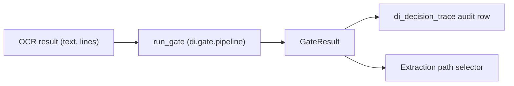
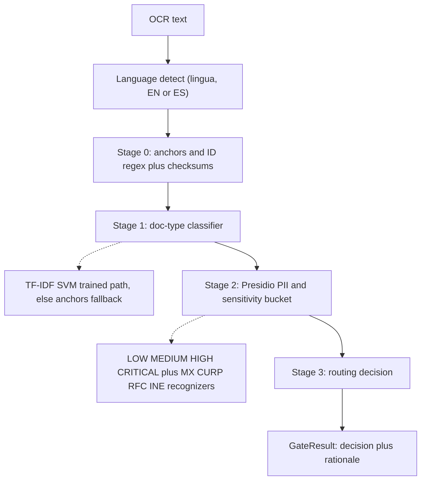
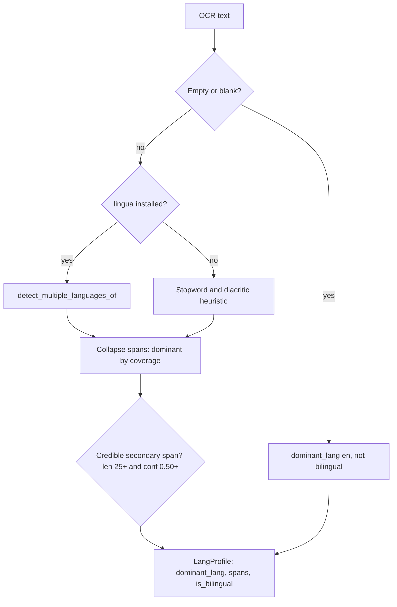
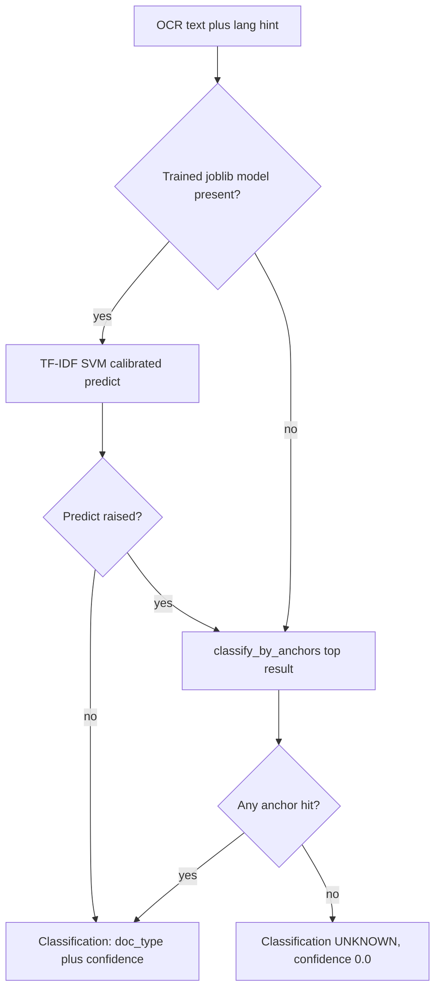
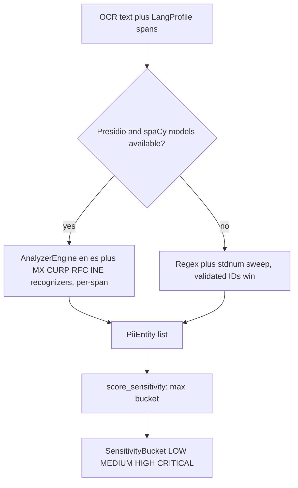
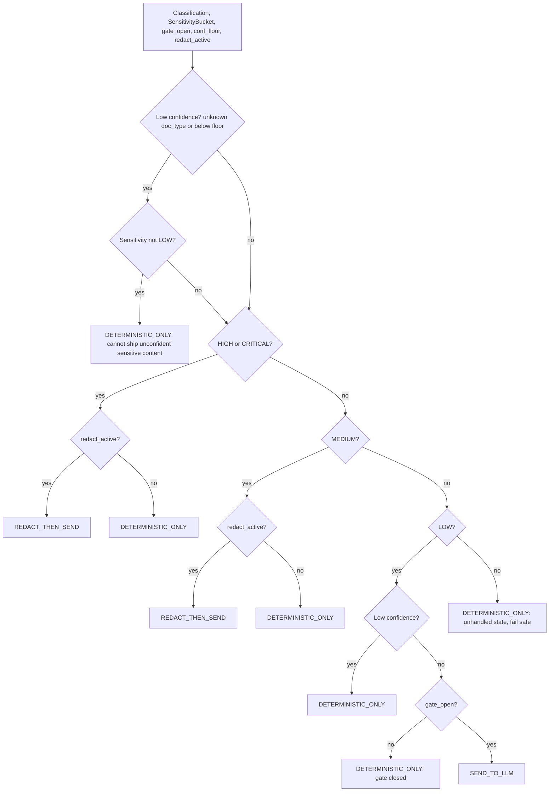

# Classification Gate Flow (PII-safe)

> Status: Implemented (v1) / Last updated 2026-06-24

The **classification gate** is the single in-memory chokepoint that turns OCR output into an
**egress decision**: may this document's content leave the local deterministic path and travel to an
external LLM, or must it be handled deterministically on-box? The gate is **fail-safe by
construction** — when anything is uncertain or sensitive, it keeps the document on the
deterministic-only path.

Everything in this document is grounded in the code under [`di/gate/`](../../../di/gate). The gate
runs **entirely offline**: every sub-stage uses local models or pure heuristics, with **no network
egress and no database access**. The orchestrator [`run_gate`](../../../di/gate/pipeline.py) is
therefore synchronous.

Related documents:

- Ingestion pipeline and SSE stages: [`../ingestion-pipeline-flow.md`](../ingestion-pipeline-flow.md)
- OCR stage that feeds the gate: [`../ocr-flow.md`](../ocr-flow.md)
- Domain model / enums: [`di/models.py`](../../../di/models.py)
- Document taxonomy and anchors: [`di/ontology.py`](../../../di/ontology.py)
- Approved design spec (§ "Stage 0–3"): [`../../specs/2026-06-24-document-intelligence-design.md`](../../specs/2026-06-24-document-intelligence-design.md)

---

## 1. Where the gate sits

The gate is invoked from the ingest driver
[`ingest_document`](../../../di/pipeline.py) immediately after OCR and before extraction. Its single
output, a [`GateResult`](../../../di/models.py), drives three downstream effects:

1. The classification (`doc_type`, `doc_category`, `jurisdiction`, `confidence`) and `sensitivity`
   are persisted onto the document metadata.
2. The full result — classifier output, PII entities, sensitivity, decision, and language profile —
   is written to the `di_decision_trace` audit table via
   [`record_decision_trace`](../../../di/store.py).
3. The `decision` selects the extraction path: `SEND_TO_LLM` enables the LLM extraction path;
   anything else runs **deterministic extraction only**. Deterministic checksum extraction always
   runs regardless.

---

## 2. The four stages at a glance

`run_gate` wires together four sibling modules. Each module degrades gracefully when its optional ML
dependency is missing, and `run_gate` adds an extra guard around the classifier and PII calls so an
unexpected failure inside an optional path still yields a usable, fail-safe `GateResult` rather than
raising.

| Stage | Module | Entry point | Optional dependency | Fallback when absent |
|-------|--------|-------------|---------------------|----------------------|
| Language detect | [`di/gate/language.py`](../../../di/gate/language.py) | `detect_language` | `lingua` | Deterministic EN/ES stopword + diacritic heuristic |
| Stage 0 — anchors + IDs | [`di/gate/anchors.py`](../../../di/gate/anchors.py) | `classify_by_anchors`, `detect_ids` | none (uses `python-stdnum`) | n/a — always available |
| Stage 1 — doc-type classifier | [`di/gate/classifier.py`](../../../di/gate/classifier.py) | `DocTypeClassifier.predict` | `scikit-learn` + `joblib` model | Defers to the Stage-0 anchor sweep |
| Stage 2 — PII + sensitivity | [`di/gate/pii.py`](../../../di/gate/pii.py) | `scan_pii` | `presidio-analyzer` + spaCy models | Deterministic regex + `stdnum` sweep |
| Stage 3 — routing | [`di/gate/routing.py`](../../../di/gate/routing.py) | `route` | none (pure function) | n/a — always available |

> **No training to launch.** v1 ships with no trained classifier model. The Stage-1 classifier
> therefore runs its **anchor fallback** out of the box; the trained TF-IDF + `LinearSVC` path is
> only used when a `joblib` model file is supplied (see § 5).

---

## 3. Stage by stage

### Stage: Language detection — `detect_language`

The pipeline is scoped to US/CA/MX KYC documents, which are overwhelmingly **English and Spanish**,
frequently bilingual on a single page. The detector distinguishes only `en` and `es`; everything
else collapses to the dominant of those two (`en` is the routing default).

- **High-accuracy path** uses `lingua` over `{ENGLISH, SPANISH}`, calling
  `detect_multiple_languages_of` to produce per-span language candidates, each with a confidence in
  `[0, 1]`. `lingua` is imported lazily inside the detector so the module imports cleanly without it.
- **Fallback path** (`lingua` absent) is a deterministic stopword/character heuristic: tiny
  high-signal EN/ES stopword sets plus a Spanish-diacritic regex (`[ñáéíóúü¿¡]`) weighted at `1.5×`
  per hit, producing a single whole-text span.

The result is a [`LangProfile`](../../../di/models.py): the `dominant_lang` (the language covering
the most characters, with a deterministic tie-break preferring English), the per-span breakdown, and
an `is_bilingual` flag. A document is flagged bilingual only when a **credible** secondary-language
span exists — at least `25` characters long and at least `0.50` confidence — guarding against a stray
loan-word flipping the flag. The span breakdown feeds Stage 2, which analyses each language span in
its own language.

### Stage 0: Anchors + ID regex + checksums — `classify_by_anchors`, `detect_ids`

Stage 0 is the **cheap gate**: pure, dependency-light, no ML. It produces two complementary signals.

**Anchor classification (`classify_by_anchors`).** For each ontology doc-type, the function counts
high-specificity anchor-string hits drawn from [`di/ontology.py`](../../../di/ontology.py). Both the
English and Spanish anchor sets are **always swept** case-insensitively (KYC documents are frequently
bilingual); the caller's `lang` hint only nudges the jurisdiction guess for multi-jurisdiction
doc-types. Each hit contributes a **specificity weight** — longer, multi-word header strings (e.g.
`"INSTITUTO NACIONAL ELECTORAL"`) score `1.0`, while short tokens (`"DL"`, `"SIN"`, `"RFC"`) score
only `0.15`. The summed weight is squashed into a `[0, 1]` confidence via `1 - 0.5^score`, capped at
`0.97` so a flood of generic single-word anchors never pins a hard `1.0`. Results are returned ranked
highest-confidence-first, one per doc-type with at least one hit.

**ID detection (`detect_ids`).** A regex sweep finds candidate SSN, SIN, CURP, RFC, EIN values and
the ICAO 9303 passport MRZ start line (`P<XXX`). Each candidate is then **checksum/structure
validated** with `python-stdnum` (imported lazily, per-country submodule). Only validated matches
are returned, normalized to their `stdnum` compact form. Notable rules:

- CURP is matched before RFC and validated via `stdnum.mx.curp` (its leading characters resemble an
  RFC).
- RFC uses **structure validation only** (`validate_check_digits=False`) — the OCR-derived homoclave
  check digit is unreliable, per the ontology hint.
- The MRZ line is structural-only (no `stdnum`) and requires a recognised issuing nation
  (`USA`, `CAN`, `MEX`).
- If `python-stdnum` is unavailable, the function emits **nothing** rather than returning unverified
  IDs.

> In `run_gate`, the anchor sweep is run for **signal/audit** but does not directly drive the
> decision — the Stage-1 classifier consults anchors internally (see § 5). Validated IDs from
> `detect_ids` are consumed by the deterministic extraction path downstream.

### Stage 1: Doc-type classifier — `DocTypeClassifier.predict`

The classifier returns a single [`Classification`](../../../di/models.py) (`doc_type` + `confidence`)
and chooses its mode automatically at predict time:

1. **Trained model** — when a `joblib`-serialised model file exists (path passed explicitly or via
   the `DI_CLASSIFIER_MODEL` env var), scikit-learn + joblib are lazily imported and a calibrated
   **TF-IDF (`char_wb` 3–5 ⊕ `word` 1–2) + `CalibratedClassifierCV(LinearSVC)`** pipeline predicts
   with a calibrated probability used directly as the confidence.
2. **Anchor fallback** — when **no model is available** (the v1 default) or scikit-learn is missing,
   prediction defers to `classify_by_anchors` (imported lazily) and takes the top-ranked result. When
   anchors yield nothing, the classifier returns a neutral `UNKNOWN` classification with confidence
   `0.0`.

The module imports cleanly with no optional ML dependency installed; the trained path is only touched
when a model file actually exists, and any model load/predict failure logs once and degrades to the
anchor fallback.

### Stage 2: PII detection + sensitivity bucket — `scan_pii`

Stage 2 detects PII and resolves a single maximum [`SensitivityBucket`](../../../di/models.py)
(`LOW | MEDIUM | HIGH | CRITICAL`). It has two paths behind one interface:

- **Preferred — Presidio.** Lazily imports `presidio_analyzer` and builds a multilingual
  `AnalyzerEngine` over `['en', 'es']` (spaCy `en_core_web_lg` + `es_core_news_lg`). It is augmented
  with **custom Mexican `PatternRecognizer` rules**:
  - `MX_CURP` — CURP regex, base score `0.85`, context `curp`, `registro de poblacion`, `renapo`.
  - `MX_RFC` — RFC regex, base score `0.80`, context `rfc`, `registro federal de contribuyentes`,
    `sat`.
  - `MX_INE_CLAVE_ELECTOR` — Clave de Elector regex at a **deliberately low** base score `0.35`,
    leaning on Spanish context (`clave de elector`, `credencial para votar`,
    `instituto nacional electoral`) to avoid false positives on generic alphanumerics.

  Each `LangSpan` from the language profile is analysed in its own language and offsets are unioned
  back to absolute positions in the text, de-duplicated by `(entity_type, start, end)`.
- **Fallback — regex + `stdnum`.** When Presidio/spaCy or its models are unavailable, a deterministic
  sweep matches SSN/SIN/CURP/RFC/EIN (validated via `python-stdnum`), plus email and phone. Validated
  national IDs claim their spans first (highest precedence; CURP before RFC), so a valid CURP is never
  mis-tagged as an RFC.

**Sensitivity scoring (`score_sensitivity`)** maps the entity set to the maximum bucket:

| Condition (highest match wins) | Bucket |
|---|---|
| Any national ID — SSN, ITIN, SIN, CURP, RFC, INE Clave de Elector, passport, EIN | `CRITICAL` |
| PERSON **and** date-of-birth **and** address all present | `HIGH` |
| PERSON **and** (date-of-birth **or** address) | `MEDIUM` |
| Address present, or date-of-birth **and** address (quasi-identifiers without a name) | `MEDIUM` |
| Only contact identifiers — email, phone, URL, IP | `LOW` |
| No entities | `LOW` |

### Stage 3: Routing decision — `route`

Stage 3 is a **pure function** — no I/O, no DB, no heavy deps — so it can be unit-tested exhaustively
and reasoned about as a fixed decision table. It takes the `Classification`, the `SensitivityBucket`,
and two operational inputs and returns a `(GateDecision, rationale)` pair. The rationale string is
stored on `GateResult.rationale` for audit.

Operational inputs come from [`Settings`](../../../di/config.py):

- `gate_open` ← `gate_default_open` (default `True`) — the operator master switch. When `False`,
  **nothing** is sent to the LLM.
- `conf_floor` ← `classifier_confidence_floor` (default `0.55`) — the minimum classifier confidence
  required to trust the `doc_type` label.
- `redact_active` ← `masking_enabled_default` (default `False`) — whether redaction is wired up. In
  v1 this is **inactive**, so `REDACT_THEN_SEND` is implemented but never taken.

A classification is treated as **low-confidence** when the `doc_type` is unknown/blank/unclassified
(case-insensitive) **or** `confidence < conf_floor`.

The three possible decisions are the [`GateDecision`](../../../di/models.py) enum values:

| Decision | Meaning | Active in v1? |
|---|---|---|
| `SEND_TO_LLM` | Low-sensitivity, confidently classified, gate open — content may go to the LLM gateway. | Yes |
| `REDACT_THEN_SEND` | Sensitive but redaction active — PII stripped before egress. | **No (implemented, inactive)** |
| `DETERMINISTIC_ONLY` | Keep on-box; deterministic extraction only. The fail-safe default. | Yes |

---

## 4. Routing policy: sensitivity × confidence → decision

This table is the v1 behaviour with **redaction inactive** (`masking_enabled_default = False`) and
the **gate open** (`gate_default_open = True`). "Confident" means a known `doc_type` with
`confidence ≥ 0.55`; "low-confidence" means an `UNKNOWN`/blank label **or** `confidence < 0.55`.

| Sensitivity | Confident classification | Low-confidence classification |
|---|---|---|
| `LOW` | `SEND_TO_LLM` (gate open) | `DETERMINISTIC_ONLY` |
| `MEDIUM` | `DETERMINISTIC_ONLY` (would be `REDACT_THEN_SEND` if redaction active) | `DETERMINISTIC_ONLY` |
| `HIGH` | `DETERMINISTIC_ONLY` (would be `REDACT_THEN_SEND` if redaction active) | `DETERMINISTIC_ONLY` |
| `CRITICAL` | `DETERMINISTIC_ONLY` (would be `REDACT_THEN_SEND` if redaction active) | `DETERMINISTIC_ONLY` |

When `gate_open = False`, the single `SEND_TO_LLM` cell also collapses to `DETERMINISTIC_ONLY`.

### The fail-safe rule

The headline guarantee — **`UNKNOWN` (or any low-confidence) classification on anything that is not
plainly `LOW` sensitivity → `DETERMINISTIC_ONLY`** — is the first rule evaluated in `route` and is
reinforced everywhere uncertainty arises:

- A PII scan that raises unexpectedly fails safe to `CRITICAL` sensitivity (guarded in
  `run_gate._scan_pii`), which keeps the document deterministic-only.
- A classifier that raises unexpectedly degrades to `UNKNOWN` / `0.0` confidence (guarded in
  `run_gate._classify`).
- Any unhandled routing state returns `DETERMINISTIC_ONLY` with a "fail safe" rationale.

The net effect: **the only way content leaves the box is to be both confidently classified and
plainly low-sensitivity (with the operator gate open).** Everything else stays local.

---

## 5. Why the classifier consults anchors in v1

There is **no trained classifier model shipped to launch** (the design calls for rules + weak
supervision before any model). Because `DI_CLASSIFIER_MODEL` is unset by default and no model file
exists, `DocTypeClassifier.predict` transparently uses the **anchor fallback** — i.e. the same
`classify_by_anchors` sweep from Stage 0 — and takes the top-ranked doc-type. The trained TF-IDF +
`LinearSVC` pipeline becomes active only once a `joblib` model is trained (via
`DocTypeClassifier.train`) and its path is supplied. This is why the high-level diagram labels
Stage 1 as "TF-IDF SVM trained path, else anchors fallback".

---

## 6. Offline / no-cloud-egress property

The gate is **local-only**, and that is a hard design property, not an accident:

- **No network.** None of `language`, `anchors`, `classifier`, `pii`, or `routing` opens a socket.
  All models (lingua, scikit-learn, Presidio + spaCy) run in-process; `python-stdnum` is a pure-Python
  validation library.
- **No database.** The gate operates purely on the in-memory `OcrResult`. Persistence (the
  `di_decision_trace` audit row) happens **after** `run_gate` returns, in the pipeline driver.
- **Synchronous.** Because there is no I/O, `run_gate` is a plain synchronous function.
- **Graceful degradation, never a hard failure.** Every optional ML dependency has a
  zero-dependency fallback, and `run_gate` additionally guards the classifier and PII calls. A
  document is never blocked by a missing model — it is routed conservatively instead.

The practical consequence for compliance: a document's **raw content never leaves the local boundary
during gating**. External egress (to the retrieval service's LLM gateway) is possible **only** after
the gate explicitly returns `SEND_TO_LLM` for that document.

---

## 7. The `GateResult` contract

`run_gate` returns one [`GateResult`](../../../di/models.py):

| Field | Type | Source |
|---|---|---|
| `classification` | `Classification` | Stage 1 (`DocTypeClassifier.predict`) |
| `lang_profile` | `LangProfile` | Language detect (`detect_language`) |
| `pii_entities` | `list[PiiEntity]` | Stage 2 (`scan_pii`) |
| `sensitivity` | `SensitivityBucket` | Stage 2 (`score_sensitivity`) |
| `decision` | `GateDecision` | Stage 3 (`route`) |
| `rationale` | `str` | Stage 3 — the human-readable deciding rule, persisted for audit |

The default `decision` on the model is `DETERMINISTIC_ONLY`, mirroring the gate's fail-safe posture.
The `rationale` string is deliberately verbose (e.g. it embeds the doc-type, confidence, floor, and
sensitivity) so the `di_decision_trace` audit row is self-explanatory at review time.
