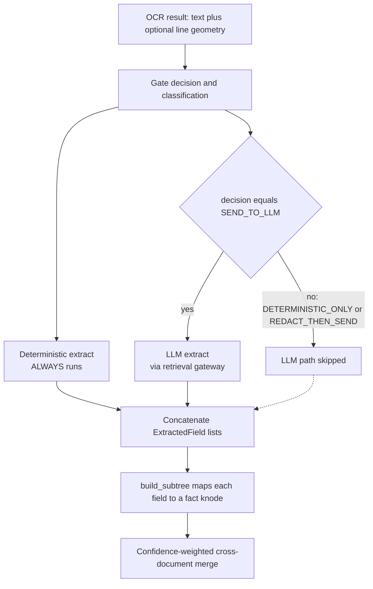
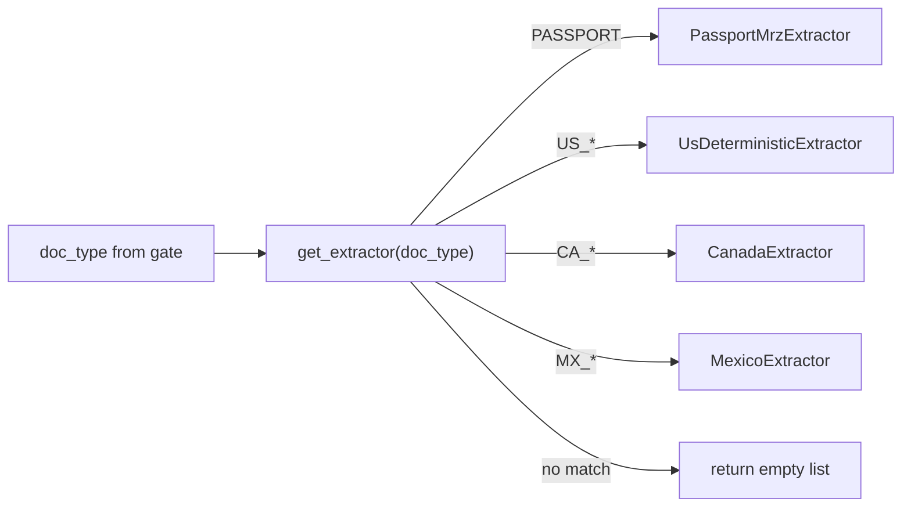
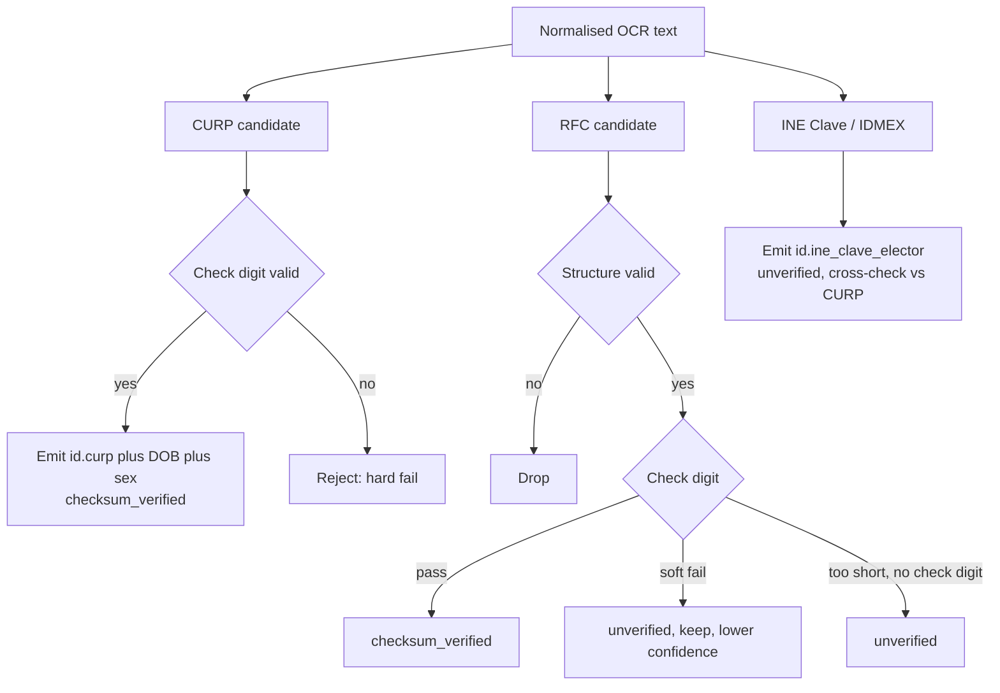
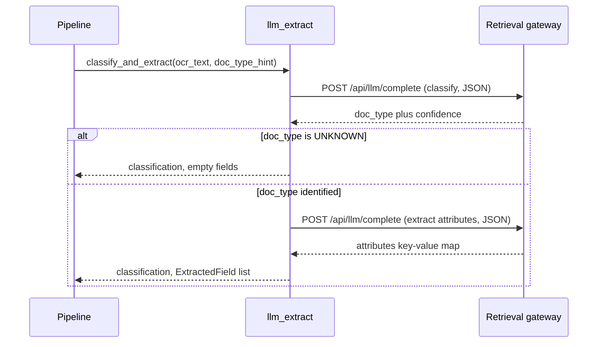
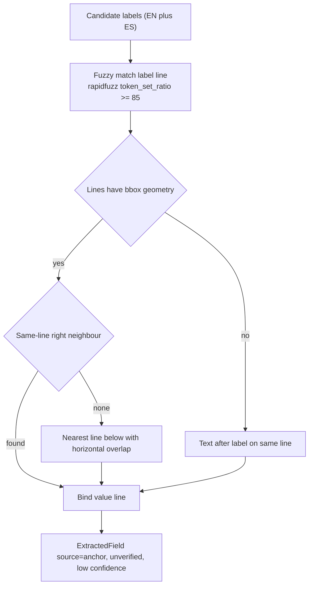
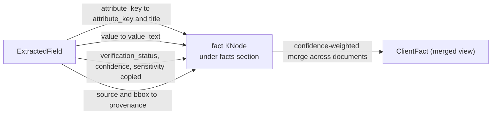

# Dual Extraction Flow

> Status: current. Last updated 2026-06-24.

How `document_intelligence` turns OCR text into structured facts. Every document runs through a
**deterministic** path; only documents the PII-safe gate clears for egress *also* run through an
**LLM** path. The two paths produce the same shape — a list of
[`ExtractedField`](../../../di/models.py) — which the subtree builder turns into `fact` knodes.

Related reading:

- [`gate-flow.md`](./gate-flow.md) — how the `GateDecision` that drives this flow is produced.
- [`ingest-flow.md`](./ingest-flow.md) — the full pipeline; this doc zooms into the `extract` stage.
- [`subtree-and-merge.md`](./subtree-and-merge.md) — what happens to facts after extraction.
- Source: [`di/extract/`](../../../di/extract), [`di/ontology.py`](../../../di/ontology.py),
  [`di/pipeline.py`](../../../di/pipeline.py).

---

## 1. The two paths at a glance

| | Deterministic path | LLM path |
|---|---|---|
| Module | `di/extract/deterministic/` | `di/extract/llm_extract.py` |
| Runs when | **Always** (every document) | **Only** when `GateDecision == SEND_TO_LLM` |
| Network | None — fully offline, pure Python | Calls the retrieval gateway `POST /api/llm/complete` |
| Dispatch | Registry keyed by `doc_type` | Model chooses attributes adaptively |
| Validation | Checksums / ICAO 9303 / `python-stdnum` | None — model output trusted as-is |
| Verification status | `checksum_verified` (hard IDs) or `unverified` (soft fields) | `llm_unverified` |
| Failure mode | Returns `[]`, never raises (guarded in `_deterministic_facts`) | Degrades to `[]`, never raises |

The deterministic path is the trust anchor: it is auditable, repeatable, and produces
checksum-verified identifiers. The LLM path is the *open* path that handles long-tail document
types and soft attributes the deterministic extractors do not cover. Their outputs are merged into
one `facts` list, then collapsed across documents by the confidence-weighted merge.

---

## 2. Flow overview



Note: `REDACT_THEN_SEND` is defined in the model but **inactive in v1** — `redact_active` is never
turned on, so a `REDACT_THEN_SEND` decision never reaches this code in practice. Effectively, the
LLM path runs **only** for `SEND_TO_LLM`. See [`gate-flow.md`](./gate-flow.md).

### Where this lives in `ingest_document`

In [`di/pipeline.py`](../../../di/pipeline.py), the `extract` stage is:

```python
facts: list[ExtractedField] = _deterministic_facts(gate.classification.doc_type, ocr)
allow_llm = gate.decision == GateDecision.send_to_llm
if allow_llm:
    _, llm_facts = await llm_extract.classify_and_extract(
        ocr.text, client=client, doc_type_hint=gate.classification.doc_type)
    facts.extend(llm_facts)
```

`_deterministic_facts` wraps the registry lookup in a `try/except` that logs and returns `[]` on
any error — extraction must never break ingest. The LLM call is similarly guarded.

---

## 3. Deterministic path

### 3.1 Registry and dispatch

Extractors implement the `DeterministicExtractor` protocol in
[`di/extract/base.py`](../../../di/extract/base.py): a `handles: frozenset[str]` of `doc_type` codes
plus an `extract(ExtractionInput) -> list[ExtractedField]`. Each jurisdiction module registers its
singleton at import time via `register(...)`; importing `di.extract.deterministic` (a side-effect
import in the pipeline) populates the registry. Dispatch is a single dict lookup:

```python
extractor = extract_base.get_extractor(doc_type)   # None when no deterministic extractor exists
```

The `ExtractionInput` carries `doc_type`, the flat OCR `text`, optional `lines` (with bbox
geometry), and a `lang` hint.



### 3.2 Registered extractors by jurisdiction

| Extractor | `doc_type` codes handled | Validation | Source |
|---|---|---|---|
| `PassportMrzExtractor` | `PASSPORT` | ICAO 9303 TD3 MRZ check digits (`mrz` lib) | [`mrz.py`](../../../di/extract/deterministic/mrz.py) |
| `UsDeterministicExtractor` | `US_SSN_CARD`, `US_EIN_LETTER`, `US_W2`, `US_1099`, `US_DRIVER_LICENSE` | `stdnum.us.{ssn,ein,itin}` | [`us.py`](../../../di/extract/deterministic/us.py) |
| `CanadaExtractor` | `CA_SIN`, `CA_BUSINESS_NUMBER`, `CA_T4`, `CA_NOA`, `CA_DRIVER_LICENSE` | `stdnum.ca.{sin,bn}` (Luhn / BN15) | [`canada.py`](../../../di/extract/deterministic/canada.py) |
| `MexicoExtractor` | `MX_CURP`, `MX_RFC_CSF`, `MX_INE` | CURP check digit (hard), RFC structure (strict) + check digit (soft) | [`mexico.py`](../../../di/extract/deterministic/mexico.py) |

`doc_type` codes are defined in the taxonomy in [`di/ontology.py`](../../../di/ontology.py)
(`DOC_TYPES`); `deterministic_doc_types()` lists the codes whose core fields are extractable without
an LLM.

### 3.3 Passport — ICAO 9303 TD3 MRZ

`PassportMrzExtractor` locates the two 44-character TD3 lines at the bottom of a passport data page
(line 1 must begin `P` + subtype + 3-letter issuing state), then:

- **Preferred path:** the optional `mrz` library's `TD3CodeChecker` validates the ICAO 9303 check
  digits. When the document is valid, fields are emitted with `checksum_ok=True`,
  `verification_status=checksum_verified`, and confidence `0.99`. A failed check digit downgrades to
  `checksum_ok=False` / `unverified` at confidence `0.40`.
- **Fallback path:** when the `mrz` library is absent, the zone is sliced by fixed ICAO offsets
  (positional). No checksum is computed — fields are `checksum_ok=None` / `unverified` at confidence
  `0.50` (source `mrz`).

Emitted attribute keys: `identity.surname`, `identity.given_names`, `id.passport_number`,
`identity.nationality`, `identity.date_of_birth`, `identity.sex`, `doc.expiry_date`. Birth dates use
ICAO century windowing; nationality is validated against ISO 3166 via `pycountry` when present.

### 3.4 United States — SSN / EIN / ITIN

`UsDeterministicExtractor` does two things:

1. **Global regex sweep over the OCR text**, validated by `python-stdnum`. The `NN-NNNNNNN` shape is
   tested as an EIN; the `NNN-NN-NNNN` shape is tested as an SSN first, then an ITIN (mutually
   exclusive in `stdnum`). Only checksum-valid numbers surface — they carry
   `source=regex_sweep`, `checksum_ok=True`, `verification_status=checksum_verified`, confidence
   `0.95`. SSN/ITIN are `CRITICAL` sensitivity; EIN is `HIGH`. Duplicates are de-duplicated by
   compact value.
2. **Anchored KV for soft fields** (names, addresses, amounts, licence numbers) via the shared
   `anchored_kv` helper — see [§5](#5-anchored-kv-label-binding-for-soft-fields). These are emitted
   `source=anchor`, `verification_status=unverified`, confidence `0.6`.

### 3.5 Canada — SIN / BN

`CanadaExtractor` dispatches by `doc_type`:

- **`CA_SIN`** — regex-sweeps 9-digit runs, validates each with `stdnum.ca.sin` (Luhn). Only valid
  SINs surface (`checksum_verified`, confidence `0.95`, `CRITICAL`).
- **`CA_BUSINESS_NUMBER`** — sweeps BN9 / BN15 (optional `RC`/`RM`/`RP`/`RT` program suffix),
  validates with `stdnum.ca.bn` (`checksum_verified`, confidence `0.95`, `HIGH`).
- **`CA_T4`** — employer name + income amounts (anchored) + any checksum-valid employee SIN.
- **`CA_NOA`** — income amounts + mailing address (anchored).
- **`CA_DRIVER_LICENSE`** — best-effort name + first-date DOB (anchored / regex, `unverified`).

Income amounts and names are bound via anchor labels (English + French, e.g. `revenu d'emploi`,
`nom de l'employeur`). Amounts parse to `value_num` via `_clean_amount`; dates parse via
`dateparser` when available.

### 3.6 Mexico — CURP (hard) / RFC (soft) / INE

`MexicoExtractor` normalises text (uppercase, collapse whitespace) then runs three sub-extractions:

- **CURP** — 18-char identity key. The published check digit is verified **hard**: a mismatch is a
  *reject* (the candidate is dropped entirely). Verification uses `stdnum.mx.curp.calc_check_digit`,
  with a self-contained RENAPO-alphabet fallback when `stdnum` is absent. The non-binary sex code
  `X` is accepted (we verify the check digit ourselves rather than routing through
  `stdnum`'s validate, which rejects `X`). A verified CURP emits `id.curp` (confidence `0.97`) plus a
  decoded `identity.date_of_birth` and `identity.sex` (both `checksum_verified`, `0.95`).
- **RFC** — taxpayer key (10/12/13 chars). Structure is validated **strictly**; the check digit is a
  **soft** signal. A structurally-valid RFC with a *failing* check digit is **kept**, not dropped:
  it stays `unverified` at confidence `0.6` with `raw_ocr="checksum_soft_fail"`, because OCR
  frequently mangles the homoclave on a CSF printout. A passing check digit yields
  `checksum_verified` at `0.95`; a too-short personal RFC (no check digit) yields `unverified` at
  `0.85`.
- **INE** — the 18-char *Clave de Elector* and the reverse-side `IDMEX` block. Neither carries a
  public checksum, so both stay `unverified`. When a CURP is present on the same document, the INE
  birth date / sex are cross-checked against it; a mismatch is recorded in `raw_ocr`
  (`ine_sex_mismatch_curp`) and lowers confidence.



---

## 4. LLM path

`classify_and_extract` in [`di/extract/llm_extract.py`](../../../di/extract/llm_extract.py) is the
*open* path. It makes two JSON round-trips through the retrieval gateway client
(`llm_complete(task="final_gen", response_format="json")`, i.e. `POST /api/llm/complete`):

1. **Classify** — name the `doc_type` (+ optional category / jurisdiction / confidence). The
   deterministic gate's `doc_type` is passed as a `doc_type_hint` that biases but does not override
   the model. If classification returns `UNKNOWN`, extraction is skipped and an empty list returned.
2. **Extract** — given the identified type, the model *chooses* the salient attributes a reviewer
   would record and returns them as `{key: value}`. Each key becomes one `ExtractedField`.



Robustness details that matter for operators:

- **OCR is capped** at `MAX_OCR_CHARS = 6000` before sending (prompt budget).
- **Tolerant JSON parsing** (`extract_json`): strips Markdown code fences, then falls back to a
  brace-balanced scan. Accepts both `{"attributes": {...}}` and a flat `{key: value}` object.
- **Never raises on model I/O**: any transport error, malformed response, or empty output degrades to
  `(Classification(doc_type="UNKNOWN"), [])`.
- Every emitted field is `source=llm`, `verification_status=llm_unverified`, with a confidence taken
  from the model's optional score (default `0.5`).

Note: this LLM classification is distinct from the gate's Stage-2 classifier — the gate decides
*whether* the document may leave the deterministic path; this call runs only *after* the gate has
already said `SEND_TO_LLM`, and re-classifies/extracts adaptively.

---

## 5. Anchored-KV label binding for soft fields

"Soft" fields — names, addresses, amounts, licence numbers — have no checksum, so the deterministic
extractors locate them by **anchoring on a label and binding the adjacent value**. The shared helper
`anchor_extract` lives in
[`di/extract/deterministic/anchored_kv.py`](../../../di/extract/deterministic/anchored_kv.py).

Given OCR `lines` and a list of candidate labels (EN + ES/FR, e.g. `["Date of Birth", "Fecha de
nacimiento"]`), it:

1. **Fuzzy-locates the label line** with `rapidfuzz.token_set_ratio` (default threshold 85), so OCR
   noise and word-order shuffles still match.
2. **Binds the value by page geometry:**
   - *Same-line right neighbour* — the line to the right on the same row (smallest positive x-gap
     with vertical overlap). This is the dominant form-field layout.
   - *Nearest line below* — failing that, the closest horizontally-overlapping line beneath the
     label (stacked label-over-value layout).
3. **Text-only fallback** when lines carry no bbox geometry at all — take the substring after the
   label on the same line, or a single fuzzy whole-line match.



In the US extractor, the label-to-attribute mapping is the per-`doc_type` `_SOFT_LABELS` table —
e.g. for `US_W2`, `("Wages", "Wages, tips", "Box 1") -> income.amount`. Each bound pair becomes an
`ExtractedField` with `source=anchor`, `verification_status=unverified`, confidence `0.6`, and the
value line's `bbox` carried into provenance. The Canada extractor uses its own anchor tuples
(`_EMPLOYER_ANCHORS_EN`, `_INCOME_ANCHORS_EN`, etc.) with a built-in line/text sweep fallback.

---

## 6. From `ExtractedField` to a `fact` knode

Both paths emit `ExtractedField` (defined in [`di/models.py`](../../../di/models.py)). The relevant
fields:

| `ExtractedField` field | Meaning |
|---|---|
| `attribute_key` | Canonical dotted key from the catalog, e.g. `identity.date_of_birth` |
| `value` / `value_date` / `value_num` | Typed value renderings |
| `raw_ocr` | Original OCR token (or a note such as `checksum_soft_fail`) |
| `source` | `mrz` / `anchor` / `positional` / `regex_sweep` / `llm` / `gov` |
| `checksum_ok` | `True` / `False` / `None` (no checksum applicable) |
| `verification_status` | `checksum_verified` / `gov_verified` / `llm_unverified` / `unverified` |
| `confidence` | `0.0`–`1.0` |
| `sensitivity` | `LOW` / `MEDIUM` / `HIGH` / `CRITICAL` |
| `bbox` | Page + coordinates when geometry was used |

`build_subtree` in [`di/subtree/build.py`](../../../di/subtree/build.py) creates a `facts` section
under the document root and one `fact` `KNode` per `ExtractedField`. The mapping:

| `ExtractedField` | `KNode` (fact) |
|---|---|
| `attribute_key` | `attribute_key` **and** `title` |
| `value` | `value_text` |
| `value_date` | `value_date` |
| `value_num` | `value_num` |
| `verification_status` | `verification_status` |
| `confidence` | `confidence` |
| `sensitivity` | `sensitivity` |
| `source` + `bbox` | `provenance` (`extractor = source.value`, `bbox`, `page`) |



### Cross-document merge

After every ingest, `_remerge_client_facts` recomputes the client-level view from all current
`fact` knodes. `merge_facts` (see [`di/subtree/merge.py`](../../../di/subtree/merge.py)) groups facts
by `attribute_key` and resolves each to one `ClientFact`:

- The resolved value is the one from the **highest-confidence** contributing fact (so a
  `checksum_verified` MRZ/`stdnum` value at `0.95`–`0.99` beats an `llm_unverified` value at `0.5`).
- `conflict` / `needs_review` are set when contributing sources disagree on the comparable value.
- `source_fact_ids` lists every contributor (winners and losers).

This is why the verification status and confidence assigned during extraction matter: they directly
determine which value wins at the client level. See
[`subtree-and-merge.md`](./subtree-and-merge.md) for the full merge semantics.

---

## 7. Verification-status and confidence cheat-sheet

| Path | Source | Example fields | `verification_status` | Confidence |
|---|---|---|---|---|
| Deterministic | `mrz` (validated) | passport MRZ fields | `checksum_verified` | 0.99 |
| Deterministic | `mrz` (failed check) | passport MRZ fields | `unverified` | 0.40 |
| Deterministic | `positional` / `mrz` (no lib) | passport MRZ fields | `unverified` | 0.50 |
| Deterministic | `regex_sweep` + `stdnum` | SSN, EIN, ITIN, SIN, BN, CURP | `checksum_verified` | 0.95–0.97 |
| Deterministic | `regex_sweep` (RFC soft fail) | RFC | `unverified` | 0.60 |
| Deterministic | `regex_sweep` (INE) | INE Clave / IDMEX | `unverified` | 0.70–0.80 |
| Deterministic | `anchor` | names, addresses, amounts | `unverified` | 0.40–0.60 |
| LLM | `llm` | adaptive attributes | `llm_unverified` | model score (default 0.5) |

`gov_verified` exists in the enum for a future government-endpoint check (e.g. SAT for RFC) and is
not emitted by any current extractor.
