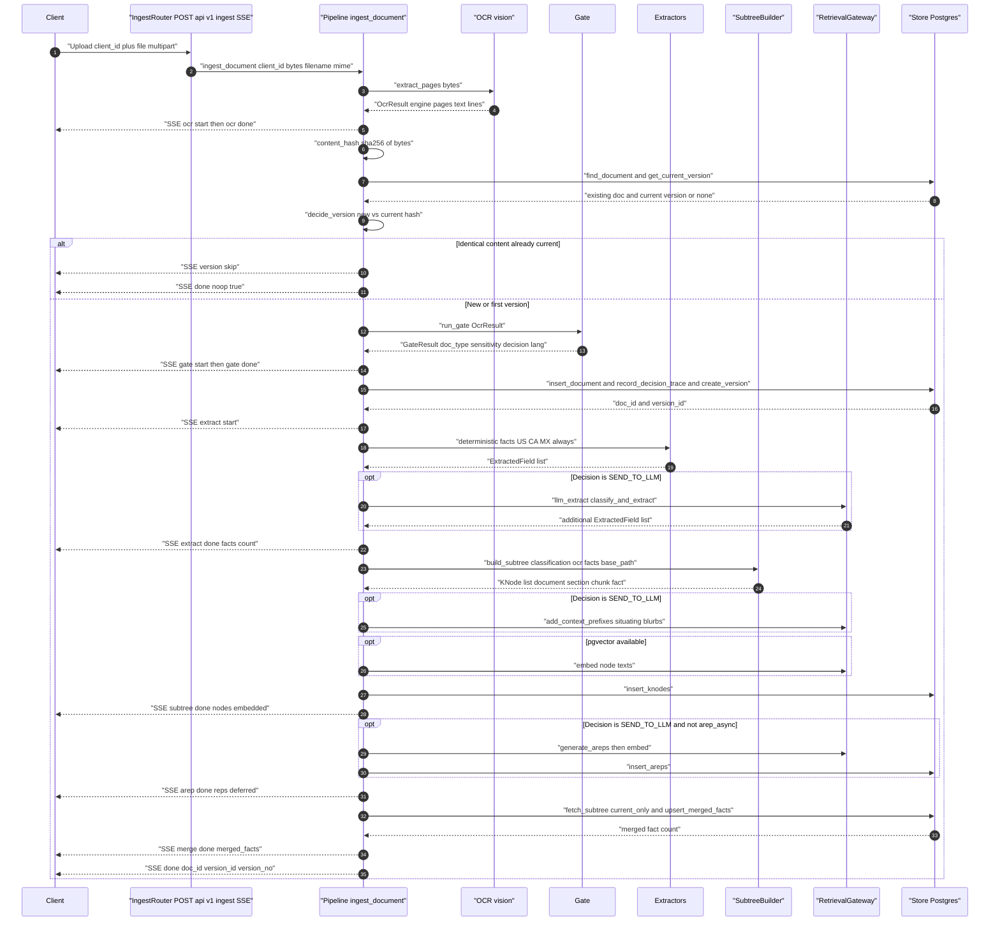
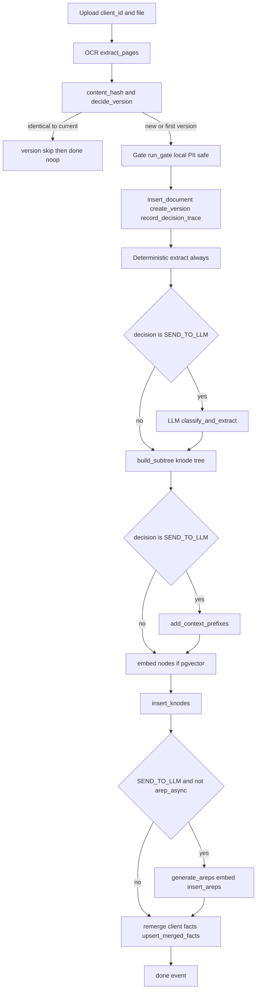

# Ingestion Flow

> Status / Last updated 2026-06-24 — grounded in `di/pipeline.py`, `di/routers/ingest.py`, the gate, OCR, extractor, subtree, and store modules.

This document describes the end-to-end **ingestion** flow: how a single uploaded document for a
client becomes a versioned, per-client knowledge subtree, and which Server-Sent-Event (SSE) stages
the caller observes along the way.

**Companion docs:** [design spec](../../specs/2026-06-24-document-intelligence-design.md) ·
[requirements & interpretation log](../../../reports/requirements-and-interpretation.md)

---

## 1. Entry point

Ingestion is driven by a single async generator, `ingest_document` in
[`di/pipeline.py`](../../../di/pipeline.py). The REST surface is a thin SSE wrapper:

- **`POST /api/v1/ingest`** — `di/routers/ingest.py`, multipart upload (`client_id` form field +
  `file`). The router reads the upload into memory, then re-streams each `IngestEvent` yielded by
  `ingest_document` as an SSE message with `event: stage` and a JSON `data` payload
  (`IngestEvent.model_dump_json()`).

The `client_id` arrives **with the document** — there is no entity-resolution step. Every node,
version, fact, and representation produced downstream is stamped with that `client_id`, and all
storage is partitioned and row-level-secured by it.

Model access (embeddings, the classification/extraction LLM, accessibility-rep generation) is
delegated to the **retrieval gateway** (`di.retrieval_client.get_retrieval_client`). The pipeline
opens one client at the start and closes it in a `finally` block (`aclose`) so the connection is
released on every exit path, including the version no-op short-circuit.

---

## 2. SSE stage events

Each `IngestEvent` carries a `stage`, a `status` (`start` | `progress` | `done` | `error` |
`skip`; defaults to `done`), and a free-form `detail` dict. The stages, in emission order:

| Stage | Emitted | `detail` highlights |
|---|---|---|
| `ocr` | start, then done | `engine`, `pages` |
| `version` | only on no-op | `status="skip"`, `reason`, `doc_id` |
| `gate` | start, then done | `doc_type`, `sensitivity`, `decision`, `lang` |
| `extract` | start, then done | `facts` count, `llm` (whether LLM aids ran) |
| `subtree` | done | `nodes` count, `embedded` (pgvector available) |
| `arep` | done | `reps` count, `deferred` (async arep mode) |
| `merge` | done | `merged_facts` count |
| `done` | terminal | `doc_id`, `version_id`, `version_no`, `doc_type`, `decision`, `nodes`, `facts` |

There are **two terminal paths**:

1. **No-op short-circuit** — identical content already current → `version` (`skip`) then
   `done` (`noop: true`). No gate, extract, subtree, arep, or merge events are emitted.
2. **Full ingest** — all stages emit, ending with the rich `done` event.

---

## 3. Sequence

---

## 4. Step-by-step

### 4.1 OCR — `vision.extract_pages`

`vision.extract_pages(file_bytes, filename, mime)` (in [`di/ocr/vision.py`](../../../di/ocr/vision.py))
turns raw bytes into an `OcrResult` (`engine`, `pages`, `text`, `lines`). It is designed to **never
raise**: the primary engine is **Azure Computer Vision Read v3.2**, driven over plain `httpx` (no
SDK) by POSTing bytes to `/vision/v3.2/read/analyze`, then polling the `Operation-Location` until
`succeeded`. The same v3.2 contract works unchanged against real Azure or the local mock container
(`mock_azure_ocr/app.py`). When Azure is not configured or fails, the function degrades through a
text-layer/format-specific path: `pypdf` text layer for native PDFs, `pdf2image` + Tesseract for
scanned PDFs, `python-docx` for `.docx`, a UTF-8 text pass-through, and finally an empty `none`
result. The chosen `engine` and `pages` are echoed in the `ocr` done event.

### 4.2 Versioning decision — `versioning.content_hash` + `versioning.decide_version`

The SHA-256 of the raw bytes (`versioning.content_hash`) is the version identity. The pipeline
looks up any existing document for this `(client_id, filename)` via `store.find_document`, then its
current version via `store.get_current_version`. `versioning.decide_version` compares the new hash
to the current hash:

- **Identical to current** → `VersionPlan.is_noop = True`. The pipeline emits `version` (`skip`,
  reason "identical content already current") and a terminal `done` (`noop: true`), then returns.
  Nothing is re-classified, re-extracted, re-built, or re-merged — this is the **idempotency
  guarantee**: re-uploading the same bytes is a cheap no-op after OCR.
- **Different / first version** → `version_no = (current_no or 0) + 1`, and the new version
  `supersedes` the prior one. `store.create_version` flips `is_current = false` on the old version
  and inserts the new row as current inside a single transaction (one current version per
  document).

The no-op check happens **after OCR but before the gate**, so OCR is the only cost paid on a
duplicate upload.

### 4.3 Gate — `gate_pipeline.run_gate`

`gate_pipeline.run_gate(ocr)` (in [`di/gate/pipeline.py`](../../../di/gate/pipeline.py)) is a
synchronous, **local-only, PII-safe** stage that collapses four sub-stages into one `GateResult`:
language detection, doc-type classification (anchors + classifier), PII/sensitivity scan, and the
egress routing decision. It never touches the network or the LLM; raw PII never leaves the box at
this point. The decision is one of:

- **`SEND_TO_LLM`** — the document may be sent to the model; all LLM aids below are enabled.
- **`REDACT_THEN_SEND`** — reserved; **inactive in v1**.
- **`DETERMINISTIC_ONLY`** — fail-safe default; no LLM aids run.

After the gate, `store.insert_document` persists the document metadata (doc-type, jurisdiction,
sensitivity, gate decision, OCR text + lines, language profile), `store.record_decision_trace`
records the gate rationale for audit, and `store.create_version` writes the version row. The `gate`
done event surfaces `doc_type`, `sensitivity`, `decision`, and dominant `lang`.

### 4.4 Extraction — deterministic always, LLM only when gated open

The pipeline computes `allow_llm = gate.decision == GateDecision.send_to_llm` once and reuses it
for every subsequent LLM-dependent step.

- **Deterministic facts always run.** `_deterministic_facts` resolves a registered US/CA/MX
  extractor by doc-type via `extract_base.get_extractor` and runs it over the OCR text/lines.
  This local, checksum-style extraction runs regardless of the gate decision, and is itself guarded
  so an extractor failure never breaks ingest (it logs and returns an empty list).
- **LLM facts run only when `allow_llm`.** `llm_extract.classify_and_extract` (in
  [`di/extract/llm_extract.py`](../../../di/extract/llm_extract.py)) makes gateway round-trips to
  classify and choose salient attributes, and its results are appended to the deterministic facts.
  This call is guarded — on failure the pipeline continues with deterministic facts only.

The `extract` done event reports the total `facts` count and the `llm` flag.

### 4.5 Subtree build — `build.build_subtree`

`build.build_subtree` (in [`di/subtree/build.py`](../../../di/subtree/build.py)) assembles the
in-memory `KNode` tree rooted at one `document` node, with `section` nodes (one per OCR page, or a
single `body` section), `chunk` children, and a `facts` section holding one `fact` node per
extracted field. The root path comes from `_base_path` —
`client_<id>.doctype_<doc_type>.v<version_no>` — and every child appends a sanitized `ltree` label,
giving each node a real UUID, `parent_id` linkage, sibling `seq`, and `depth`. This is the
**index-many / return-parent** knowledge subtree: granular content nodes are indexed, structural
parents are traversed. (See [`di/subtree/`](../../../di/subtree/) and the design spec §6.)

### 4.6 Contextual prefixes + embeddings (LLM aid, gated)

- **Context prefixes** — only when `allow_llm`. `context.add_context_prefixes` asks the gateway for
  a 50–100 token situating blurb for each content-bearing node (Anthropic-style Contextual
  Retrieval), mutating `context_prefix` in place. Bounded concurrency; each call is guarded.
- **Embeddings** — only when `pgvector_available()` returns true. `_embed_nodes` embeds the text of
  content-bearing nodes (`chunk`/`table`/`figure`/`fact`) through the gateway in batches.

`store.insert_knodes` persists the nodes (with the `content_embedding` `vector` column when
pgvector is present). The `subtree` done event reports the `nodes` count and whether embeddings
were written.

### 4.7 Accessibility representations (`arep`) — LLM aid, gated

Only when `allow_llm` **and** synchronous arep mode is configured (`not settings.arep_async`),
`arep_mod.generate_areps` expands each content-bearing node into alternative phrasings
(hypothetical question, proposition, summary, paraphrase, media descriptions, EN↔ES translation)
through the gateway. These are embedded (if pgvector is available) and persisted via
`store.insert_areps`. This is the **two-table** model: `knode` rows plus their `arep` multi-vector
family. The `arep` event reports the `reps` count and a `deferred` flag (true when arep generation
is configured to run asynchronously out-of-band).

### 4.8 Cross-document merge — `_remerge_client_facts`

After persisting this document's subtree, `_remerge_client_facts(client_id)` rebuilds the
**client-level merged view** from *all* current fact nodes across the client's documents
(`store.fetch_subtree(current_only=True)`). `merge.merge_facts` collapses candidate facts per
`attribute_key` using **confidence-weighted** resolution — the highest-confidence source wins, and
disagreement among sources flags `conflict`/`needs_review`. `store.upsert_merged_facts` writes the
result with an `ON CONFLICT (client_id, attribute_key) DO UPDATE`, so the merged view is itself
idempotent and always reflects the latest current facts. The `merge` event reports the
`merged_facts` count.

### 4.9 Done

The terminal `done` event reports `doc_id`, `version_id`, `version_no`, `doc_type`, `decision`,
`nodes`, and `facts`. The retrieval gateway client is closed in the pipeline's `finally` block.

---

## 5. Stage order summary

---

## 6. Gating, idempotency, and resilience at a glance

- **Gated steps (run only on `SEND_TO_LLM`):** LLM attribute extraction, context-prefix
  generation, and accessibility-rep generation. Deterministic extraction, subtree build, embeddings
  (when pgvector is present), and the cross-document merge always run.
- **Idempotency:** identical content (same SHA-256) re-uploaded for the same document
  short-circuits after OCR with a no-op. Versioning supersedes the prior version atomically. The
  merged-fact upsert is conflict-keyed on `(client_id, attribute_key)`.
- **Resilience:** OCR never raises; the gate fails safe to `DETERMINISTIC_ONLY`/`CRITICAL`;
  deterministic and LLM extraction, context prefixes, and arep generation are each individually
  guarded so any single failure logs and degrades rather than aborting the ingest.
