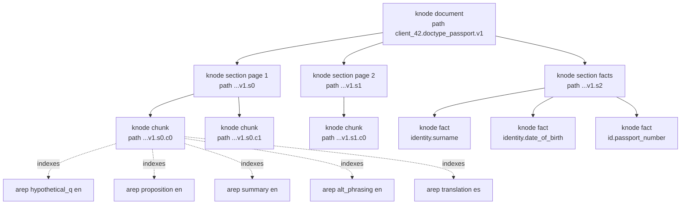
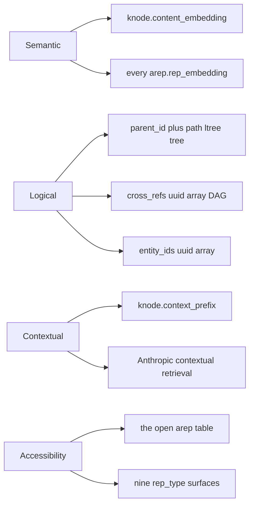
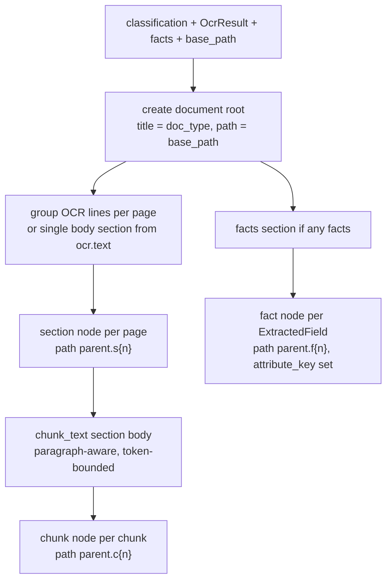
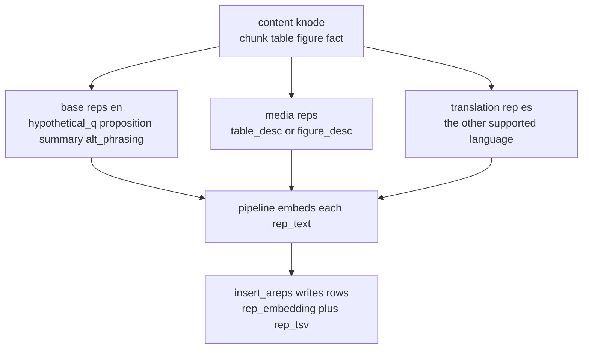
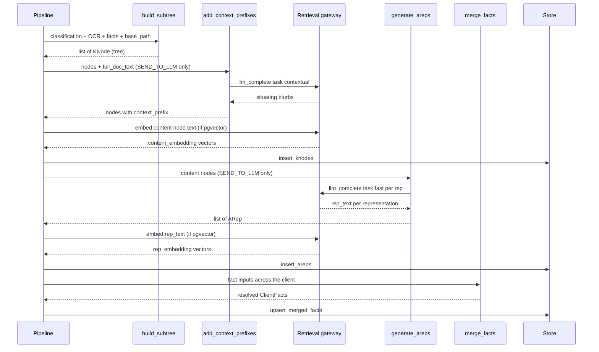

# The Knowledge Subtree — `knode` + `arep`

> Status: Living document · Last updated 2026-06-24

The knowledge subtree is the heart of the Document Intelligence platform. Every document a client
submits is turned into a small, self-describing tree of returnable nodes (`knode`) plus a layer of
searchable phrasings hung off those nodes (`arep`). This document explains the two-table
**index-many / return-parent** design, how a subtree is built, and how the four required properties
(semantic, logical, contextual, accessibility) are realised in code.

**Source modules:** [`di/subtree/build.py`](../../../di/subtree/build.py),
[`di/subtree/chunk.py`](../../../di/subtree/chunk.py),
[`di/subtree/context.py`](../../../di/subtree/context.py),
[`di/subtree/arep.py`](../../../di/subtree/arep.py),
[`di/subtree/merge.py`](../../../di/subtree/merge.py),
[`di/subtree/versioning.py`](../../../di/subtree/versioning.py).
**Schema:** [`di/migrations/003_knode_arep.sql`](../../../di/migrations/003_knode_arep.sql).
**Models:** [`di/models.py`](../../../di/models.py).
**Driver:** [`di/pipeline.py`](../../../di/pipeline.py).
**Design spec:** [`docs/specs/2026-06-24-document-intelligence-design.md`](../../specs/2026-06-24-document-intelligence-design.md) §6.

---

## 1. The core idea: index-many / return-parent

Most retrieval systems search and return the same object: you index a chunk, you match a chunk, you
return that chunk. The subtree splits those two jobs across two tables:

| Table | Role | Searched? | Returned to consumer? |
|-------|------|-----------|-----------------------|
| **`knode`** | Canonical logical and content nodes — the real document structure and the extracted facts | Yes (its own `content_embedding` + `content_tsv`) | **Yes — always** |
| **`arep`** | Accessibility representations — many alternative phrasings of a node's content | Yes (its `rep_embedding` + `rep_tsv`) | **Never directly** |

Each content `knode` is expanded into several `arep` rows. A query can match the representation
whose *form* is closest to it — a hypothetical question, an atomic proposition, a one-line summary,
a paraphrase, a media description, or a cross-language translation — and the system then **returns
the parent `knode`**, never the representation. You index many surfaces; you return one canonical
parent. That is "index-many / return-parent".

Two consequences fall straight out of this design:

- **The representation system is open.** A new way to find a node is a new `arep` row
  (`RepType` value), never a schema migration. The `arep` table is a bag of rows keyed by
  `rep_type`; adding `keyword_set` or a new language is data, not DDL. See
  `RepType` in [`di/models.py`](../../../di/models.py).
- **Answers come at any altitude.** Because the canonical nodes form a tree
  (`document → section → chunk/table/figure → fact`, plus synthetic `summary`), a match on a
  chunk-level proposition can be answered with the chunk, its section, or the whole-document
  summary — collapsed-tree retrieval over one structure.

---

## 2. A sample subtree

The diagram below shows one passport document for client `42`, rooted at the `ltree` path
`client_42.doctype_passport.v1`. Sections are synthesised per OCR page; chunks hang off sections;
`fact` nodes live under a synthetic `facts` section; and the `arep` rows hang off a single chunk to
show the index-many fan-out. Real paths are sanitised, lowercased, and dot-separated by
`build_subtree`.

Every `arep` row carries a `knode_id` back-pointer and a denormalised copy of its parent's `path`,
so a representation match resolves to its `knode` in one hop (`arep_client_knode` index) and the
structural neighbourhood is known without a join.

---

## 3. The four properties, physically

The spec requires four properties of the structure. Each maps to concrete columns and modules.

- **Semantic** — every content `knode` carries a `content_embedding`, and *every* `arep` row carries
  its own `rep_embedding`. Each representation is a separate semantic surface, so the multi-vector
  layer multiplies the ways a query can land near the right node.
- **Logical** — `parent_id` + `path` (`ltree`) form the tree edges; `cross_refs uuid[]` express a
  cross-reference DAG; `entity_ids uuid[]` link nodes to the per-client entity graph
  (`di_entity`). `path` is GiST-indexed for fast `<@` ancestor/descendant scoping.
- **Contextual** — each content node gets a `context_prefix`, a 50–100 token blurb that situates it
  in the whole document (§5). This is Anthropic-style Contextual Retrieval.
- **Accessibility** — the entire `arep` table. Hypothetical questions, propositions, summaries,
  paraphrases, media descriptions, and translations are all just rows (§6).

---

## 4. Building the subtree — `build_subtree`

[`di/subtree/build.py`](../../../di/subtree/build.py) is a pure, in-memory, DB-free transform. It
takes the upstream artefacts (classification, OCR result, extracted facts) and the root `base_path`,
and returns a flat list of `KNode` objects — root first, then sections and chunks, then facts.

Key behaviours, grounded in the code:

- **Path construction.** Each child appends a sanitised label to its parent's `path`.
  `sanitize_label` lowercases, replaces every run of non-`[A-Za-z0-9_]` with `_`, collapses repeats,
  and falls back to `x` for an otherwise-empty label — so the result is always a valid, non-empty
  `ltree` label. `depth` equals `nlevel(path)` (the count of dot-separated labels).
- **Sections from flat OCR.** Azure Vision Read returns lines, not a logical hierarchy, so
  `_sections_from_ocr` synthesises sections by grouping lines per page in ascending page order. When
  there are no lines it derives a single `body` section from `ocr.text`. Empty pages are dropped.
- **Chunking.** Section bodies are split by [`chunk_text`](../../../di/subtree/chunk.py), which packs
  whole paragraphs (blank-line delimited) up to `chunk_max_tokens` (default 512), only hard-splitting
  a single over-long paragraph on word boundaries with `chunk_overlap_tokens` (default 64) of shared
  context across the seam. Tiny "slivers" are merged into a neighbour. Token counts are estimated as
  `len // 4` — cheap and deterministic, never tokenised.
- **Facts are first-class.** Each `ExtractedField` becomes a `fact` node under a synthetic `facts`
  section, carrying `attribute_key`, the typed value (`value_text`/`value_date`/`value_num`),
  `verification_status`, `confidence`, `sensitivity`, and field-level provenance (bbox/page +
  extractor source).

The `base_path` is computed by the pipeline as
`client_<id>.doctype_<doc_type>.v<version_no>` (see `_base_path` in
[`di/pipeline.py`](../../../di/pipeline.py)), so a client's whole forest is one `ltree` rooted at
`client_<id>`, branching by doc-type and version.

---

## 5. Context prefixes — Anthropic Contextual Retrieval

[`di/subtree/context.py`](../../../di/subtree/context.py) implements
[Contextual Retrieval](https://www.anthropic.com/news/contextual-retrieval). Before a
content-bearing node is embedded, the LLM (via the retrieval gateway, `task="contextual"`) is asked
for a short 50–100 token blurb that situates the node inside the full document — for example,
"This section of the 2023 W-2 reports federal income tax withheld for ...". Prepending this blurb
to the node's own content before embedding sharply improves recall, because each chunk carries its
surrounding context instead of standing alone with dangling pronouns.

Details from the code:

- Only `chunk`, `table`, `figure`, and `fact` nodes get a prefix. Structural `document` and
  `section` roots are skipped and keep `context_prefix = None`.
- The full document text fed into each prompt is capped (~12k chars) and each node's own content is
  capped (~4k chars) to keep prompts cheap.
- Calls are fanned out under a bounded `asyncio.Semaphore`. Each per-node call is individually
  guarded — one failure (or an empty node) leaves that node's prefix `None` without aborting the
  batch.
- The prefix is **prepended to the node text before embedding** and folded into FTS. In the pipeline
  `_node_text` joins `context_prefix` and `content`, and that combined string is what gets embedded.

Context prefixes run only when the gate allows the document out to the LLM (`SEND_TO_LLM`). The
deterministic-only path skips this enrichment.

---

## 6. Accessibility representations — `generate_areps`

[`di/subtree/arep.py`](../../../di/subtree/arep.py) expands each content node into a family of
alternative phrasings. It is an in-memory transform: it produces `ARep` objects but deliberately does
**not** compute embeddings (the pipeline does that downstream).

For every `chunk` / `table` / `figure` / `fact` node it produces:

| Rep set | `rep_type`s | When |
|---------|-------------|------|
| **Base** | `hypothetical_q`, `proposition`, `summary`, `alt_phrasing` | Every content node |
| **Media** | `table_desc` | `table` nodes |
| **Media** | `figure_desc` | `figure` nodes |
| **Cross-lingual** | `translation` | One per node, into the *other* supported language (EN↔ES) |

The full `RepType` enum also defines `synonym_expansion` and `keyword_set`; these are part of the
open representation system and can be enabled by passing an explicit `rep_types` override.

Behaviour from the code:

- **Cross-lingual.** `_other_language` picks the first supported language that differs from the
  node's source language (English by default), producing one `translation` rep. With
  `supported_languages = ("en", "es")`, an English node yields a Spanish translation, so a Spanish
  query can hit an English source and vice versa.
- **Generation gateway.** Every rep is produced through the retrieval service's LLM gateway with
  `task="fast"`; `gen_model` is stamped as `retrieval:fast`. Each prompt instructs the model to
  emit *only* the representation text in the target language.
- **Resilience.** Jobs are planned up front (deterministic node-then-rep order), fanned out under a
  bounded semaphore, and individually guarded. A rep whose call fails or returns empty text is
  simply omitted — the node and its other reps survive.
- **Async backfill.** `arep_async` (default `True`) defers generation: the synchronous core lands
  the subtree first, and reps are backfilled afterwards. When `arep_async` is `False` the pipeline
  generates and embeds reps inline. As with context prefixes, reps are generated only for
  `SEND_TO_LLM` documents.

---

## 7. Embeddings via the retrieval gateway

Document Intelligence holds no model credentials. All embedding goes through the **retrieval
service** acting as a model gateway (`di/retrieval_client.py`, `POST /api/embed`).

- `_embed_nodes` ([`di/pipeline.py`](../../../di/pipeline.py)) embeds the content nodes
  (`chunk`/`table`/`figure`/`fact`) in batches of `embedding_batch_size` (default 32), using the
  context-prefixed text from `_node_text`.
- `_embed_areps` embeds each `rep_text` the same way.
- Embedding only runs when pgvector is available (`pgvector_available()`); the vector columns
  (`content_embedding`, `rep_embedding`) and per-partition HNSW indexes are added at runtime once the
  embedding dimension is discovered. When pgvector is absent, `insert_knodes`/`insert_areps` simply
  omit the vector columns and the system falls back to lexical (`tsvector`) and structural (`ltree`)
  retrieval.

---

## 8. Provenance — page and bbox

Every node carries provenance so answers are verifiable by construction.

- **Structural nodes** (sections, chunks) get a `Provenance` with `document_id`, `version_id`, and
  the `page` they were grouped from (`_provenance` in `build.py`).
- **Fact nodes** additionally carry the field's `bbox` and the `extractor` that produced it
  (`_provenance_for_field`) — for example `mrz`, `anchor`, `positional`, `regex_sweep`, `llm`, or
  `gov` (see `ExtractionSource` in [`di/models.py`](../../../di/models.py)).
- Provenance is persisted as the `knode.provenance jsonb` column and surfaced by the
  `GET /api/v1/nodes/{id}/provenance` endpoint alongside `verification_status` and `confidence`,
  enabling "verified-only" queries.

---

## 9. Persistence and partitioning

The in-memory `KNode` / `ARep` shapes mirror the DB rows. `store.insert_knodes` and
`store.insert_areps` ([`di/store.py`](../../../di/store.py)) bind `path` as `::ltree` and the
embedding as `::vector`, conditionally including the vector column based on pgvector availability.

From [`003_knode_arep.sql`](../../../di/migrations/003_knode_arep.sql):

- Both tables `PARTITION BY HASH (client_id)` with a composite primary key `(client_id, id)`.
  Indexes declared on the partitioned parents propagate to all current and future partitions.
- `knode` is indexed for tree (`gist(path)`), lexical (`gin(content_tsv)`), and lookup
  (`(client_id, doc_id, version_id)`, `(client_id, node_type)`) access, with a partial
  `(client_id, attribute_key)` index restricted to `fact` nodes.
- `arep` is indexed for lexical (`gin(rep_tsv)`), structural (`gist(path)`), back-pointer
  (`(client_id, knode_id)`), and `(client_id, rep_type)` access.
- `content_tsv` and `rep_tsv` are generated `tsvector` columns (`simple` config), so full-text
  search is always available even without pgvector.
- RLS is `FORCE`d by `client_id` at the connection level — every read and write is tenant-scoped.

---

## 10. Where the subtree sits in ingestion

`ingest_document` ([`di/pipeline.py`](../../../di/pipeline.py)) wires the modules together, emitting
SSE stage events. The subtree-specific stages are `subtree`, `arep`, and `merge`.

---

## 11. Cross-document merge (the client-level view)

After the subtree lands, `_remerge_client_facts` rebuilds the client-level merged view from all
*current* `fact` nodes. [`di/subtree/merge.py`](../../../di/subtree/merge.py) groups fact inputs by
`attribute_key` and resolves each group **confidence-weighted**:

- The resolved value is the one carried by the **highest-confidence** source. Recency is
  intentionally not a tiebreaker — the subtree's validity columns (`valid_from` / `valid_to`) and
  the version chain own time-travel.
- `conflict` (and therefore `needs_review`) is set when contributing sources disagree on the
  comparable value. String comparison is case-insensitive and whitespace-collapsed so cosmetic OCR
  noise is not flagged.
- `source_fact_ids` retains **every** contributing fact id (winners and losers), so the merged view
  is fully traceable back to its `knode` facts and is rebuildable at any time.

The merge is intra-client only; there is no cross-client merge. See the design spec §7.

---

## 12. Versioning and reuse

[`di/subtree/versioning.py`](../../../di/subtree/versioning.py) decides what an upload means:

- `content_hash` is the SHA-256 of the canonical bytes. An identical re-upload is a **no-op** —
  the pipeline short-circuits before building a subtree.
- Otherwise `decide_version` mints `version_no = (current_no or 0) + 1` and records what it
  supersedes. The new subtree is built under a fresh `v<n>` `base_path`.
- `diff_nodes` compares two sets of `(path, node_content_hash)` pairs into `added` / `removed` /
  `modified` entries — the basis of the version-delta feed (`GET /api/v1/clients/{id}/changes`) and
  of embedding/aid reuse for unchanged nodes.

---

## Related documents

- Design spec: [`docs/specs/2026-06-24-document-intelligence-design.md`](../../specs/2026-06-24-document-intelligence-design.md) (§6 is the subtree).
- Requirements & decisions: [`reports/requirements-and-interpretation.md`](../../../reports/requirements-and-interpretation.md) (§3.3, D7/D8/D13).
- Schema: [`di/migrations/003_knode_arep.sql`](../../../di/migrations/003_knode_arep.sql).
