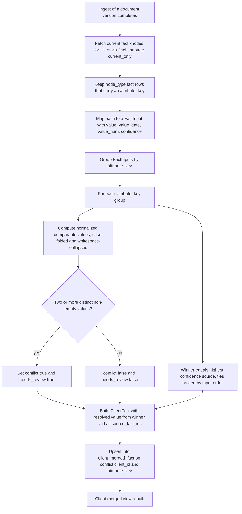
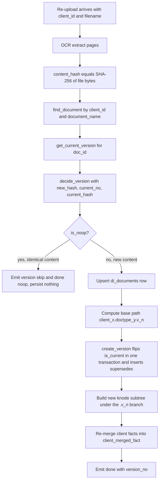
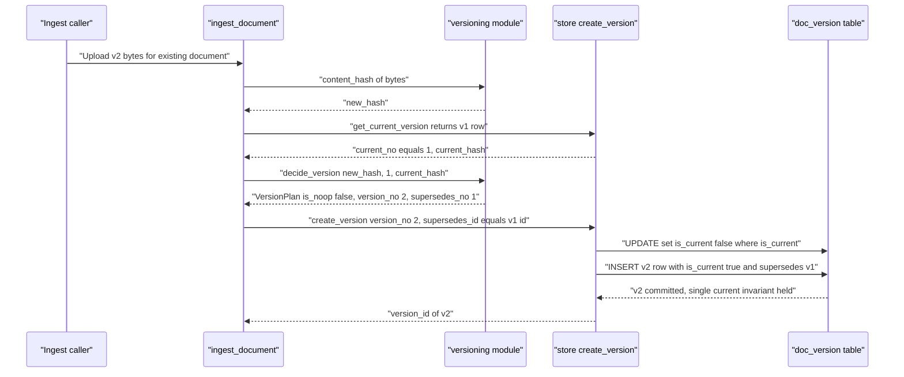

# Cross-Document Merge & Versioning Flow

> Status: current implementation. Last updated 2026-06-24.

This document describes two intra-client data flows in the `document_intelligence` platform:

1. **Cross-document merge** — how per-document `fact` knodes are consolidated into one resolved
   `client_merged_fact` per canonical attribute key, using confidence-weighted resolution.
2. **Versioning** — how a re-uploaded document becomes a new immutable version via copy-on-write,
   with content-hash dedup, a supersession chain, a `changed_fields` diff, the `.v<n>` ltree path
   segment, and the version delta feed.

Both flows are **intra-client only** — there is no cross-client merge or comparison. Every query is
scoped to a single `client_id` and enforced by row-level security (decisions D7 and D11).

Related documentation:

- Design spec: [`../../specs/2026-06-24-document-intelligence-design.md`](../../specs/2026-06-24-document-intelligence-design.md) (sections 4, 5, 7)
- Requirements & decisions: [`../../../reports/requirements-and-interpretation.md`](../../../reports/requirements-and-interpretation.md) (D7, D11, Q-C, Q-K)
- Sibling flow: [`./ingest-flow.md`](./ingest-flow.md) — the end-to-end ingest pipeline that drives both flows

Source modules:

| Concern | Module |
|---|---|
| Pure merge resolution | [`di/subtree/merge.py`](../../../di/subtree/merge.py) |
| Pure versioning decisions + node diff | [`di/subtree/versioning.py`](../../../di/subtree/versioning.py) |
| Persistence (upsert, version chain, delta feed) | [`di/store.py`](../../../di/store.py) |
| Orchestration | [`di/pipeline.py`](../../../di/pipeline.py) |
| Domain models | [`di/models.py`](../../../di/models.py) |
| Schema | [`di/migrations/002_core_tables.sql`](../../../di/migrations/002_core_tables.sql) |
| Delta-feed endpoint | [`di/routers/clients.py`](../../../di/routers/clients.py) |

---

## 1. Cross-document merge

### 1.1 What it does

Across a client's documents the same canonical attribute may be asserted by several independent
sources — a passport MRZ read, an anchored key-value extraction, an LLM extraction from a bank
statement. The merge collapses all of those into exactly one resolved
[`ClientFact`](../../../di/models.py) per `attribute_key`, persisted as a `client_merged_fact` row.

The canonical attribute key namespace comes from [`di/ontology.py`](../../../di/ontology.py)
(for example `identity.date_of_birth`, `identity.full_name`, `id.passport_number`). Two facts merge
**only** when they carry the identical key.

### 1.2 Resolution policy (decision Q-K: confidence-weighted plus flag)

The resolution logic lives in `merge_facts` in [`di/subtree/merge.py`](../../../di/subtree/merge.py)
and is **pure** — no database, no network, deterministic output:

- **Group** all candidate `FactInput`s by `attribute_key`.
- **Winner** is the source with the **highest `confidence`**. Recency is intentionally *not* a
  tiebreaker — the subtree's `valid_from` / `valid_to` columns own real-world validity windows, not
  the merge. Confidence ties are broken by input order (first wins) for determinism.
- The resolved value (`resolved_value`, `value_date`, `value_num`) and `confidence` are taken from
  the winning source.
- **Conflict detection**: sources are compared on a normalized, hashable view of their value.
  String values are whitespace-collapsed and case-folded so cosmetic OCR differences
  (`"John  Smith"` versus `"john smith"`) do **not** count as a conflict. When two or more distinct,
  non-empty comparable values exist in a group, `conflict` and `needs_review` are both set to `true`.
- **All sources retained**: `source_fact_ids` lists every contributing `fact_id` — winners and
  losers alike — so the merged view always fans out to its provenance in the knode facts.

Output is one `ClientFact` per distinct key, sorted by `attribute_key` for stable ordering.

### 1.3 How it runs in the pipeline

Merge is **not** a per-document delta. After every successful ingest the pipeline rebuilds the
entire client-level view from scratch, so it is always derivable from the current `fact` knodes.
`_remerge_client_facts` in [`di/pipeline.py`](../../../di/pipeline.py):

1. Fetches the client's `fact` knodes restricted to current versions
   (`store.fetch_subtree(client_id, current_only=True)`).
2. Maps each fact knode that has an `attribute_key` into a `merge.FactInput`.
3. Calls `merge.merge_facts(...)` to resolve them.
4. Upserts the results via `store.upsert_merged_facts(...)`.

The upsert is an `INSERT ... ON CONFLICT (client_id, attribute_key) DO UPDATE` against
`client_merged_fact` (see [`di/store.py`](../../../di/store.py)), so one row exists per
`(client_id, attribute_key)` and it is overwritten on each re-merge.

### 1.4 Merge flow diagram



### 1.5 Worked example

Three documents assert `identity.date_of_birth` for the same client:

| Source fact | Extractor | Value | Confidence |
|---|---|---|---|
| `fact-a` | passport MRZ (checksum verified) | `1985-03-12` | 0.98 |
| `fact-b` | driver-license anchored KV | `1985-03-12` | 0.71 |
| `fact-c` | LLM read of a bank letter | `1985-12-03` | 0.55 |

Result in `client_merged_fact`:

- `resolved_value` / `value_date` = `1985-03-12` (from `fact-a`, highest confidence)
- `confidence` = `0.98`
- `conflict` = `true`, `needs_review` = `true` (`fact-c` disagrees on the comparable date)
- `source_fact_ids` = `[fact-a, fact-b, fact-c]` (all three retained)

`fact-a` and `fact-b` agree, so on their own they would not raise a conflict; `fact-c`'s differing
date is what trips the flag. The reviewer keeps the high-confidence MRZ value while seeing the full
provenance fan-out.

### 1.6 Serving the merged view

`GET /api/v1/clients/{client_id}/facts` ([`di/routers/clients.py`](../../../di/routers/clients.py))
reads `client_merged_fact` and projects it through `serving.project_facts`. That projection derives:

- a **`verified`** flag (`confidence >= 0.8` **and** not `conflict`),
- a **`sensitivity`** level from the attribute key, and
- an optional masked `resolved_value` when `mask=true` and the key is maskable.

`verified_only=true` filters out unverified or conflicting facts.

---

## 2. Versioning (copy-on-write)

### 2.1 What it does

Each re-upload of a logically-same document (same `client_id` plus `document_name`) is treated as a
new **immutable version** rather than an in-place mutation (decisions in design spec section 5.4 and
Q-C). A version is identified by the SHA-256 of its bytes. The flow decides, per upload, whether the
content is:

- **Identical** to the current version — a **no-op** (nothing is written), or
- **New** — a new `doc_version` row that **supersedes** the prior current version and flips the
  current pointer.

### 2.2 Content-hash dedup

`content_hash` in [`di/subtree/versioning.py`](../../../di/subtree/versioning.py) returns the
lowercase hex SHA-256 of the document bytes (strings are UTF-8 encoded first, so the same logical
content always hashes identically). The pipeline computes this hash from `file_bytes` immediately
after OCR and before any expensive work.

`decide_version(new_hash, current_no, current_hash)` returns a `VersionPlan`:

- If `new_hash == current_hash`, `is_noop=True`, `version_no` stays at `current_no` (or `0`), and
  nothing is superseded.
- Otherwise `is_noop=False`, `version_no = (current_no or 0) + 1`, and `supersedes_no = current_no`
  (`None` for the very first version).

On a no-op the pipeline short-circuits: it emits a `version` skip event and a `done` event with
`noop: true`, persisting nothing. An identical re-upload is therefore genuinely free of new rows.

### 2.3 The version chain and `is_current`

The `doc_version` table ([`di/migrations/002_core_tables.sql`](../../../di/migrations/002_core_tables.sql))
holds the immutable chain:

| Column | Role |
|---|---|
| `id` | Version id (referenced by `knode.version_id` / `arep.version_id`) |
| `doc_id` | The logical document (`di_documents.id`) |
| `version_no` | Monotonic per-document version number |
| `content_hash` | SHA-256 dedup guard |
| `supersedes` | The `doc_version.id` this version replaces (null for v1) |
| `is_current` | Exactly one current version per document |
| `changed_fields` | JSONB diff describing what changed (see below) |

A **partial unique index** enforces the single-current invariant:

```sql
CREATE UNIQUE INDEX doc_version_one_current
    ON doc_version (client_id, doc_id) WHERE is_current;
```

`create_version` in [`di/store.py`](../../../di/store.py) flips the pointer inside a single
transaction: it first sets `is_current = false` on the prior current row, then inserts the new row
with `is_current = true`. Because both statements run in one transaction, the partial-unique index is
never violated.

> Note: `decide_version` reasons in terms of `version_no`, while `create_version` records the
> superseded version by its **`id`** (`supersedes_id`), resolved by the pipeline from the current
> version row. The two views of "what was superseded" stay consistent.

### 2.4 The `.v<n>` ltree path segment

Knowledge subtree nodes are versioned in their `path`. `_base_path` in
[`di/pipeline.py`](../../../di/pipeline.py) builds the document root path as:

```
client_<client_id>.doctype_<doc_type>.v<version_no>
```

for example `client_42.doctype_us_passport.v2`. The `.v<n>` segment means every version's nodes live
under a distinct ltree subtree, so versions never collide in the `path` namespace and time-travel
reads can target a specific version's branch. Labels are sanitized to the ltree-safe alphabet by
`build.sanitize_label`.

This realizes the **copy-on-write** model: v1's nodes remain untouched; the new version gets a fresh
set of `knode` rows under its own `.v<n>` branch (full per-version node copies are the v1 default per
Q-C). Default reads filter to current versions via the `_current_clause` predicate in
[`di/store.py`](../../../di/store.py).

### 2.5 The `changed_fields` diff

`diff_nodes(old, new)` in [`di/subtree/versioning.py`](../../../di/subtree/versioning.py) compares two
lists of `(path, node_content_hash)` pairs and emits change entries:

- A path present only in `new` is `added`.
- A path present only in `old` is `removed`.
- A path present in both with a differing hash is `modified`.
- Unchanged paths are omitted.

Duplicate paths within one input collapse to their last occurrence (a node path is a stable
identity). Results are ordered: `added` / `modified` entries follow `new`'s order, then `removed`
entries follow `old`'s order. The result is a list of `{"path": ..., "change": ...}` dicts suitable
for the `doc_version.changed_fields` JSONB column.

### 2.6 Versioning flow diagram



### 2.7 Supersession sequence



### 2.8 The delta feed (`GET /changes`)

The change-awareness surface for periodic re-KYC is served by
`GET /api/v1/clients/{client_id}/changes?since=<timestamp>`
([`di/routers/clients.py`](../../../di/routers/clients.py)), backed by `store.list_version_changes`:

- It joins `doc_version` to `di_documents` to return each version row together with its
  `document_name` and `doc_type`.
- The optional `since` query parameter filters to versions created on or after a timestamp
  (`created_at >= $since::timestamptz`).
- Results are ordered `created_at DESC` (newest first).

Each entry carries the version's `changed_fields` diff, so a downstream consumer can ask "what
changed since my last poll" and see exactly which knode paths were added, modified, or removed across
the client's documents.

---

## 3. How the two flows relate

Versioning and merge run back to back at the tail of every ingest (see
[`./ingest-flow.md`](./ingest-flow.md)):

1. **Version** is decided first — a no-op short-circuits the entire pipeline before any extraction.
2. A new version writes a fresh `.v<n>` subtree of `fact` knodes.
3. **Merge** then rebuilds `client_merged_fact` from the client's *current* fact knodes, so the
   merged view always reflects the latest versions.

Because the merged view is fully derivable from current `knode` facts, and because superseded
versions are retained immutably, the platform supports both a single consolidated answer per
attribute (merge) and full historical / time-travel reads (versioning) without the two ever fighting
over the same row.
