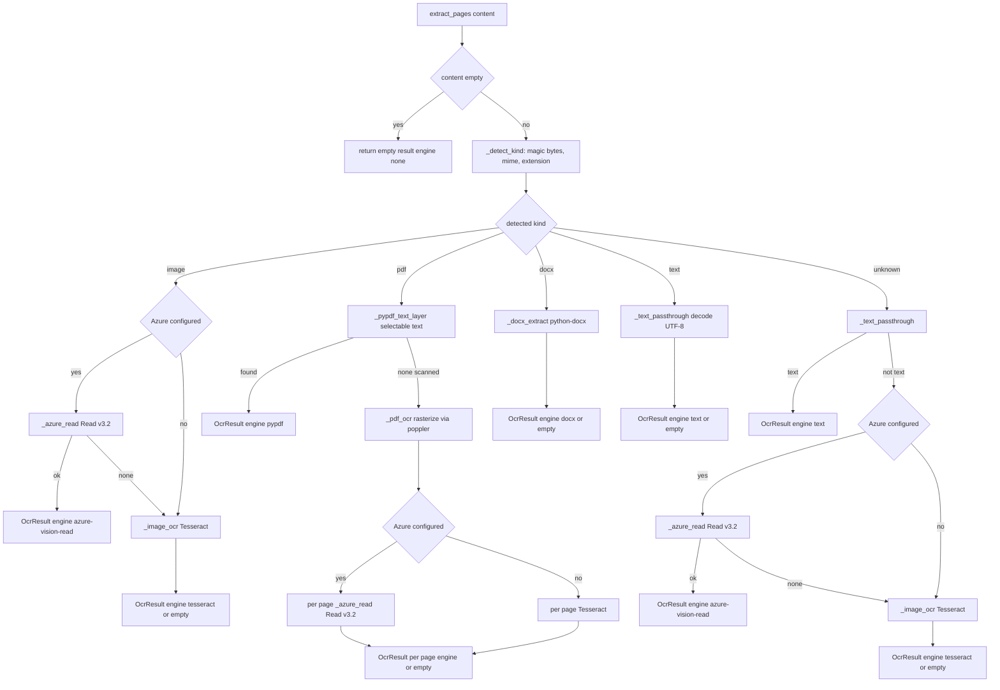
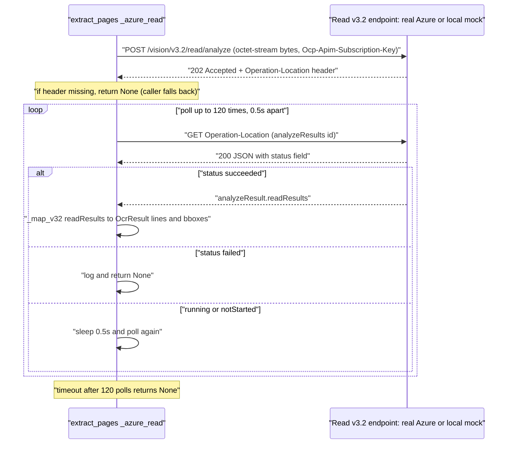
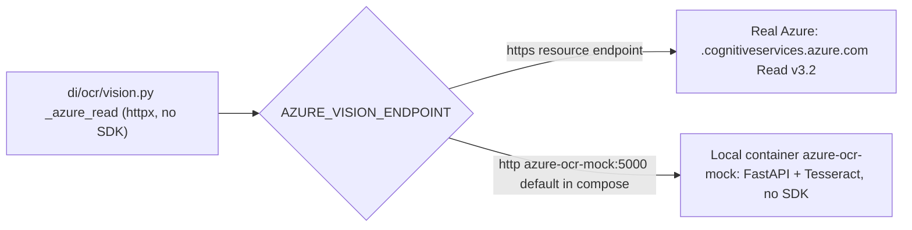

# OCR Flow

> Status: Accepted - Last updated 2026-06-24

How the Document Intelligence platform turns raw uploaded bytes into an `OcrResult`
(text plus per-line geometry and confidence) that the rest of the pipeline consumes.

The single public entrypoint is `extract_pages` in [`di/ocr/vision.py`](../../../di/ocr/vision.py).
It is the first stage of the ingest pipeline (see
[`di/pipeline.py`](../../../di/pipeline.py), stage `ocr`) and feeds the PII-safe gate, the
deterministic extractors, and the knowledge-subtree builder.

Related docs:

- [Design spec](../../specs/2026-06-24-document-intelligence-design.md)
- [Requirements and interpretation](../../../reports/requirements-and-interpretation.md)
- [Ingest pipeline flow](./ingest-flow.md)
- [Gate flow](./gate-flow.md)

---

## 1. Contract: `extract_pages` never raises

`extract_pages(content, *, filename="", mime=None) -> OcrResult` is designed so that no
upstream caller ever has to wrap it in a `try`/`except`. Every optional dependency (Azure
HTTP path, `pypdf`, `python-docx`, `pytesseract`/`Pillow`, `pdf2image`/poppler) is imported
lazily inside the function that uses it, and every external call is wrapped so that any
failure degrades to the next-best path. The worst case is an empty result, never an
exception.

The returned `OcrResult` carries the engine that produced it. The `engine` value is recorded
on the document row (`DocumentMeta.ocr_engine`) and emitted on the SSE `ocr` event, so the
chosen path is always observable.

| Engine constant | `engine` value | Produced by |
|---|---|---|
| `ENGINE_AZURE` | `azure-vision-read` | Azure Computer Vision Read v3.2 over `httpx` (real Azure or the local mock) |
| `ENGINE_PYPDF` | `pypdf` | Native PDF text-layer extraction (not OCR) |
| `ENGINE_DOCX` | `docx` | `python-docx` paragraph and table-cell extraction |
| `ENGINE_TESSERACT` | `tesseract` | Local Tesseract OCR of an image or rasterized PDF page |
| `ENGINE_TEXT` | `text` | Plain-text passthrough (UTF-8 or `text/*`) |
| `ENGINE_NONE` | `none` | Empty result; nothing could be extracted |

---

## 2. Format routing in `extract_pages`

`extract_pages` first classifies the upload with `_detect_kind`, using magic bytes, the MIME
hint, and the filename extension, into one of `pdf`, `docx`, `image`, `text`, or `unknown`.
It then routes to the path for that kind. Azure is only attempted when
`Settings.has_azure_vision` is true, that is, when both `AZURE_VISION_ENDPOINT` and
`AZURE_VISION_KEY` are set.



### Path notes

- **Image** (`image/*`, PNG, JPEG, TIFF, BMP, WEBP, HEIC): Azure Read v3.2 when configured,
  otherwise Tesseract. If Azure returns `None` (any error or empty mapping) the code falls
  through to Tesseract rather than failing.
- **PDF**: the cheap, offline `pypdf` text-layer path is tried first. A native digital PDF
  with a selectable text layer returns `engine: pypdf` with one `OcrLine` per physical line
  (no geometry, since pypdf does not expose reliable per-line bounding boxes). Only a
  scanned PDF, where no text layer is recovered, is rasterized by `pdf2image`
  (poppler, 200 DPI) and each page image is OCR'd, by Azure when configured, otherwise by
  Tesseract. The resulting `engine` reflects whichever per-page OCR ran.
- **DOCX**: `python-docx` reads paragraphs and table cells into one `OcrLine` per non-empty
  block on page 1.
- **Text**: UTF-8 or `text/*` bytes are treated as already-OCR'd output, one `OcrLine` per
  non-empty line. This covers pre-OCR'd exports, plain-text KYC documents, and local or dev
  ingestion without a live OCR engine.
- **Unknown**: try text first, then Azure (if configured), then Tesseract, then empty.

---

## 3. Azure Computer Vision Read v3.2 contract

`_azure_read` speaks the Azure Computer Vision **Read v3.2** asynchronous REST contract
directly over `httpx`. It is a two-step async operation: a `POST` that returns `202 Accepted`
with an `Operation-Location` header, then a poll loop on that location until the job reports
`succeeded` or `failed`.



### Request and response details

- **Endpoint**: `POST {AZURE_VISION_ENDPOINT}/vision/v3.2/read/analyze` with the trailing
  slash stripped from the endpoint. Body is the raw bytes with
  `Content-Type: application/octet-stream`. Auth header is
  `Ocp-Apim-Subscription-Key: {AZURE_VISION_KEY}`.
- **Async handoff**: the `202` response carries `Operation-Location` (the header lookup is
  case-insensitive). If it is absent, `_azure_read` returns `None` and the caller degrades.
- **Polling**: up to 120 iterations spaced 0.5 seconds apart (about 60 seconds total) of
  `GET {Operation-Location}`. A lowercased `status` of `succeeded` maps the payload; `failed`
  returns `None`; anything else sleeps and retries. The `httpx.Client` itself uses a 60-second
  timeout, and any `httpx.HTTPError` returns `None`.
- **Mapping** (`_map_v32`): iterates `analyzeResult.readResults`, then `lines` per page. Each
  line becomes an `OcrLine` with the page number, the line `text`, an axis-aligned `BBox`
  derived from the v3.2 flat 8-value `boundingBox` polygon (`_bbox_from_polygon` collapses
  `[x1,y1,...,x4,y4]` to min/max corners), and a confidence averaged over the line's words.
  If no lines are produced the mapping returns `None`, so an empty Azure response falls back
  to Tesseract.

---

## 4. One client, two backends: real Azure or the local mock

The exact same `httpx` code in `_azure_read` talks to either real Azure or the local
`azure-ocr-mock` container, decided entirely by `AZURE_VISION_ENDPOINT`. There is no
conditional, no separate code path, and no Azure SDK on either side.



The mock ([`mock_azure_ocr/app.py`](../../../mock_azure_ocr/app.py)) is a small FastAPI app
that implements the identical v3.2 contract:

- `POST /vision/v3.2/read/analyze` runs Tesseract locally, stores the job, and returns `202`
  with an `Operation-Location` pointing at its own `analyzeResults/{id}`.
- `GET /vision/v3.2/read/analyzeResults/{id}` returns the job in the Azure v3.2 JSON shape
  (`{status, analyzeResult: {version, readResults: [...]}}`), including per-line and per-word
  `boundingBox` polygons and word confidences, so `_map_v32` parses it unchanged.
- `GET /health` is used by the compose healthcheck.

Because the mock returns the result on the first poll, the success path is exercised
end-to-end offline. Images ingested against the mock still report `engine: azure-vision-read`,
proving the Azure code path works without a real resource.

---

## 5. Configuration

| Setting | Env var | Default | Effect |
|---|---|---|---|
| Azure endpoint | `AZURE_VISION_ENDPOINT` | empty | Base URL for the Read v3.2 API |
| Azure key | `AZURE_VISION_KEY` | empty | `Ocp-Apim-Subscription-Key` value |
| Derived flag | (none) | `has_azure_vision` | True only when both endpoint and key are set |

Both settings live in [`di/config.py`](../../../di/config.py). The `has_azure_vision`
property gates whether the Azure path is attempted at all.

- **Both set** -> Azure Read v3.2 is the primary OCR engine for images and scanned PDFs.
- **Either unset** -> `has_azure_vision` is false and OCR uses local Tesseract directly.

The compose stack ([`docker-compose.yml`](../../../docker-compose.yml)) defaults the app to
the mock so the Azure code path is exercised offline:

```yaml
AZURE_VISION_ENDPOINT: ${AZURE_VISION_ENDPOINT:-http://azure-ocr-mock:5000}
AZURE_VISION_KEY: ${AZURE_VISION_KEY:-mock-key}
```

Point at real Azure with no code change by overriding the env:

```bash
AZURE_VISION_ENDPOINT=https://<resource>.cognitiveservices.azure.com/ \
AZURE_VISION_KEY=<key> docker compose up -d app
```

---

## 6. Decision: no Azure SDK in any container

The platform deliberately does **not** depend on the `azure-ai-vision` (or any Azure) SDK in
any image. The Read v3.2 contract is small and stable enough to speak directly over `httpx`:
a `POST`, a header read, and a `GET` poll loop. The benefits that motivated this decision:

- **One client, two backends.** The same `_azure_read` function targets real Azure or the
  local mock purely by endpoint, with no SDK-specific configuration object to swap.
- **Lean images.** Neither the application image
  ([`Dockerfile`](../../../Dockerfile)) nor the mock image
  ([`mock_azure_ocr/Dockerfile`](../../../mock_azure_ocr/Dockerfile)) carries the Azure SDK or
  its transitive dependencies. The app image only adds the system OCR tools `tesseract-ocr`
  and `poppler-utils`; the mock image only adds `tesseract-ocr`.
- **Faithful local testing.** Because the wire contract, not an SDK surface, is what both
  sides implement, the mock can be a genuine drop-in: it returns the exact v3.2 JSON shape
  `_map_v32` already parses.
- **No raises.** Wrapping plain `httpx` calls in the never-raises contract is straightforward;
  any `httpx.HTTPError` simply returns `None` and lets the caller fall back.

---

## 7. Engines summary

The `engine` reported on every `OcrResult` is one of:

- `azure-vision-read` - Azure Read v3.2 (real or mock) for images and scanned PDF pages.
- `pypdf` - native PDF text-layer extraction (offline, free, no OCR).
- `docx` - `python-docx` paragraph and table extraction.
- `tesseract` - local image or rasterized-PDF-page OCR.
- `text` - plain-text passthrough.
- `none` - empty result; nothing extracted.

---

## 8. Operational note: macOS ports 5000 and 5005

On macOS, the AirPlay Receiver squats on port `5000`, which collides with the mock's internal
listen port. The compose stack therefore publishes the mock on the host as `5005:5000`: the
container still listens on `5000` internally (the app reaches it at `http://azure-ocr-mock:5000`
over the compose network), but on the host it is reachable at `http://localhost:5005`.

When running the mock directly on a Mac without compose, either disable the AirPlay Receiver
(System Settings -> General -> AirDrop and Handoff) or run it on a different port, for example
`uvicorn app:app --host 0.0.0.0 --port 5005`. See
[`docker-compose.yml`](../../../docker-compose.yml) for the published mapping.
