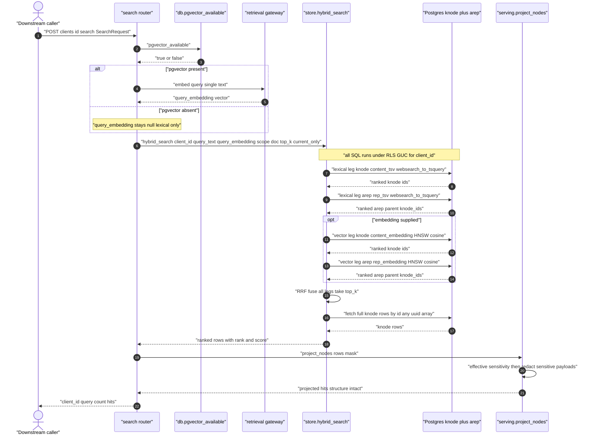
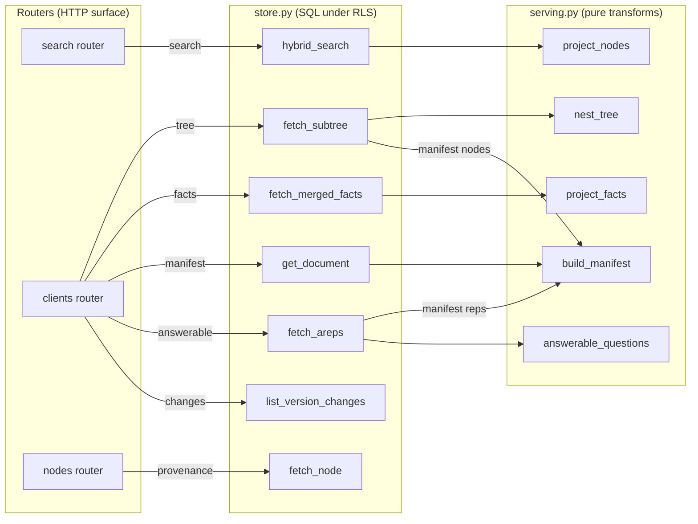
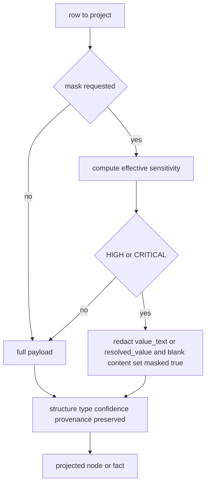

# Search & Serving Flow

> Status: current. Last updated 2026-06-24.

This document describes the **read side** of the document_intelligence platform: how a client
queries its KYC knowledge tree (`POST /api/v1/clients/{id}/search`) and how the other serving
endpoints expose the tree, facts, capabilities manifest, answerable-questions index, provenance,
and version changes. It also documents the toggleable, access-aware **masking projection** applied
to every response.

The serving layer is split cleanly in the code:

- **Routers** (`di/routers/search.py`, `di/routers/clients.py`, `di/routers/nodes.py`) — HTTP
  surface; thin orchestration only.
- **Store** (`di/store.py`) — all SQL; every call goes through `di.db.acquire(client_id)`, which
  binds the row-level-security (RLS) tenant GUC for the connection checkout.
- **Serving transforms** (`di/serving.py`) — pure, dependency-free functions over already-fetched
  rows (no DB, no network): tree nesting, masking, fact/node projection, manifest, answerable index.

Related: [ingest flow](./ingest-flow.md) (write side) · [gate flow](./gate-flow.md) ·
[storage schema](../storage-schema.md) · [design spec](../../specs/2026-06-24-document-intelligence-design.md)
(§6 capabilities, §8 serving API, §9 security; decision D13 on masking).

---

## 1. Search: `POST /api/v1/clients/{id}/search`

The search call is the "find relevant documents / ask a question about a part" entry point. It
performs **hybrid retrieval** — lexical, dense (vector), and structural (`ltree` scope) — fused by
**Reciprocal Rank Fusion (RRF)**, using the **index-many / return-parent** pattern: representations
in `arep` are searched alongside `knode` content, but every hit is collapsed back to its parent
`knode`, which is what the caller receives.

### 1.1 Request

```json
POST /api/v1/clients/acme-bank-mx/search
Content-Type: application/json
X-API-KEY: <key>

{
  "query": "fecha de nacimiento del titular",
  "scope_path": "doc_ine_2026.identity",
  "doc_id": "f3c9...",
  "top_k": 20,
  "current_only": true,
  "mask": true
}
```

| Field          | Type    | Required | Default | Meaning |
|----------------|---------|----------|---------|---------|
| `query`        | string  | yes      | —       | Natural-language or keyword query; may be EN or ES. |
| `scope_path`   | string  | no       | `null`  | `ltree` prefix; restricts search to a subtree (`path <@ scope_path`). |
| `doc_id`       | string  | no       | `null`  | Restrict to a single document. |
| `top_k`        | int     | no       | `20`    | Number of fused hits returned. |
| `current_only` | bool    | no       | `true`  | Restrict to nodes whose `version_id` is the document's current version. |
| `mask`         | bool    | no       | `false` | Toggle the access-aware masking projection (see §4). |

The body is `SearchRequest` in `di/routers/search.py`. `client_id` comes from the path and scopes
the entire query under RLS.

### 1.2 Sequence



### 1.3 Step-by-step

1. **Embed the query (vector-optional).** The router calls `pgvector_available()`. Only when
   pgvector is installed does it embed the query through the **retrieval gateway**
   (`get_retrieval_client().embed([query])`). The platform holds no model credentials of its own —
   all embedding, LLM, and rerank calls are delegated to the retrieval service (decision D12). The
   client is closed in a `finally` block. If pgvector is absent, `query_embedding` stays `None` and
   search degrades cleanly to lexical-only.

2. **`store.hybrid_search`** runs up to four ranked legs under the client's RLS scope. Each leg is
   independently scoped by `client_id`, optional `doc_id`, optional `scope_path` (`path <@ ::ltree`),
   and the current-version predicate when `current_only` is set:

   | Leg | Source | Predicate | Ordered by |
   |-----|--------|-----------|------------|
   | Lexical (knode) | `knode.content_tsv` | `@@ websearch_to_tsquery('simple', $q)` | `ts_rank(...)` desc |
   | Lexical (arep)  | `arep.rep_tsv`      | `@@ websearch_to_tsquery('simple', $q)` | `ts_rank(...)` desc |
   | Vector (knode)  | `knode.content_embedding` | `<=>` cosine via per-partition HNSW | nearest |
   | Vector (arep)   | `arep.rep_embedding`      | `<=>` cosine via per-partition HNSW | nearest |

   `content_tsv` and `rep_tsv` are `STORED` generated `tsvector` columns (GIN-indexed); the vector
   legs run only when an embedding was supplied. Each leg pulls a candidate pool of
   `max(top_k * 5, 50)` rows.

3. **Index-many / return-parent.** Both `arep` legs `SELECT a.knode_id` — the representation is the
   thing matched, but the **parent `knode`** is the unit of return. This lets many lightweight
   representations (hypothetical questions, propositions, translations, keyword sets) point retrieval
   at one canonical node without duplicating it.

4. **RRF fusion.** `_rrf(rankings, k=60)` assigns each node `1 / (k + rank)` per leg and sums across
   legs. Rank position, not raw score, drives fusion, so the lexical and vector legs combine without
   score-scale normalization. The top `top_k` fused ids are taken.

5. **Hydrate + annotate.** The fused ids are re-fetched as full `knode` rows
   (`id = ANY($2::uuid[])`, still client-scoped), re-ordered to match the fused ranking, and each row
   is annotated with `_rank` (1-based) and `_score` (its RRF score).

6. **Project with provenance.** The router calls `serving.project_nodes(hits, mask=req.mask)`, which
   surfaces the per-node fields (including `provenance`, `doc_id`, `version_id`, `confidence`,
   `verification_status`) and applies masking. `_rank`/`_score` are preserved on each hit.

### 1.4 Response

```json
{
  "client_id": "acme-bank-mx",
  "query": "fecha de nacimiento del titular",
  "count": 2,
  "hits": [
    {
      "id": "9b1c...",
      "node_type": "fact",
      "path": "doc_ine_2026.identity.date_of_birth",
      "attribute_key": "identity.date_of_birth",
      "value_text": "1984-07-02",
      "verification_status": "checksum_verified",
      "confidence": 0.97,
      "sensitivity": "HIGH",
      "doc_id": "f3c9...",
      "version_id": "a221...",
      "provenance": { "page": 1, "bbox": {"page": 1, "x0": 0.31, "y0": 0.44, "x1": 0.58, "y1": 0.47},
                      "extractor": "anchor", "model": null },
      "_rank": 1,
      "_score": 0.0492
    }
  ]
}
```

Each hit carries enough grounding (`doc_id`, `version_id`, `provenance.page`, `provenance.bbox`,
`extractor`, `confidence`, `verification_status`) to be traced one hop back to its exact source —
or to call `GET /api/v1/nodes/{id}/provenance` for the canonical provenance payload.

### 1.5 Degraded mode (no pgvector)

When pgvector is not installed the platform still serves search: the query is **not** embedded, the
two vector legs are skipped, and RRF fuses only the two lexical legs. Results are still scoped,
RLS-enforced, and return-parent — only dense recall is unavailable. This is the same graceful
degradation used at ingest time, where embedding columns and HNSW indexes are simply not created.

---

## 2. Serving endpoints

All serving endpoints are `client_id`-scoped, RLS-enforced, and gated by `X-API-KEY`. Every endpoint
that returns node/fact payloads accepts `?mask=true|false` (default `false`).

| Endpoint | Router | Returns |
|----------|--------|---------|
| `GET /api/v1/clients/{id}/tree?doc_id=&path=&max_depth=&current_only=&mask=` | `clients.py` | Nested subtree (roots → children) from flat `knode` rows. |
| `GET /api/v1/clients/{id}/facts?attribute_key=&verified_only=&mask=` | `clients.py` | Cross-document **merged** client facts with a derived `verified` flag. |
| `GET /api/v1/clients/{id}/documents` | `clients.py` | Document inventory (most recent first). |
| `GET /api/v1/clients/{id}/changes?since=` | `clients.py` | Version delta feed (versions + `changed_fields`). |
| `GET /api/v1/clients/{id}/docs/{doc_id}/manifest` | `clients.py` | Self-describing capabilities manifest for one document. |
| `GET /api/v1/clients/{id}/docs/{doc_id}/answerable` | `clients.py` | Answerable-questions index (from `hypothetical_q` reps). |
| `GET /api/v1/nodes/{id}/provenance?client_id=` | `nodes.py` | One node's source doc / page / bbox / extractor / confidence. |
| `POST /api/v1/clients/{id}/search` | `search.py` | Ranked hybrid hits (see §1). |

### 2.1 Tree — `GET /clients/{id}/tree`

Fetches a flat list of `knode` rows via `store.fetch_subtree` (filterable by `doc_id`, `path`
prefix, `max_depth`, current version) and nests them with `serving.nest_tree`:

- Children are attached by `parent_id`; rows whose parent is absent from the result set become
  roots, so scoped/subtree queries still produce a valid forest.
- Children are ordered by `seq` then `path` at every level.
- `mask` is applied per node during projection.

### 2.2 Facts — `GET /clients/{id}/facts`

Returns the cross-document **merged** view (`client_merged_fact`, grouped by `attribute_key`,
resolved by confidence-weighted merge). `serving.project_facts` derives two things per fact:

- `verified` = `confidence >= 0.8` **and** not `conflict`. `verified_only=true` filters to these.
- `sensitivity` = derived from the `attribute_key` namespace (see §4.1).

When `mask=true`, the `resolved_value` of HIGH/CRITICAL facts is redacted.

### 2.3 Manifest — `GET /clients/{id}/docs/{doc_id}/manifest`

A self-describing summary of what one document knows and can do, built by `serving.build_manifest`
over the document row, its `knode` rows, and its `arep` rows. It surfaces document metadata
(`doc_type`, `jurisdiction`, `page_count`, dominant languages, `sensitivity`, `gate_decision`),
`node_type_counts`, the sorted set of `attribute_keys` present on `fact` nodes,
`verification_status_counts`, `accessibility_rep_counts` by rep type, and two capability flags:
`answerable` (true when any `hypothetical_q` reps exist) and `searchable` (always true). Returns
`404` if the document is unknown to the client.

### 2.4 Answerable questions — `GET /clients/{id}/docs/{doc_id}/answerable`

Materialized index of the `hypothetical_q` representations attached to a document
(`serving.answerable_questions`): each entry is `{question, knode_id, path, lang}`, pointing at the
node that answers it. This is the human-readable "what can I ask?" surface.

### 2.5 Provenance — `GET /nodes/{id}/provenance`

Node-level grounding lookup. `client_id` is a **required** query parameter (it is the RLS scope).
Returns `doc_id`, `version_id`, `node_type`, `attribute_key`, `verification_status`, `confidence`,
and the full `provenance` object (page + bbox + extractor + model). `404` if the node is not found
for that client. This endpoint is deliberately **not** masked — it is an audit/grounding surface.

### 2.6 Changes — `GET /clients/{id}/changes`

Version delta feed (`store.list_version_changes`): document versions, newest first, joined to
document name/type, each carrying its `changed_fields`. Optional `since` (a `timestamptz`) limits
the feed for periodic re-KYC ("what changed since last upload").

### 2.7 Endpoint structure



---

## 3. Provenance is carried, not reconstructed

Every `knode` row stores a `provenance` JSONB (`page`, `bbox`, `char_span`, `extractor`, `model`,
`extracted_at`) plus `doc_id`, `version_id`, `verification_status`, and `confidence`. Search hits
and tree nodes surface these fields directly, and `GET /nodes/{id}/provenance` returns the canonical
form. No serving path recomputes provenance — it is written at ingest and read back verbatim, which
is what makes every answer one hop from its exact source.

---

## 4. Access-aware masking projection (toggleable, non-breaking)

Masking is applied uniformly by the serving transforms in `di/serving.py`. It implements design
decision **D13**: masking is **toggleable** (`mask=false` ⇒ full view) and **non-breaking** — when
on, only sensitive **payloads** are redacted; structure, type, confidence, provenance, sensitivity
labels, and all non-PII content stay fully intact and traversable.

### 4.1 Effective sensitivity

For node projection, `_effective_sensitivity(row)` takes the **maximum** of two signals:

- the node's stored `sensitivity` (which different deterministic extractors set inconsistently), and
- the level **implied by the canonical `attribute_key`** via `sensitivity_for_key`:

  | Attribute key namespace | Sensitivity |
  |-------------------------|-------------|
  | `id.*` (SSN, ITIN, SIN, CURP, RFC, passport, INE, EIN, ...) | `CRITICAL` |
  | `identity.*`, `address.*`, `income.*`, `account.*` | `HIGH` |
  | everything else | `LOW` |

Because the canonical key is reliable, masking a CURP/SSN/passport number never depends on which
extractor produced the node. The effective sensitivity is surfaced back on the node so the displayed
sensitivity pill always matches the masking decision. (Fact projection in `project_facts` derives
sensitivity from the attribute key directly.)

### 4.2 What gets masked

Only `HIGH` and `CRITICAL` payloads are maskable (`_MASKABLE`). When `mask=true`:

- **Nodes** — `value_text` is redacted via `_redact` (last 4 chars kept for recognisability, e.g.
  `••••••••1984`; values of length ≤ 4 become `[REDACTED]`); `content`, if present, becomes
  `[REDACTED]`; `masked: true` is set. **All other fields stay intact** — `id`, `parent_id`, `path`,
  `node_type`, `seq`, `depth`, `title`, `attribute_key`, `verification_status`, `confidence`,
  `sensitivity`, validity dates, `provenance`, `doc_id`, `version_id`.
- **Facts** — `resolved_value` is redacted and `masked: true` is set; everything else (including the
  derived `verified` flag and `sensitivity`) stays intact.

`LOW`/`MEDIUM` content is never altered. This guarantees that turning masking on never breaks
structure, search, or traversal — it only blanks the sensitive values themselves.

### 4.3 Masking decision



---

## 5. Security & tenancy notes

- **RLS everywhere.** Every store call opens its connection through `acquire(client_id)`, binding
  the tenant GUC for the checkout. `knode` and `arep` are HASH-partitioned by `client_id` with
  `FORCE` row-level security, so cross-tenant reads are impossible even within a single query.
- **No cross-client data.** Merge and search are intra-client only; there is no cross-client view.
- **No model credentials here.** Query embedding (and any future rerank step) is delegated to the
  retrieval gateway (D12); the platform stores no Stellar/COIN/VDI credentials.
- **Masking is a projection, not deletion.** Underlying values remain stored and provenance-linked;
  masking only changes what a given response surfaces. The unmasked path (`mask=false`) and the
  provenance endpoint remain available for authorized/audit use.

---

## 6. Source map

| Concern | File / symbol |
|---------|---------------|
| Search request + orchestration | `di/routers/search.py` (`SearchRequest`, `search`) |
| Hybrid search + RRF | `di/store.py` (`hybrid_search`, `_rrf`, `_scope`, `_current_clause`) |
| Vector availability + HNSW | `di/db.py` (`pgvector_available`, `_ensure_vector_columns`) |
| Query embedding gateway | `di/retrieval_client.py` (`get_retrieval_client`, `embed`) |
| Tree / facts / manifest / answerable / changes | `di/routers/clients.py` |
| Provenance lookup | `di/routers/nodes.py` (`get_provenance`) |
| Pure serving transforms + masking | `di/serving.py` (`project_nodes`, `nest_tree`, `project_facts`, `build_manifest`, `answerable_questions`, `_effective_sensitivity`, `sensitivity_for_key`, `_redact`) |
| Schema (tsv columns, GIN/HNSW indexes) | `di/migrations/003_knode_arep.sql` |
| Attribute-key namespaces | `di/ontology.py` (`ATTRIBUTE_KEYS`) |
