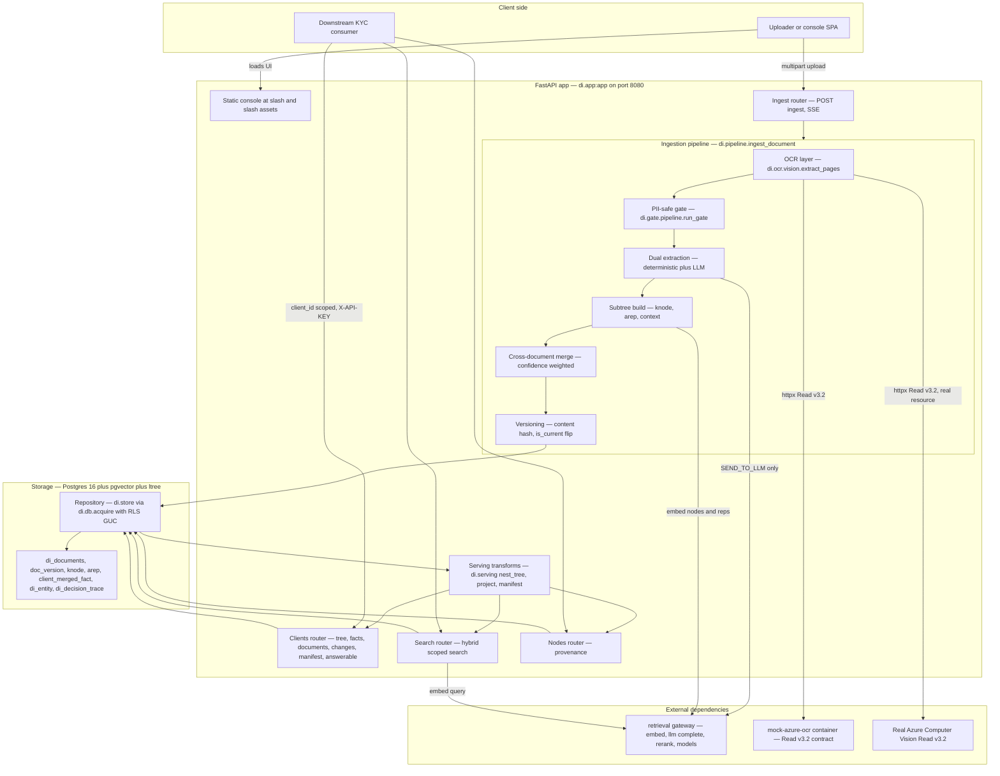
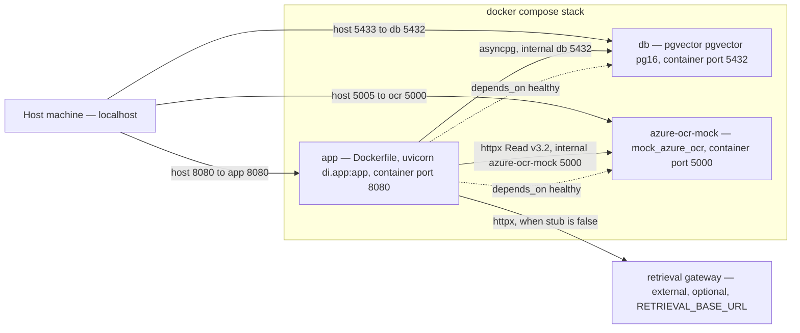

# Document Intelligence — Architecture Overview

**Status:** Living document · **Last updated:** 2026-06-24

This is the system-level map of the Document Intelligence platform: how a client's KYC document
travels from upload to a versioned, per-client knowledge tree, and how downstream services query
that tree. It is grounded in the committed code under [`di/`](../../di), the design spec
([`docs/specs/2026-06-24-document-intelligence-design.md`](../specs/2026-06-24-document-intelligence-design.md)),
and the decision log ([`reports/requirements-and-interpretation.md`](../../reports/requirements-and-interpretation.md)).

**Companion docs**

- Data model / ERD: [`flows/data-model-erd.md`](flows/data-model-erd.md)
- Ingestion pipeline flow: [`flows/ingestion-pipeline.md`](flows/ingestion-pipeline.md)
- PII-safe gate flow: [`flows/pii-gate.md`](flows/pii-gate.md)
- OCR layer flow: [`flows/ocr-layer.md`](flows/ocr-layer.md)
- Extraction (deterministic + LLM): [`flows/extraction.md`](flows/extraction.md)
- Knowledge subtree (knode + arep): [`flows/knowledge-subtree.md`](flows/knowledge-subtree.md)
- Serving / retrieval API: [`flows/serving-api.md`](flows/serving-api.md)

> Cross-links assume the per-flow docs live in `docs/architecture/flows/`. If a link 404s, that
> flow doc has not landed yet — the section below still describes the behaviour from the code.

---

## 1. What the system does

The platform turns a bank client's KYC documents (PDF, DOCX, PNG/JPEG, plain text) into a
**versioned, per-client knowledge tree** and serves it to downstream services for search,
single-document Q&A, and structured fact retrieval — PII-safe throughout.

- **Tenancy:** the primary key `client_id` arrives *with* the document; there is no entity
  resolution. Every row, every query, and every API call is scoped to one `client_id`.
- **Geography / languages:** US, Canada, Mexico · English + Spanish (bilingual documents
  supported).
- **The star data structure:** a per-document **knowledge subtree** built from two tables —
  `knode` (canonical, returnable nodes) and `arep` (multi-vector accessibility representations,
  searched). This is the "index-many / return-parent" pattern.
- **Model access is delegated.** Embeddings, LLM completion, and reranking are *not* performed
  locally. They go through the external **`retrieval`** service over HTTP. The platform holds no
  Stellar / COIN / VDI credentials.

---

## 2. The whole system at a glance

The diagram below traces a single document from the browser/console to the downstream consumer,
through every internal stage, with the two external systems (the retrieval gateway and the mock
Azure OCR container) drawn as separate boxes.



**Reading the flow:**

1. A document is uploaded to `POST /api/v1/ingest` (multipart). The same app also serves the
   browser console as a static SPA from `frontend/dist`.
2. `ingest_document` drives the pipeline and yields stage events that the router re-streams as
   **Server-Sent Events** (`ocr → gate → extract → subtree → arep → merge → done`).
3. **OCR** talks the Azure Computer Vision **Read v3.2** REST contract over `httpx` — pointed at
   the mock container by default, or a real Azure resource via env. Local fallbacks cover
   digital PDFs, DOCX, plain text, and Tesseract images.
4. The **PII-safe gate** classifies and assigns a routing decision *without any network call*.
5. **Extraction** always runs the deterministic path; the **LLM path** runs only when the gate
   returns `SEND_TO_LLM`, calling the retrieval gateway.
6. The **subtree build** assembles `knode` nodes (and, for LLM-allowed docs, `arep` aids), embeds
   them via the retrieval gateway, and persists everything.
7. **Merge** rebuilds the client-level `client_merged_fact` view; **versioning** stamps a new
   `doc_version` and flips `is_current`.
8. Downstream consumers read the tree, facts, search results, manifest, answerable-questions, and
   per-node provenance — all `client_id`-scoped and behind `X-API-KEY`.

---

## 3. Component catalog

| Component | Responsibility | Key files |
|---|---|---|
| Application factory + lifespan | Builds the FastAPI app, mounts routers + the static SPA, opens the DB pool, applies migrations, learns the embedding dimension from `/api/models`. Degrades to a bootable state on any startup failure. | [`di/app.py`](../../di/app.py) |
| Ingestion driver | Async generator orchestrating the full pipeline; emits `IngestEvent` stages; dedups by content hash; persists the subtree and re-merges facts. | [`di/pipeline.py`](../../di/pipeline.py) |
| OCR layer | Never-raises multi-format text + line-geometry extraction. Azure Read v3.2 over `httpx` (no SDK), with `pypdf` / `python-docx` / Tesseract / plain-text fallbacks. | [`di/ocr/vision.py`](../../di/ocr/vision.py) |
| PII-safe gate | Local-only, synchronous: language → anchors + checksums → classifier → Presidio PII/sensitivity → fail-safe routing decision. | [`di/gate/pipeline.py`](../../di/gate/pipeline.py), [`di/gate/language.py`](../../di/gate/language.py), [`di/gate/anchors.py`](../../di/gate/anchors.py), [`di/gate/classifier.py`](../../di/gate/classifier.py), [`di/gate/pii.py`](../../di/gate/pii.py), [`di/gate/routing.py`](../../di/gate/routing.py) |
| Deterministic extraction | Per-jurisdiction (US/CA/MX + universal passport MRZ) checksum-verified field extraction from the OCR dump; always runs, no network. | [`di/extract/deterministic/`](../../di/extract), [`di/extract/base.py`](../../di/extract/base.py) |
| LLM extraction | Classification + attribute KV extraction via the retrieval gateway; runs only on `SEND_TO_LLM`. | [`di/extract/llm_extract.py`](../../di/extract/llm_extract.py) |
| Subtree build | Assembles the `knode` tree (document → section → chunk/table/figure → fact + summary), structure-aware chunking, `ltree` paths. | [`di/subtree/build.py`](../../di/subtree) |
| Context enrichment | Per-node `context_prefix` generation (LLM-allowed docs). | [`di/subtree/context.py`](../../di/subtree/context.py) |
| Accessibility reps (`arep`) | Generates hypothetical questions, propositions, summaries, alt-phrasings, table/figure descriptions, EN↔ES translations. | [`di/subtree/arep.py`](../../di/subtree/arep.py) |
| Cross-document merge | Confidence-weighted consolidation of `fact` knodes into `client_merged_fact`; flags conflicts + `needs_review`. | [`di/subtree/merge.py`](../../di/subtree/merge.py) |
| Versioning | Content-hash dedup, version number assignment, `is_current` management. | [`di/subtree/versioning.py`](../../di/subtree/versioning.py) |
| Persistence / repository | All SQL; goes through `acquire(client_id)` to bind the RLS GUC; hybrid search (RRF fusion of dense + lexical + structural, index-many/return-parent). | [`di/store.py`](../../di/store.py) |
| Data layer | asyncpg pool, `search_path` + jsonb codec, RLS GUC binding, idempotent migration runner, programmatic HASH partitions, runtime pgvector columns + HNSW indexes. | [`di/db.py`](../../di/db.py) |
| Migrations | Extensions, core tables, knode/arep, RLS policies. | [`di/migrations/`](../../di/migrations) |
| Serving transforms | Pure (no DB/network) projections: nest flat rows into a tree, toggleable masking, manifest, answerable-questions. | [`di/serving.py`](../../di/serving.py) |
| REST routers | Ingest (SSE), clients (tree/facts/documents/changes/manifest/answerable), search, nodes (provenance). | [`di/routers/`](../../di/routers) |
| Domain model | Pydantic models + enums shared everywhere (`NodeType`, `RepType`, `GateDecision`, `SensitivityBucket`, …). | [`di/models.py`](../../di/models.py) |
| Ontology | US/CA/MX taxonomy, canonical attribute-key catalog, per-type field schemas; data, not logic. | [`di/ontology.py`](../../di/ontology.py) |
| Retrieval client | Thin async HTTP client for the model gateway; in-process stub for offline runs. | [`di/retrieval_client.py`](../../di/retrieval_client.py) |
| Mock Azure OCR | Standalone container speaking the Read v3.2 contract using local Tesseract; lets the Azure code path run offline. | [`mock_azure_ocr/app.py`](../../mock_azure_ocr/app.py) |

---

## 4. Technology stack

| Layer | Choice | Notes |
|---|---|---|
| Language / runtime | Python 3.12 | Slim base image; `uv` for installs |
| Web framework | FastAPI + `sse-starlette` | Routers under `/api/v1`; SSE for ingest progress |
| ASGI server | uvicorn | `di.app:app` on port 8080 |
| Database | PostgreSQL 16 (`pgvector/pgvector:pg16`) | Single store for documents, tree, facts, audit |
| Vector search | pgvector, HNSW (`vector_cosine_ops`) | Columns + indexes added **at runtime** once embedding dim is known; per-partition indexes |
| Hierarchy | `ltree` | Tree paths on `knode` / `arep`; GiST indexes |
| Full-text search | Postgres `tsvector` + GIN | Generated `content_tsv` / `rep_tsv` columns |
| DB driver | asyncpg (pool) | Per-connection `search_path` + jsonb codec; per-acquire RLS GUC |
| OCR | Azure Computer Vision **Read v3.2** REST | Driven directly over `httpx` — **no Azure SDK** in any image |
| OCR fallbacks | `pypdf`, `python-docx`, Tesseract (`pytesseract` + Pillow + poppler/`pdf2image`), plain-text passthrough | OCR layer never raises; degrades through these in order |
| Language detection | `lingua-py` (EN/ES) | Optional dep; fail-safe when absent |
| Classification | TF-IDF + `LinearSVC` / SetFit, with anchor gazetteers + ID checksums | No trained model required to launch (rules-only) |
| PII / sensitivity | Presidio (`en_core_web_lg`, `es_core_news_lg`) + custom MX recognizers | Optional dep; deterministic regex sweep + fail-safe CRITICAL when absent |
| ID validation | `python-stdnum`, `PassportEye`/`mrz`, `dateparser`, `rapidfuzz`, `usaddress` | Deterministic, checksum-backed |
| Model gateway | External **`retrieval`** service (`/api/embed`, `/api/llm/complete`, `/api/rerank`, `/api/models`) | Reached via `httpx`; `X-API-KEY`; in-process stub for offline |
| Frontend | Static SPA, no build step | Served from `frontend/dist`; `/api/*` returns 404 from the SPA fallback |
| Packaging / deploy | Docker + Docker Compose | App + pgvector DB + mock OCR |

See [`reports/retrieval-api-requirements.md`](../../reports/retrieval-api-requirements.md) for the
exact model-gateway contract the retrieval team must deploy.

---

## 5. Deployment topology

`docker compose up --build` brings up three services. The app applies migrations on startup; the
compose DB ships pgvector, so the full vector path is exercised. The mock OCR container lets the
Azure code path run end-to-end offline.



**Service notes (from [`docker-compose.yml`](../../docker-compose.yml)):**

- **`app`** — built from the repo `Dockerfile` (Python 3.12-slim + Tesseract + poppler). Live-mounts
  `./di` and `./frontend/dist` read-only so edits apply on restart without a rebuild. Key env:
  `PG_*`, `PG_HASH_PARTITIONS=8`, `RLS_ENABLED=false` (demo connects as DB owner; prod uses a
  non-superuser + RLS), `DI_RETRIEVAL_STUB=true` (offline gateway), `AZURE_VISION_ENDPOINT`
  defaulting to `http://azure-ocr-mock:5000`, `EMBEDDING_DIM_DEFAULT=768`, `AREP_ASYNC=false`.
- **`db`** — `pgvector/pgvector:pg16`; host port **5433** maps to container 5432 (avoids clashing
  with a host Postgres); `pg_isready` healthcheck; persistent `pgdata` volume.
- **`azure-ocr-mock`** — built from `./mock_azure_ocr` (plain Python + Tesseract, no Azure SDK);
  host port **5005** maps to container 5000 (macOS AirPlay squats on 5000); the app reaches it on
  the internal `:5000`.
- The app `depends_on` both `db` and `azure-ocr-mock` being healthy before it starts.

**Pointing at real services (no code change):**

```bash
# Real Azure OCR
AZURE_VISION_ENDPOINT=https://<resource>.cognitiveservices.azure.com/ \
AZURE_VISION_KEY=<key> docker compose up -d app

# Real model gateway: set RETRIEVAL_BASE_URL and DI_RETRIEVAL_STUB=false in docker-compose.yml
```

If `AZURE_VISION_*` is unset entirely, OCR falls back to local Tesseract. If the local Postgres
lacks pgvector (e.g. a bare `uvicorn`/`pytest` run against host Postgres), search degrades to
FTS-only.

---

## 6. Cross-cutting concerns

### 6.1 Security & multi-tenant isolation (RLS)

- **`client_id` everywhere.** Every table carries `client_id`; it arrives with the document and
  scopes every read and write. There is no cross-client merge (intra-client only).
- **Row-Level Security, `FORCE`d.** Migration [`004_rls.sql`](../../di/migrations/004_rls.sql)
  enables and `FORCE`s RLS on all seven tables with a `tenant_isolation` policy of
  `client_id = current_setting('app.current_client_id', true)` for both `USING` and `WITH CHECK`.
- **Per-acquire GUC binding.** `di.db.acquire(client_id)` sets `app.current_client_id` on checkout
  and resets it on release (when `RLS_ENABLED` is true). In production the app connects as a
  non-superuser so even the table owner is filtered; the compose demo connects as the DB owner with
  `RLS_ENABLED=false` and relies on the application always passing `client_id`.
- **HASH partitioning.** `knode` and `arep` are `PARTITION BY HASH (client_id)` (count from
  `PG_HASH_PARTITIONS`), partitions created programmatically by `di.db`, each with its own HNSW
  index. Lower-volume tables in `002_core_tables.sql` are non-partitioned but RLS-isolated.
- **API auth.** All `/api/v1/*` endpoints are `client_id`-scoped and gated by `X-API-KEY`.
- **The PII-safe gate** keeps sensitive content local: only `SEND_TO_LLM` documents leave for the
  external gateway; `REDACT_THEN_SEND` is implemented but inactive in v1; everything else stays
  `DETERMINISTIC_ONLY`. The decision is **fail-safe** (see [`di/gate/routing.py`](../../di/gate/routing.py)).
- **Masking projections** (see [`di/serving.py`](../../di/serving.py)) give least-privilege serving.
  They are toggleable (`?mask=`): when on, only HIGH/CRITICAL sensitive values are masked while
  structure, non-PII content, provenance, and traversal stay intact. Effective sensitivity is the
  max of a node's stored value and the level implied by its canonical `attribute_key`
  (`id.*` → CRITICAL, `identity.*`/`address.*`/`income.*`/`account.*` → HIGH).
- **No model credentials here.** No Stellar/COIN/VDI secrets live in this repo; secrets come from
  env / secret manager.

### 6.2 Provenance & verifiability

- Every `knode` carries `provenance jsonb` (page / bbox / offsets / extractor + model+version),
  a `verification_status` (`checksum_verified`, `gov_verified`, `llm_unverified`, `unverified`),
  and a `confidence`. `GET /api/v1/nodes/{id}/provenance` returns the source doc/page/bbox + extractor
  + confidence in one hop.
- `client_merged_fact` keeps `source_fact_ids[]` fanning back to the contributing `knode` facts and
  sets `conflict` / `needs_review` on disagreement — the merged view is fully rebuildable from the
  fact nodes.
- `di_decision_trace` is the per-document compliance audit (classifier output + confidence, PII
  entities + scores, gate decision, language profile).
- Soft delete (`deleted_at`) + partial indexes retain history for auditability.

### 6.3 Observability

- Ingest progress is observable in real time via the **SSE** stage stream
  (`ocr → gate → extract → subtree → arep → merge → done`), each event carrying structured detail
  (engine, page count, doc_type, sensitivity, decision, node/fact counts).
- `/health` (app) and per-router `*/health` endpoints provide liveness.
- Standard-library logging throughout (`DI_LOG_LEVEL`); every degradation path logs why it fell
  back (OCR engine failure, pgvector absent, classifier/PII optional-dep missing, migration failure).

### 6.4 Configuration & graceful degradation

- All configuration is env-driven via `di.config.Settings`: `PG_*`, `RLS_ENABLED`,
  `RETRIEVAL_BASE_URL` / `RETRIEVAL_API_KEY` / `DI_RETRIEVAL_STUB`, `AZURE_VISION_ENDPOINT` /
  `AZURE_VISION_KEY`, `EMBEDDING_DIM_DEFAULT`, `PG_HASH_PARTITIONS`, `AREP_ASYNC`,
  `GATE_DEFAULT_OPEN`, `CLASSIFIER_CONFIDENCE_FLOOR`, `SUPPORTED_LANGUAGES` (`en`, `es`).
- **Degradation is a design principle.** The OCR layer never raises; the gate never raises (fails
  safe to `DETERMINISTIC_ONLY` / CRITICAL); migrations failing still boot the app in degraded mode;
  missing pgvector drops to FTS-only; a missing model gateway is covered by the in-process stub; a
  missing `/api/models` falls back to the default embedding dim (768).
- **Idempotency.** Migrations are `CREATE … IF NOT EXISTS` + `DO`-block guards; document inserts
  UPSERT on `(client_id, document_name)`; identical re-uploads (same content hash) are no-ops.

---

## 7. Where to go next

- For the table-by-table schema and relationships, see the **ERD**:
  [`flows/data-model-erd.md`](flows/data-model-erd.md).
- For the stage-by-stage ingestion walk-through, see
  [`flows/ingestion-pipeline.md`](flows/ingestion-pipeline.md).
- For the routing decision table and PII handling, see [`flows/pii-gate.md`](flows/pii-gate.md).
- For the serving contract (endpoints, params, masking), see
  [`flows/serving-api.md`](flows/serving-api.md).
- For the full design rationale and decisions D1–D13, see the
  [design spec](../specs/2026-06-24-document-intelligence-design.md) and the
  [requirements & interpretation log](../../reports/requirements-and-interpretation.md).
