# Business Requirements Document — Document Intelligence Platform

> **Status / Last updated 2026-06-24** · Status: Approved design, v1 cores implemented (M0–M5).
> **Companion docs:** [Engineering design spec](../specs/2026-06-24-document-intelligence-design.md) ·
> [Requirements & interpretation log (decisions D1–D13)](../../reports/requirements-and-interpretation.md) ·
> [Retrieval API additions](../../reports/retrieval-api-requirements.md) ·
> [Project README](../../README.md)

This Business Requirements Document (BRD) states *what the business needs and why*. The companion
engineering spec states *how it is built*. Every requirement below is traceable to a locked decision
(D1–D13) in the interpretation log and to code in the `di/` package.

---

## 1. Executive summary

The Document Intelligence platform turns a bank client's Know-Your-Customer (KYC) documents — PDF,
DOCX, JPEG, PNG, and plain text — into a **versioned, per-client knowledge tree** and serves that
knowledge to downstream services through a single API. Each document a client submits becomes a
**knowledge subtree** hanging under `client → document-type → version`, and the facts extracted from
every document are consolidated into a **client-level merged view** so downstream consumers can ask
one question and get one answer about the client.

The platform is built around three differentiators:

1. A **PII-safe processing gate** that classifies and risk-scores every document *locally* and
   decides — per document — whether content may be sent to an external language model
   (`SEND_TO_LLM`), must be redacted first (`REDACT_THEN_SEND`, designed but inactive in v1), or
   must stay on a fully local, deterministic path (`DETERMINISTIC_ONLY`). The default posture is
   fail-safe: when in doubt, nothing leaves.
2. A **novel two-table knowledge subtree** (`knode` for returnable nodes, `arep` for searchable
   accessibility representations) that is simultaneously semantic, logically linked, contextually
   enriched, and accessibility-enhanced — with provenance and verification status on every fact.
3. **Multi-tenant isolation at scale** — Postgres with `pgvector` and `ltree`, hash-partitioned and
   row-level-security-isolated by `client_id`, designed for millions of clients.

The platform supports **US, Canada, and Mexico**, in **English and Spanish** (bilingual documents
included), and it holds **no** model credentials of its own: all embedding, LLM, and rerank calls
are delegated to the existing `retrieval` service acting as a model gateway.

---

## 2. Business context & problem

Banks must collect, verify, and periodically refresh KYC documentation for every client. Today this
information is trapped in unstructured files. Downstream systems that need it — onboarding,
compliance review, account servicing, periodic re-KYC — must each re-read raw documents, re-extract
the same fields, and reconcile inconsistencies independently. This produces duplicated effort,
inconsistent extraction, weak auditability, and uncontrolled exposure of personal data to external
processing.

The specific problems this platform solves:

- **No single source of structured client knowledge.** Each document is read in isolation; there is
  no consolidated, queryable view of "what we know about this client."
- **Uncontrolled PII egress.** Sending raw KYC documents to external models risks leaking national
  identifiers (SSN, SIN, CURP/RFC, passport numbers) with no governing policy.
- **No provenance or verification trail.** Downstream consumers cannot tell whether a value was
  checksum-verified, government-verified, or merely inferred by a model.
- **Fragmented retrieval.** Keyword search, semantic Q&A, and structured fact lookup are usually
  separate systems with separate indexes.
- **No change tracking for re-KYC.** Re-uploaded documents are not diffed, so "what changed since
  last review" is a manual exercise.

The platform is a **separate system** from the existing `retrieval` RAG Studio (decision D3); it
reuses that system's infrastructure patterns and treats it as a model gateway (decision D12).

---

## 3. Goals & objectives

| Goal | Objective (measurable intent) |
|------|-------------------------------|
| **G1 — Structure every document** | Convert each submitted document into a versioned per-client knowledge subtree (`knode` + `arep`) under `client → doc-type → version`. |
| **G2 — Consolidate client knowledge** | Merge per-document facts into one client-level view, grouped by canonical attribute key, with conflict flags and full provenance. |
| **G3 — Process PII safely** | Classify and risk-score every document locally and gate all external-model egress through a single fail-safe chokepoint. |
| **G4 — Serve three retrieval modes** | Support keyword/semantic search, single-document Q&A, and structured fact retrieval over one set of rows via one API. |
| **G5 — Be verifiable & auditable** | Attach provenance (page + bounding box), verification status, and confidence to every fact; persist a per-document decision trace. |
| **G6 — Support multi-jurisdiction KYC** | Handle US, Canada, and Mexico document types in English and Spanish, including cross-lingual retrieval. |
| **G7 — Scale to millions of clients** | Isolate and partition all data by `client_id` so tenant count is not a correctness or performance ceiling. |
| **G8 — Hold no model or vault credentials** | Delegate all model access to the `retrieval` gateway; keep no Stellar/COIN/VDI credentials in this system. |

---

## 4. Stakeholders & personas

| Persona | Who they are | What they need from the platform |
|---------|--------------|----------------------------------|
| **Bank KYC operations** | Onboarding and account-servicing teams who collect client documents | Reliable ingestion of any common file format; fast structured extraction of identity, address, income, and ownership facts; a `needs_review` flag when facts conflict. |
| **Downstream services** | Programmatic consumers (onboarding, servicing, search front-ends, agents) | A stable, `client_id`-scoped API for tree traversal, hybrid search, single-document Q&A, structured facts, capabilities manifests, and answerable-questions indexes. |
| **Compliance / risk** | KYC, CDD, and PLD (anti-money-laundering, *Prevención de Lavado de Dinero*) officers | Provenance and verification status on every fact; an auditable per-document decision trace; assurance that sensitive documents are not sent to external models; toggleable masked projections for least-privilege access. |
| **Engineering / platform** | The team that builds and operates the service | A clean separation of concerns (pipeline / storage / serving); config-driven taxonomy and gate policy; graceful degradation when optional dependencies are absent; no credential sprawl. |

---

## 5. Scope

### 5.1 In scope (v1)

Anchored in decision D2 ("extract → structure → serve") and the headline capabilities locked in D13.

- **Ingestion of PDF, DOCX, JPEG, PNG, and plain text** for a known `client_id` that arrives *with*
  the document (D1 — no entity resolution for the primary key).
- **OCR** via Azure Computer Vision Read v3.2 (REST over `httpx`, no SDK), with a local mock-OCR
  container and Tesseract / pypdf / python-docx fallbacks, and a never-raises contract (D4).
- **PII-safe classification gate**: language split (EN/ES), local doc-type classification, PII /
  sensitivity scan, and a fail-safe routing decision among `SEND_TO_LLM`, `REDACT_THEN_SEND`
  (designed, inactive in v1), and `DETERMINISTIC_ONLY`.
- **Dual extraction**: a deterministic, fully local path (per-jurisdiction checksummed IDs and
  schemas) and an LLM path (via the retrieval gateway) for documents the gate allows out.
- **The knowledge subtree** (`knode` + `arep`) with all four properties and all D13 capabilities:
  answer at any altitude, self-describing manifests + answerable-questions, verifiable-by-construction
  facts, cross-lingual retrieval, access-aware masking (toggleable, non-breaking), time-travel /
  change-awareness, an open representation system, and hybrid scoped retrieval.
- **Cross-document merge** into a client-level view, intra-client only, with confidence-weighted
  conflict resolution and `needs_review` flags (D7, D-K).
- **Storage** in Postgres + pgvector + ltree, hash-partitioned and RLS-isolated by `client_id`
  (D6, D11).
- **Serving API** — `client_id`-scoped tree, facts, documents, search, provenance, manifest,
  answerable-questions, and version deltas, with `?mask=true|false` honored everywhere (D13).

### 5.2 Out of scope (v1)

From the interpretation log §5 ("Out of v1 scope") and design spec §2 (non-goals).

- Entity resolution / name matching for the primary key (`client_id` is provided — D1).
- Risk scoring, PEP / sanctions adjudication, and **cross-client** AML link analysis (D2).
- Automated beneficial-owner graph walking for Mexican *persona-moral* files — the platform
  **captures and links** ownership facts but does **not** adjudicate them.
- A graph database; a human-review UI (the platform emits `needs_review` flags and a list endpoint
  only); full bitemporal audit; any local Azure Document Intelligence Docker container.
- Custom classifier training as a launch prerequisite — v1 launches on rules + weak supervision; no
  hand-labeled corpus is required (interpretation log §3.11).
- Storage or use of Stellar / COIN / VDI credentials (D12).

---

## 6. Business requirements (BR)

| ID | Business requirement | Source |
|----|----------------------|--------|
| **BR-1** | Every submitted document of a supported format becomes a versioned, per-client knowledge subtree. | D2, D5; `di/pipeline.py` |
| **BR-2** | The platform consolidates per-document facts into a single client-level view, intra-client only. | D7; `di/subtree/merge.py` |
| **BR-3** | No sensitive document content is sent to an external model unless an explicit, auditable gate decision permits it; the default is fail-safe. | D2; `di/gate/routing.py` |
| **BR-4** | Every fact carries provenance and a verification status sufficient for a compliance audit. | D5; `di/models.py` (`Provenance`, `VerificationStatus`) |
| **BR-5** | Downstream services retrieve client knowledge through one `client_id`-scoped API. | D5; `di/routers/` |
| **BR-6** | The platform supports US, Canada, and Mexico KYC documents in English and Spanish. | D9, D10, Q-J; `di/ontology.py` |
| **BR-7** | Client data is isolated per tenant and the design scales to millions of clients. | D6, D11; `di/migrations/004_rls.sql` |
| **BR-8** | The platform holds no model or vault credentials; model access is delegated to the retrieval gateway. | D12; `di/retrieval_client.py` |
| **BR-9** | Access-aware masking is available, toggleable, and non-breaking (non-sensitive content stays fully accessible). | D13; `di/serving.py` |
| **BR-10** | Re-uploaded documents are versioned and diffed so consumers can ask "what changed since last review." | D-Q-C; `di/subtree/versioning.py` |

---

## 7. Functional requirements (FR) — mapped to the pipeline

The ingestion driver `ingest_document(client_id, file)` (`di/pipeline.py`) emits Server-Sent Event
(SSE) stage events in this order:
`ocr → gate → extract → subtree → arep → merge → done`.

| ID | Functional requirement | Pipeline stage / module |
|----|------------------------|-------------------------|
| **FR-1** | Accept a document for a given `client_id`, store the source, hash it (SHA-256), and skip identical re-uploads as a no-op. | upload / version; `di/subtree/versioning.py` |
| **FR-2** | OCR the document to text plus per-line bounding boxes and confidence; never raise (degrade to a text layer / fallback engine). | `ocr`; `di/ocr/vision.py` |
| **FR-3** | Detect dominant and per-span language (EN/ES); fail safe on tiny, low-confidence, or out-of-scope spans. | `gate` (language); `di/gate/language.py` |
| **FR-4** | Classify the document type locally via anchor gazetteers + checksum sweep + a calibrated classifier; emit UNKNOWN with low confidence on failure. | `gate` (anchors/classifier); `di/gate/anchors.py`, `di/gate/classifier.py` |
| **FR-5** | Scan for PII and resolve a sensitivity bucket (LOW…CRITICAL) using a multilingual analyzer with custom MX recognizers (CURP/RFC/INE). | `gate` (PII); `di/gate/pii.py` |
| **FR-6** | Route each document to `SEND_TO_LLM`, `REDACT_THEN_SEND` (inactive v1), or `DETERMINISTIC_ONLY` via a pure, fail-safe decision function. | `gate` (routing); `di/gate/routing.py` |
| **FR-7** | Run deterministic, per-jurisdiction extraction locally for every document, emitting checksum/government-verified facts where applicable. | `extract`; `di/extract/deterministic/` |
| **FR-8** | Run LLM-based attribute extraction + structure reconstruction *only* for documents the gate allows out (`SEND_TO_LLM`), via the retrieval gateway. | `extract`; `di/extract/llm_extract.py` |
| **FR-9** | Build the `knode` subtree (document → section → chunk/table/figure → fact + synthetic summary), with reading-order, structure-aware chunking, and per-node context prefixes. | `subtree`; `di/subtree/build.py`, `di/subtree/context.py` |
| **FR-10** | Generate embeddings for content nodes (when pgvector is available) and persist the subtree. | `subtree`; `di/pipeline.py`, `di/store.py` |
| **FR-11** | Generate accessibility representations (`arep`) — hypothetical questions, propositions, summaries, alt-phrasings/synonyms, table/figure descriptions, and EN↔ES translations — for LLM-allowed documents. | `arep`; `di/subtree/arep.py` |
| **FR-12** | Merge all current `fact` nodes into the client-level view, grouped by canonical attribute key, with confidence-weighted resolution + conflict/`needs_review` flags. | `merge`; `di/subtree/merge.py` |
| **FR-13** | Create a new immutable document version, diff against the current version, reuse unchanged nodes, and flip the `is_current` pointer. | version; `di/subtree/versioning.py` |
| **FR-14** | Serve the (sub)tree as nested JSON, scoped by `doc_type`, `version`, `path`, and `depth`, with optional masking. | `GET /api/v1/clients/{id}/tree`; `di/routers/clients.py` |
| **FR-15** | Serve merged and per-document facts, filterable by attribute key and verified-only, with optional masking. | `GET /api/v1/clients/{id}/facts`; `di/routers/clients.py` |
| **FR-16** | Serve a hybrid (dense + lexical + structural) search scoped to client / doc / section, returning nodes plus grounding (doc/page/bbox). | `POST /api/v1/clients/{id}/search`; `di/routers/search.py` |
| **FR-17** | Serve node provenance (source doc/page/bbox + extractor + confidence). | `GET /api/v1/nodes/{id}/provenance`; `di/routers/nodes.py` |
| **FR-18** | Serve a per-document capabilities manifest and an answerable-questions index. | `GET …/docs/{doc}/manifest`, `…/answerable`; `di/routers/clients.py`, `di/serving.py` |
| **FR-19** | Serve a document inventory with versions and a version-delta feed (`changes?since=`). | `GET …/documents`, `…/changes`; `di/routers/clients.py` |
| **FR-20** | Honor `?mask=true|false` on every serving endpoint; when masking is on, mask only sensitive spans/values and keep structure, non-PII content, provenance, and traversal intact. | all serving endpoints; `di/serving.py` |

---

## 8. Non-functional requirements (NFR)

### 8.1 Security & tenant isolation (RLS)

- **NFR-SEC-1 — Row-level tenant isolation.** Every table carries `client_id`; all KYC tables have
  Row-Level Security *forced* with policy `client_id = current_setting('app.current_client_id')`,
  bound per connection-acquire and reset on release (`di/migrations/004_rls.sql`, `di/db.py`).
- **NFR-SEC-2 — Hash partitioning by tenant.** Tables `PARTITION BY HASH (client_id)` (fixed count,
  e.g. 64), each partition with its own HNSW index, so no single tenant's data dominates a partition.
- **NFR-SEC-3 — API authentication.** All endpoints require an `X-API-KEY` header and are
  `client_id`-scoped.
- **NFR-SEC-4 — No credentials in code.** Secrets are supplied via environment / secret manager;
  the system holds no Stellar/COIN/VDI credentials and no Azure key in any image (D12).
- **NFR-SEC-5 — Least-privilege serving.** Toggleable, non-breaking masking projections let callers
  receive structure and non-PII content without exposing sensitive values (D13).

### 8.2 PII-safe processing

- **NFR-PII-1 — Local-first risk assessment.** Language detection, classification, and PII scanning
  run locally with no network egress (`di/gate/pipeline.py` is synchronous and local-only).
- **NFR-PII-2 — Fail-safe egress gate.** The routing function is pure and fail-safe: UNKNOWN /
  low-confidence classifications on anything not plainly LOW sensitivity, and all HIGH/CRITICAL
  documents (with redaction inactive), stay `DETERMINISTIC_ONLY` (`di/gate/routing.py`).
- **NFR-PII-3 — Authoritative sensitivity.** The sensitivity scan is independent of and authoritative
  over the type classifier; national IDs (SSN, SIN, CURP/RFC/INE) map to the CRITICAL tier.

### 8.3 Multi-jurisdiction & multilingual

- **NFR-JUR-1 — US / CA / MX coverage.** The taxonomy and deterministic extractors cover US, Canada,
  and Mexico document types (`di/ontology.py`, `di/extract/deterministic/`).
- **NFR-LANG-1 — English + Spanish.** Bilingual documents are supported; French / Indigenous
  languages are detect-and-defer (route to `DETERMINISTIC_ONLY`).
- **NFR-LANG-2 — Cross-lingual retrieval.** EN↔ES `translation`/`alt_phrasing` representations let a
  query in one language hit facts stated in the other, with no query-time translation.

### 8.4 Performance & scale

- **NFR-PERF-1 — Millions of clients.** The data model is designed for millions of tenants via hash
  partitioning + per-partition HNSW indexes (D11).
- **NFR-PERF-2 — Embedding cost control.** Re-uploads reuse unchanged nodes' embeddings and
  accessibility aids; embeddings are batched (`embedding_batch_size`).
- **NFR-PERF-3 — Graceful degradation.** When pgvector is absent the system degrades to FTS-only
  search rather than failing; OCR and gate sub-stages degrade rather than raise.
- **NFR-PERF-4 — Streaming ingestion.** Ingestion emits SSE stage events so long-running ingests
  give the caller progress feedback.

### 8.5 Auditability & provenance

- **NFR-AUD-1 — Per-fact provenance.** Every fact carries page, bounding box, extractor, model, and
  confidence (`Provenance` in `di/models.py`).
- **NFR-AUD-2 — Verification status.** Facts are tagged `checksum_verified`, `gov_verified`,
  `llm_unverified`, or `unverified`, enabling verified-only queries.
- **NFR-AUD-3 — Decision trace.** A per-document `di_decision_trace` records classifier output +
  confidence, PII entities + scores, the gate decision, and the language profile.
- **NFR-AUD-4 — Soft delete + retention.** Soft delete (`deleted_at`) and retained provenance keep
  the audit trail intact.

### 8.6 Compliance (KYC / CDD / PLD)

- **NFR-COMP-1 — Customer Due Diligence support.** Structured identity, address, income, and
  ownership facts plus a consolidated client view support CDD workflows.
- **NFR-COMP-2 — Regulatory-drift tolerance.** Required-document lists and gate policy are
  config/data-driven (e.g. anticipated 2026 CNBV changes) so regulatory drift needs no code change.
- **NFR-COMP-3 — PLD / AML capture (no adjudication).** Mexican corporate ownership documents are
  recognized and ownership facts are captured and linked; beneficial-owner adjudication is explicitly
  out of v1 scope.
- **NFR-COMP-4 — Jurisdiction-aware verification.** ID checks honor jurisdiction rules — CURP is a
  hard checksum, RFC checksum is a soft warning, INE is consistency-validated only, SAT CSF can be
  government-verified.

---

## 9. Assumptions & dependencies

### 9.1 Assumptions

- **A1** — `client_id` is supplied with every document; the platform performs no entity resolution to
  derive it (D1).
- **A2** — A sample document corpus may be provided later to bootstrap weak-supervision training and
  evaluation, but is **not** required to launch (Q-M, non-blocking).
- **A3** — Re-uploads of a "similar" document are treated as new immutable versions of the same
  document; identical bytes are a no-op (Q-C default).
- **A4** — Downstream services authenticate with an `X-API-KEY` and operate within a single client's
  scope per request.

### 9.2 Dependencies

| Dependency | Purpose | Notes |
|------------|---------|-------|
| **`retrieval` service (model gateway)** | All embedding, LLM completion, and rerank calls (`/api/embed`, `/api/llm/complete`, `/api/rerank`, `/api/models`) | Endpoints are added by another team (see retrieval API requirements). Deterministic and rules paths run without it; an in-process stub (`DI_RETRIEVAL_STUB=true`) exercises the pipeline offline (D12). |
| **Azure AI Vision Read v3.2** | Cloud OCR for images and scanned PDFs over `httpx` (no SDK) | A local mock-OCR container serves the same v3.2 contract for offline runs; Tesseract / pypdf / python-docx are fallbacks (D4). |
| **PostgreSQL 16 + pgvector + ltree** | Storage, vector search, and the path-encoded forest | Hash-partitioned + RLS-isolated by `client_id`; degrades to FTS-only when pgvector is unavailable (D6, D11). |
| **S3 / MinIO** | Source-file object storage | Holds the original uploaded documents. |

---

## 10. Success criteria & KPIs

| KPI | Target intent |
|-----|---------------|
| **K1 — Format coverage** | PDF, DOCX, JPEG, PNG, and plain text ingest successfully end-to-end. |
| **K2 — Knowledge-subtree creation** | 100% of successfully ingested documents produce a persisted `knode` subtree under `client → doc-type → version`. |
| **K3 — Gate safety** | 0 documents at HIGH/CRITICAL sensitivity sent to an external model while redaction is inactive; UNKNOWN + non-LOW always stays deterministic. |
| **K4 — Provenance completeness** | Every fact node carries provenance + a verification status. |
| **K5 — Merge consolidation** | All current per-document facts are reflected in the client-level merged view, with conflicts surfaced as `needs_review`. |
| **K6 — Verified-extraction rate** | Track the share of facts that are `checksum_verified` / `gov_verified` per jurisdiction and document type. |
| **K7 — Cross-lingual recall** | A query in EN retrieves facts stated in ES (and vice versa) without query-time translation. |
| **K8 — Tenant isolation** | No cross-tenant data is returned for any `client_id`-scoped request (RLS enforced). |

---

## 11. Risks

| ID | Risk | Mitigation |
|----|------|------------|
| **R1** | External-model PII leakage. | Fail-safe local gate; `REDACT_THEN_SEND` designed but inactive; HIGH/CRITICAL blocked from egress by default. |
| **R2** | Retrieval gateway endpoints not yet deployed. | Deterministic + rules paths run without it; offline stub exercises the pipeline; LLM/embed features are additive (M3/M2). |
| **R3** | pgvector unavailable in an environment. | Graceful degradation to FTS-only search; embedding columns added at runtime once available. |
| **R4** | OCR quality on poor scans. | Per-line confidence retained; deterministic extraction is bbox-geometry aware; OCR never raises. |
| **R5** | Misclassification of document type. | Anchors + checksum sweep + calibrated classifier; UNKNOWN fails safe; sensitivity scan is authoritative and independent. |
| **R6** | Regulatory drift (e.g. 2026 CNBV changes). | Required-document lists and gate policy are config/data-driven, not code. |
| **R7** | Merge conflicts producing wrong "resolved" values. | Confidence-weighted resolution, all sources retained via `source_fact_ids`, conflicts flagged `needs_review`. |
| **R8** | No labeled training corpus at launch. | No training required to launch (rules + weak supervision); targeted training added only as samples accrue. |
| **R9** | Cross-tenant data exposure. | RLS *forced* + per-connection GUC + hash partitioning + `client_id` scoping on every endpoint. |

---

## 12. Business value chain

```mermaid
flowchart LR
  doc["KYC document arrives with client_id"]
  ocr["OCR and language split"]
  gate["PII-safe gate decides egress"]
  extract["Dual extraction: deterministic plus gated LLM"]
  subtree["Knowledge subtree built: knode plus arep"]
  merge["Cross-document merge into client view"]
  store["Stored per client: isolated and versioned"]
  api["client_id scoped serving API"]
  down["Downstream services: onboarding, compliance, servicing"]

  doc --> ocr --> gate --> extract --> subtree --> merge --> store --> api --> down
```

---

## 13. Glossary

| Term | Meaning |
|------|---------|
| **KYC** | Know Your Customer — regulated identity verification for banking clients. |
| **CDD** | Customer Due Diligence — collecting and verifying client information for risk assessment. |
| **PLD** | *Prevención de Lavado de Dinero* — Mexico's anti-money-laundering regime. |
| **PII** | Personally Identifiable Information. |
| **knode** | A returnable knowledge node (document, section, chunk, table, figure, fact, or summary) in the subtree. |
| **arep** | An accessibility representation — a searchable derivative of a `knode` (hypothetical question, proposition, summary, alt-phrasing, synonym set, table/figure description, keyword set, or translation). The "index-many / return-parent" design. |
| **Knowledge subtree** | The per-document structure of `knode` + `arep` rows hanging under `client → doc-type → version`. |
| **Client-level merged view** | The intra-client consolidation of per-document facts, grouped by canonical attribute key, with conflict resolution. |
| **Gate decision** | One of `SEND_TO_LLM`, `REDACT_THEN_SEND` (inactive v1), or `DETERMINISTIC_ONLY`. |
| **Sensitivity bucket** | LOW / MEDIUM / HIGH / CRITICAL — the document's PII risk tier driving the gate. |
| **Verification status** | `checksum_verified`, `gov_verified`, `llm_unverified`, or `unverified` — how a fact was confirmed. |
| **Provenance** | The source location of a fact: document, version, page, bounding box, extractor, model, and confidence. |
| **RLS** | Row-Level Security — Postgres policy enforcing per-tenant isolation by `client_id`. |
| **ltree** | Postgres extension encoding the hierarchical path of each node (`client → doc-type → version → … → fact`). |
| **pgvector** | Postgres extension providing vector columns and HNSW indexes for semantic search. |
| **Retrieval gateway** | The existing `retrieval` service used as the sole model gateway for embeddings, LLM completion, and rerank. |
| **persona-moral / persona-física** | Mexican legal entity (corporate) / natural person — relevant to corporate KYC ownership capture. |
| **CURP / RFC / INE** | Mexican identifiers: population registry code, taxpayer ID, and voter credential. |
| **MRZ** | Machine-Readable Zone (e.g. ICAO 9303 passports) — checksum-verifiable. |
