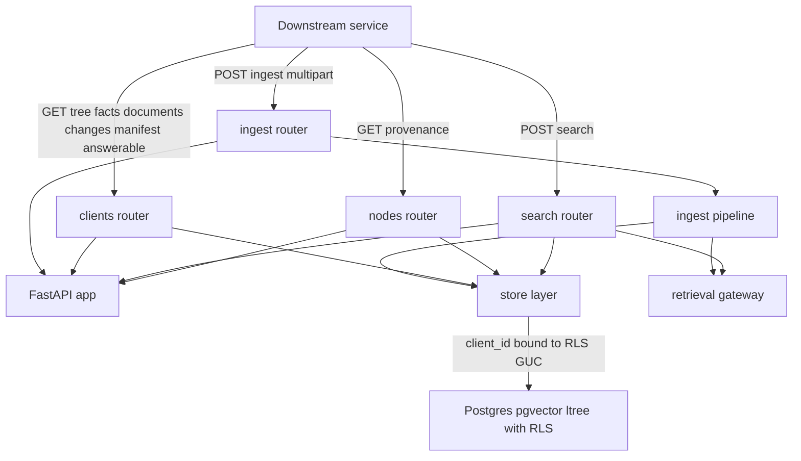
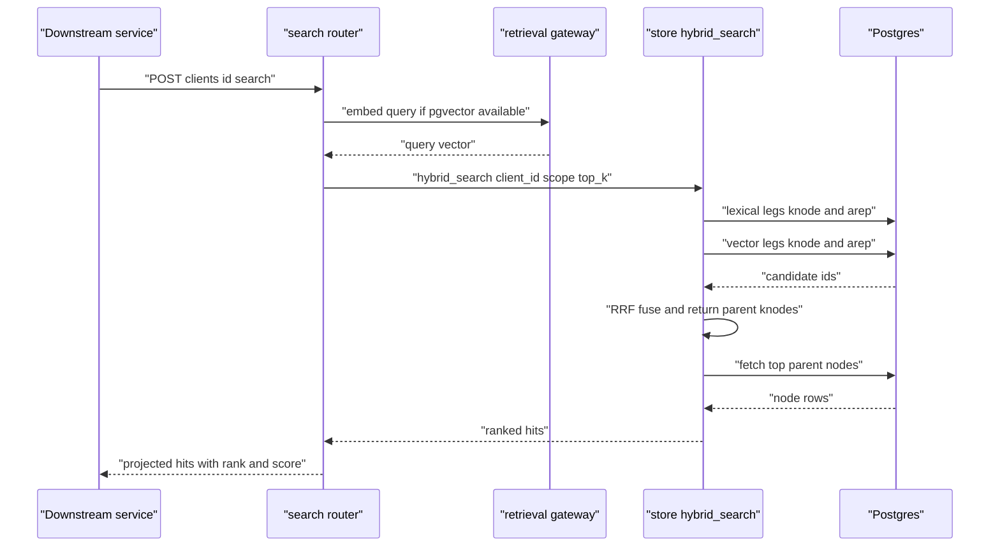

# Document Intelligence — REST API Reference

> **Status:** Current · **Last updated:** 2026-06-24

This is the complete REST surface of the `document_intelligence` platform: ingestion, per-client
knowledge-tree traversal, the self-describing per-document surfaces, hybrid search, node provenance,
and health probes. Every shape below is grounded in the code in
[`di/routers/`](../../di/routers), [`di/serving.py`](../../di/serving.py),
[`di/store.py`](../../di/store.py), and the domain models in [`di/models.py`](../../di/models.py).

**Companion docs:**
[design spec](../specs/2026-06-24-document-intelligence-design.md) ·
[requirements & interpretation log](../../reports/requirements-and-interpretation.md)

---

## Conventions

- **Base URL:** the application root (FastAPI app from [`di/app.py`](../../di/app.py)). All data
  endpoints live under the `/api/v1` prefix; the application health probe is at the root (`/health`).
- **API version:** the FastAPI app reports version `0.1.0`; the route version prefix is `v1`.
- **Content type:** responses are `application/json` unless noted. `POST /api/v1/ingest` consumes
  `multipart/form-data` and responds with `text/event-stream` (Server-Sent Events).
- **Tenant scoping (RLS):** `client_id` is **required** on every data path — either in the URL
  (`/clients/{client_id}/...`, `/clients/{client_id}/search`) or as a query parameter
  (`/nodes/{node_id}/provenance?client_id=...`). The store layer binds `client_id` to the
  per-connection Postgres GUC `app.current_client_id`, and Row-Level Security policies
  (`tenant_isolation`, defined in [`di/migrations/004_rls.sql`](../../di/migrations/004_rls.sql))
  filter every row by that GUC. There is **no cross-client endpoint** — a `client_id` only ever sees
  its own tree, facts, documents, versions, nodes, and search results.
- **Model access is delegated.** This service holds no embedding / LLM / rerank credentials. Search
  query embedding (and, during ingest, embeddings + LLM context + accessibility representations) is
  obtained from the **retrieval gateway** ([`di/retrieval_client.py`](../../di/retrieval_client.py)):
  `POST /api/embed`, `POST /api/llm/complete`, `POST /api/rerank`, `GET /api/models`. When the
  gateway is unavailable or `DI_RETRIEVAL_STUB=true`, a deterministic in-process stub is used so the
  API stays functional offline.
- **Masking projection.** Several read endpoints accept `mask` (boolean, default `false`). When
  `true`, values whose effective sensitivity is `HIGH` or `CRITICAL` are redacted in the projection
  — structure, provenance, type, and confidence are preserved. Effective sensitivity is the max of
  the stored `sensitivity` and the level implied by the canonical `attribute_key` (`id.*` →
  `CRITICAL`; `identity.*` / `address.*` / `income.*` / `account.*` → `HIGH`), so masking an
  SSN / CURP / passport number never depends on which extractor produced it
  ([`di/serving.py`](../../di/serving.py)).

### Common error envelope

Errors are FastAPI's standard envelope:

```json
{ "detail": "document not found" }
```

| Status | When |
|--------|------|
| `200 OK` | Successful read or completed action. |
| `404 Not Found` | A named document, node, or non-`/api/*` SPA path is missing. `/api/*` paths that do not match a route return `{"detail": "API route not found"}`. |
| `422 Unprocessable Entity` | Request body / form / query fails validation (FastAPI/pydantic). |

---

## Endpoint index

| Method | Path | Purpose |
|--------|------|---------|
| `POST` | `/api/v1/ingest` | Upload a document; stream pipeline stages over SSE. |
| `GET`  | `/api/v1/clients/{client_id}/tree` | Nested knowledge tree for a client (scopable / maskable). |
| `GET`  | `/api/v1/clients/{client_id}/facts` | Client-level merged facts (confidence-weighted). |
| `GET`  | `/api/v1/clients/{client_id}/documents` | All documents ingested for a client. |
| `GET`  | `/api/v1/clients/{client_id}/changes` | Version delta feed (optionally since a timestamp). |
| `GET`  | `/api/v1/clients/{client_id}/docs/{doc_id}/manifest` | Self-describing capabilities manifest for one document. |
| `GET`  | `/api/v1/clients/{client_id}/docs/{doc_id}/answerable` | Hypothetical questions one document can answer. |
| `POST` | `/api/v1/clients/{client_id}/search` | Hybrid (dense + lexical + structural) search scoped to a client. |
| `GET`  | `/api/v1/nodes/{node_id}/provenance` | One-hop provenance for a single node. |
| `GET`  | `/health` | Application health. |
| `GET`  | `/api/v1/ingest/health` | Ingest router health. |
| `GET`  | `/api/v1/clients/health` | Clients router health. |
| `GET`  | `/api/v1/search/health` | Search router health. |
| `GET`  | `/api/v1/nodes/health` | Nodes router health. |

---

## Ingestion

### `POST /api/v1/ingest`

Upload a single document and receive a live SSE stream of pipeline stage events. The endpoint drives
[`di.pipeline.ingest_document`](../../di/pipeline.py) end to end: OCR, versioning decision, the
PII-safe gate, deterministic (+ optionally LLM) extraction, knowledge-subtree build, embedding,
accessibility-representation generation, and the cross-document merge into the client-level view.

**Request — `multipart/form-data`**

| Field | Type | Required | Description |
|-------|------|----------|-------------|
| `client_id` | string (form) | yes | Tenant identifier. Arrives **with** the document — this service does not resolve it. Binds the RLS scope for everything persisted. |
| `file` | file (form) | yes | The source document. Multi-format OCR accepts PDF, DOCX, JPEG, PNG. The filename and `Content-Type` are read from the upload part. |

The logical document key is `(client_id, filename)`; re-uploading the same filename updates that
document and creates a new version (or is a no-op if the content hash is unchanged).

**Response — `text/event-stream`**

Each SSE message has `event: stage` and a `data` payload that is the JSON serialization of an
[`IngestEvent`](../../di/models.py):

```json
{ "stage": "gate", "status": "done", "detail": { "doc_type": "MX_CURP", "sensitivity": "CRITICAL", "decision": "SEND_TO_LLM", "lang": "es" } }
```

| Field | Type | Description |
|-------|------|-------------|
| `stage` | string | Pipeline stage (see vocabulary below). |
| `status` | string | One of `start`, `progress`, `done`, `error`, `skip`. Defaults to `done`. |
| `detail` | object | Stage-specific payload. |

**Stage vocabulary** (emitted in order; `detail` keys shown are the ones the pipeline sets):

| `stage` | Typical `status` | `detail` |
|---------|------------------|----------|
| `ocr` | `start`, then `done` | `{ "engine": "azure-read-v3.2", "pages": 2 }` |
| `version` | `skip` (only when content is identical to the current version) | `{ "reason": "identical content already current", "doc_id": "..." }` |
| `gate` | `start`, then `done` | `{ "doc_type": "...", "sensitivity": "...", "decision": "...", "lang": "..." }` |
| `extract` | `start`, then `done` | `{ "facts": 7, "llm": true }` (`llm` = whether the LLM extractor ran, i.e. gate decision was `SEND_TO_LLM`) |
| `subtree` | `done` | `{ "nodes": 24, "embedded": true }` (`embedded` = whether pgvector was available) |
| `arep` | `done` | `{ "reps": 18, "deferred": false }` (`deferred` = accessibility reps queued for async generation) |
| `merge` | `done` | `{ "merged_facts": 12 }` (client-level merged view recomputed) |
| `done` | `done` | terminal event — see below |

The terminal `done` event carries the ingest result:

```json
{
  "stage": "done",
  "status": "done",
  "detail": {
    "doc_id": "8f1c0b2e-9a3d-4c77-8e21-0b5a1d4e9f10",
    "version_id": "b2d4e6f8-1357-2468-9abc-def012345678",
    "version_no": 1,
    "doc_type": "MX_CURP",
    "decision": "SEND_TO_LLM",
    "nodes": 24,
    "facts": 7
  }
}
```

If the upload is identical to the document's current version, the stream short-circuits with a
`version` event (`status: skip`) followed by a terminal `done` event that carries `{ "doc_id": "...",
"noop": true }`.

**Gate decision and what runs.** The PII-safe gate
([`di/gate/pipeline.py`](../../di/gate/pipeline.py)) classifies each document and emits a
`GateDecision`:

| Decision | Effect on the pipeline |
|----------|------------------------|
| `SEND_TO_LLM` | Deterministic extraction **and** LLM extraction, LLM context prefixes, and accessibility-representation generation all run (all model calls via the retrieval gateway). |
| `REDACT_THEN_SEND` | Reserved; **inactive in v1**. Treated as not-allow-out (no LLM path). |
| `DETERMINISTIC_ONLY` | Only local deterministic checksum/anchor extraction runs; nothing leaves for an LLM. |

**Status codes**

| Status | Meaning |
|--------|---------|
| `200 OK` | The SSE stream opened. Stage-level failures are reported in-band as events; the connection still returns `200`. |
| `422 Unprocessable Entity` | Missing `client_id` or `file` in the multipart body. |

**Example — open the stream**

```bash
curl -N -X POST http://localhost:8080/api/v1/ingest \
  -F 'client_id=acme-bank-00417' \
  -F 'file=@/path/to/curp_juan_perez.pdf'
```

```
event: stage
data: {"stage":"ocr","status":"start","detail":{}}

event: stage
data: {"stage":"ocr","status":"done","detail":{"engine":"azure-read-v3.2","pages":1}}

event: stage
data: {"stage":"gate","status":"done","detail":{"doc_type":"MX_CURP","sensitivity":"CRITICAL","decision":"SEND_TO_LLM","lang":"es"}}

event: stage
data: {"stage":"extract","status":"done","detail":{"facts":3,"llm":true}}

event: stage
data: {"stage":"subtree","status":"done","detail":{"nodes":9,"embedded":true}}

event: stage
data: {"stage":"arep","status":"done","detail":{"reps":14,"deferred":false}}

event: stage
data: {"stage":"merge","status":"done","detail":{"merged_facts":12}}

event: stage
data: {"stage":"done","status":"done","detail":{"doc_id":"8f1c0b2e-9a3d-4c77-8e21-0b5a1d4e9f10","version_id":"b2d4e6f8-1357-2468-9abc-def012345678","version_no":1,"doc_type":"MX_CURP","decision":"SEND_TO_LLM","nodes":9,"facts":3}}
```

---

## Clients — knowledge-tree traversal

All endpoints in this section are prefixed `/api/v1/clients` and scoped to `{client_id}` (RLS).

### `GET /api/v1/clients/{client_id}/tree`

Return the client's knowledge tree as a nested structure (`document → section → chunk/table/fact …`),
built from flat `knode` rows via `parent_id` and ordered by `seq` then `path`. Rows whose parent is
outside the queried set become roots, so scoped subtree queries still nest correctly.

**Path parameters**

| Name | Type | Description |
|------|------|-------------|
| `client_id` | string | Tenant identifier (RLS scope). |

**Query parameters**

| Name | Type | Default | Description |
|------|------|---------|-------------|
| `doc_id` | string | — | Restrict to a single document's subtree. |
| `path` | string | — | `ltree` prefix; returns nodes under that path (`path <@ {path}`). |
| `max_depth` | integer | — | Cap on node `depth`. |
| `current_only` | boolean | `true` | Only nodes belonging to each document's current version. |
| `mask` | boolean | `false` | Apply the sensitivity masking projection (see Conventions). |

**Response — `200 OK`**

| Field | Type | Description |
|-------|------|-------------|
| `client_id` | string | Echoed scope. |
| `count` | integer | Number of `knode` rows matched (flat count, before nesting). |
| `tree` | array | Nested root nodes; each node has a `children` array. |

Per-node fields are projected from `knode` (see [`di/serving.py`](../../di/serving.py) `_NODE_FIELDS`):
`id`, `parent_id`, `path`, `node_type`, `seq`, `depth`, `title`, `content`, `context_prefix`,
`attribute_key`, `value_text`, `value_date`, `value_num`, `verification_status`, `confidence`,
`sensitivity`, `valid_from`, `valid_to`, `provenance`, `doc_id`, `version_id`, plus `children`. When
`mask=true` and a node is sensitive, the projection additionally sets `"masked": true` and redacts
`value_text` / `content`.

```json
{
  "client_id": "acme-bank-00417",
  "count": 9,
  "tree": [
    {
      "id": "1a2b3c4d-0000-4000-8000-000000000001",
      "parent_id": null,
      "path": "client_acme_bank_00417.doctype_mx_curp.v1",
      "node_type": "document",
      "seq": 0,
      "depth": 0,
      "title": "Mexican CURP",
      "content": null,
      "attribute_key": null,
      "value_text": null,
      "verification_status": "unverified",
      "confidence": 0.91,
      "sensitivity": "LOW",
      "doc_id": "8f1c0b2e-9a3d-4c77-8e21-0b5a1d4e9f10",
      "version_id": "b2d4e6f8-1357-2468-9abc-def012345678",
      "provenance": null,
      "children": [
        {
          "id": "1a2b3c4d-0000-4000-8000-000000000007",
          "parent_id": "1a2b3c4d-0000-4000-8000-000000000001",
          "path": "client_acme_bank_00417.doctype_mx_curp.v1.fact.id_curp",
          "node_type": "fact",
          "seq": 1,
          "depth": 2,
          "title": "CURP",
          "attribute_key": "id.curp",
          "value_text": "PEPJ900115HDFRRN08",
          "value_date": null,
          "verification_status": "checksum_verified",
          "confidence": 0.99,
          "sensitivity": "CRITICAL",
          "provenance": {
            "document_id": "8f1c0b2e-9a3d-4c77-8e21-0b5a1d4e9f10",
            "page": 1,
            "bbox": { "page": 1, "x0": 120.0, "y0": 318.5, "x1": 402.0, "y1": 339.0 },
            "extractor": "anchor",
            "extracted_at": "2026-06-24T09:14:22Z"
          },
          "children": []
        }
      ]
    }
  ]
}
```

With `?mask=true`, the same fact node becomes:

```json
{
  "attribute_key": "id.curp",
  "value_text": "••••••••••••••RN08",
  "sensitivity": "CRITICAL",
  "verification_status": "checksum_verified",
  "confidence": 0.99,
  "masked": true
}
```

---

### `GET /api/v1/clients/{client_id}/facts`

Return the **client-level merged view** — facts consolidated across all of the client's documents by
canonical `attribute_key`, confidence-weighted (`client_merged_fact`). Each fact gets a derived
`verified` flag (`confidence >= 0.8` and not in conflict) and a derived `sensitivity` from its
attribute key.

**Query parameters**

| Name | Type | Default | Description |
|------|------|---------|-------------|
| `attribute_key` | string | — | Filter to a single canonical key (e.g. `id.curp`, `identity.full_name`). |
| `verified_only` | boolean | `false` | Drop facts that are not `verified`. |
| `mask` | boolean | `false` | Redact `resolved_value` for `HIGH`/`CRITICAL` facts. |

**Response — `200 OK`**

| Field | Type | Description |
|-------|------|-------------|
| `client_id` | string | Echoed scope. |
| `count` | integer | Number of facts after filtering. |
| `facts` | array | Merged facts (see fields below). |

Each fact contains the `client_merged_fact` columns plus the derived `verified` and `sensitivity`:
`client_id`, `attribute_key`, `resolved_value`, `value_date`, `value_num`, `confidence`, `conflict`,
`needs_review`, `source_fact_ids`, `verified`, `sensitivity` (and `masked` when redacted).

```json
{
  "client_id": "acme-bank-00417",
  "count": 2,
  "facts": [
    {
      "client_id": "acme-bank-00417",
      "attribute_key": "identity.full_name",
      "resolved_value": "Juan Pérez Rodríguez",
      "value_date": null,
      "value_num": null,
      "confidence": 0.96,
      "conflict": false,
      "needs_review": false,
      "source_fact_ids": ["1a2b3c4d-0000-4000-8000-000000000007"],
      "verified": true,
      "sensitivity": "HIGH"
    },
    {
      "client_id": "acme-bank-00417",
      "attribute_key": "id.curp",
      "resolved_value": "PEPJ900115HDFRRN08",
      "value_date": null,
      "value_num": null,
      "confidence": 0.99,
      "conflict": false,
      "needs_review": false,
      "source_fact_ids": ["1a2b3c4d-0000-4000-8000-000000000007"],
      "verified": true,
      "sensitivity": "CRITICAL"
    }
  ]
}
```

---

### `GET /api/v1/clients/{client_id}/documents`

List every document ingested for the client (newest first, soft-deleted rows excluded). Returns the
raw `di_documents` rows.

**Response — `200 OK`**

| Field | Type | Description |
|-------|------|-------------|
| `client_id` | string | Echoed scope. |
| `count` | integer | Number of documents. |
| `documents` | array | `di_documents` rows. |

Each document row includes `id`, `client_id`, `document_name`, `sha256`, `mime`, `doc_type`,
`doc_category`, `subject`, `jurisdiction`, `lang_profile`, `sensitivity_bucket`, `gate_decision`,
`confidence`, `ocr_engine`, `page_count`, `created_at`, `updated_at` (and the stored `ocr_text` /
`ocr_lines`).

```json
{
  "client_id": "acme-bank-00417",
  "count": 1,
  "documents": [
    {
      "id": "8f1c0b2e-9a3d-4c77-8e21-0b5a1d4e9f10",
      "client_id": "acme-bank-00417",
      "document_name": "curp_juan_perez.pdf",
      "sha256": "9b74c9897bac770ffc029102a200c5de",
      "mime": "application/pdf",
      "doc_type": "MX_CURP",
      "doc_category": "identity",
      "jurisdiction": "MX",
      "lang_profile": { "dominant_lang": "es", "is_bilingual": false },
      "sensitivity_bucket": "CRITICAL",
      "gate_decision": "SEND_TO_LLM",
      "confidence": 0.91,
      "ocr_engine": "azure-read-v3.2",
      "page_count": 1,
      "created_at": "2026-06-24T09:14:20Z",
      "updated_at": "2026-06-24T09:14:23Z"
    }
  ]
}
```

---

### `GET /api/v1/clients/{client_id}/changes`

Version delta feed: every `doc_version` for the client (newest first), joined to its document's name
and type, with the `changed_fields` recorded for that version. Useful for incremental sync.

**Query parameters**

| Name | Type | Default | Description |
|------|------|---------|-------------|
| `since` | string (timestamptz) | — | Only versions created at or after this timestamp (ISO 8601). |

**Response — `200 OK`**

| Field | Type | Description |
|-------|------|-------------|
| `client_id` | string | Echoed scope. |
| `count` | integer | Number of version rows. |
| `changes` | array | `doc_version` rows joined with `document_name` and `doc_type`. |

Each change row includes `id`, `client_id`, `doc_id`, `version_no`, `content_hash`, `supersedes`,
`is_current`, `changed_fields`, `created_at`, `created_by`, plus the joined `document_name` and
`doc_type`.

```json
{
  "client_id": "acme-bank-00417",
  "count": 1,
  "changes": [
    {
      "id": "b2d4e6f8-1357-2468-9abc-def012345678",
      "client_id": "acme-bank-00417",
      "doc_id": "8f1c0b2e-9a3d-4c77-8e21-0b5a1d4e9f10",
      "document_name": "curp_juan_perez.pdf",
      "doc_type": "MX_CURP",
      "version_no": 1,
      "content_hash": "9b74c9897bac770ffc029102a200c5de",
      "supersedes": null,
      "is_current": true,
      "changed_fields": [],
      "created_at": "2026-06-24T09:14:23Z",
      "created_by": null
    }
  ]
}
```

**Example**

```bash
curl 'http://localhost:8080/api/v1/clients/acme-bank-00417/changes?since=2026-06-01T00:00:00Z'
```

---

### `GET /api/v1/clients/{client_id}/docs/{doc_id}/manifest`

Return a **self-describing capabilities manifest** for one document: what it is, what it knows, and
what it can do. Derived from the document row, its `knode` subtree, and its `arep` representations
([`di.serving.build_manifest`](../../di/serving.py)).

**Path parameters**

| Name | Type | Description |
|------|------|-------------|
| `client_id` | string | Tenant identifier (RLS scope). |
| `doc_id` | string | Document id. |

**Response — `200 OK`**

| Field | Type | Description |
|-------|------|-------------|
| `doc_id` | string | Document id. |
| `document_name` | string | Original filename. |
| `doc_type` | string | Classified doc-type code (e.g. `MX_CURP`). |
| `jurisdiction` | string | `US` / `CA` / `MX`. |
| `page_count` | integer | OCR page count. |
| `languages` | string | Dominant language from the language profile. |
| `sensitivity` | string | Document sensitivity bucket. |
| `gate_decision` | string | Gate routing decision. |
| `node_type_counts` | object | Count of nodes by `node_type`. |
| `attribute_keys` | array | Sorted canonical keys present on fact nodes. |
| `verification_status_counts` | object | Count of fact nodes by verification status. |
| `accessibility_rep_counts` | object | Count of `arep` rows by `rep_type`. |
| `answerable` | boolean | `true` if the document has any `hypothetical_q` representations. |
| `searchable` | boolean | Always `true` (the document is in the searchable index). |

```json
{
  "doc_id": "8f1c0b2e-9a3d-4c77-8e21-0b5a1d4e9f10",
  "document_name": "curp_juan_perez.pdf",
  "doc_type": "MX_CURP",
  "jurisdiction": "MX",
  "page_count": 1,
  "languages": "es",
  "sensitivity": "CRITICAL",
  "gate_decision": "SEND_TO_LLM",
  "node_type_counts": { "document": 1, "section": 2, "chunk": 3, "fact": 3 },
  "attribute_keys": ["id.curp", "identity.date_of_birth", "identity.sex"],
  "verification_status_counts": { "checksum_verified": 1, "llm_unverified": 2 },
  "accessibility_rep_counts": { "hypothetical_q": 6, "summary": 3, "translation": 5 },
  "answerable": true,
  "searchable": true
}
```

**Status codes**

| Status | Meaning |
|--------|---------|
| `200 OK` | Manifest returned. |
| `404 Not Found` | No document with that id for the client (`{"detail": "document not found"}`). |

---

### `GET /api/v1/clients/{client_id}/docs/{doc_id}/answerable`

Return the **answerable-questions index** for one document — the hypothetical questions it can
answer, generated as `hypothetical_q` accessibility representations during ingest. This is the
self-describing surface that lets a downstream router decide whether a document is relevant before
running a search.

**Response — `200 OK`**

| Field | Type | Description |
|-------|------|-------------|
| `client_id` | string | Echoed scope. |
| `doc_id` | string | Document id. |
| `answerable` | array | One entry per hypothetical question. |

Each entry: `question` (the `rep_text`), `knode_id` (the node that answers it), `path` (the node's
`ltree` path), `lang` (the representation language).

```json
{
  "client_id": "acme-bank-00417",
  "doc_id": "8f1c0b2e-9a3d-4c77-8e21-0b5a1d4e9f10",
  "answerable": [
    {
      "question": "What is the CURP of the document holder?",
      "knode_id": "1a2b3c4d-0000-4000-8000-000000000007",
      "path": "client_acme_bank_00417.doctype_mx_curp.v1.fact.id_curp",
      "lang": "en"
    },
    {
      "question": "¿Cuál es la fecha de nacimiento del titular?",
      "knode_id": "1a2b3c4d-0000-4000-8000-000000000008",
      "path": "client_acme_bank_00417.doctype_mx_curp.v1.fact.identity_date_of_birth",
      "lang": "es"
    }
  ]
}
```

---

## Search

### `POST /api/v1/clients/{client_id}/search`

Hybrid retrieval scoped to one client. Implements the **index-many / return-parent** pattern: it
searches both `knode` content and `arep` representations (lexical full-text always; dense vectors
when pgvector is present and an embedding is available), maps `arep` hits back to their parent
`knode`, and fuses the legs with Reciprocal Rank Fusion ([`di.store.hybrid_search`](../../di/store.py)).
The query is embedded through the **retrieval gateway**; if pgvector is absent the search degrades
gracefully to lexical-only.

**Path parameters**

| Name | Type | Description |
|------|------|-------------|
| `client_id` | string | Tenant identifier (RLS scope). |

**Request body — `application/json`** ([`SearchRequest`](../../di/routers/search.py))

| Field | Type | Default | Description |
|-------|------|---------|-------------|
| `query` | string | — (required) | Natural-language query. |
| `scope_path` | string | `null` | `ltree` prefix to restrict the search (e.g. a single doc-type subtree). |
| `doc_id` | string | `null` | Restrict the search to a single document. |
| `top_k` | integer | `20` | Number of ranked parent nodes to return. |
| `current_only` | boolean | `true` | Restrict to current-version nodes. |
| `mask` | boolean | `false` | Apply the sensitivity masking projection to returned hits. |

**Response — `200 OK`**

| Field | Type | Description |
|-------|------|-------------|
| `client_id` | string | Echoed scope. |
| `query` | string | Echoed query. |
| `count` | integer | Number of hits returned. |
| `hits` | array | Ranked parent `knode` nodes (projected node fields, plus `_rank` and `_score`). |

Each hit is a projected node (same fields as the tree endpoint) with two extra fields: `_rank`
(1-based position) and `_score` (the fused RRF score).

```json
{
  "client_id": "acme-bank-00417",
  "query": "what is the client's CURP",
  "count": 1,
  "hits": [
    {
      "id": "1a2b3c4d-0000-4000-8000-000000000007",
      "path": "client_acme_bank_00417.doctype_mx_curp.v1.fact.id_curp",
      "node_type": "fact",
      "title": "CURP",
      "attribute_key": "id.curp",
      "value_text": "PEPJ900115HDFRRN08",
      "verification_status": "checksum_verified",
      "confidence": 0.99,
      "sensitivity": "CRITICAL",
      "doc_id": "8f1c0b2e-9a3d-4c77-8e21-0b5a1d4e9f10",
      "version_id": "b2d4e6f8-1357-2468-9abc-def012345678",
      "provenance": {
        "document_id": "8f1c0b2e-9a3d-4c77-8e21-0b5a1d4e9f10",
        "page": 1,
        "extractor": "anchor"
      },
      "_rank": 1,
      "_score": 0.0328
    }
  ]
}
```

**Example**

```bash
curl -X POST http://localhost:8080/api/v1/clients/acme-bank-00417/search \
  -H 'Content-Type: application/json' \
  -d '{"query":"what is the client'\''s CURP","top_k":5,"mask":true}'
```

**Status codes**

| Status | Meaning |
|--------|---------|
| `200 OK` | Ranked hits returned (empty `hits` if nothing matched). |
| `422 Unprocessable Entity` | Body fails validation (e.g. missing `query`). |

---

## Nodes — provenance

### `GET /api/v1/nodes/{node_id}/provenance`

Return the one-hop provenance for a single node: its source document, version, type, attribute key,
verification status, confidence, and the full `provenance` object (page / bounding box / extractor /
model / timestamp). Every answer the platform serves is one hop from its exact source.

**Path parameters**

| Name | Type | Description |
|------|------|-------------|
| `node_id` | string | The `knode` id. |

**Query parameters**

| Name | Type | Required | Description |
|------|------|----------|-------------|
| `client_id` | string | yes | Tenant identifier (RLS scope). Required because there is no cross-client lookup. |

**Response — `200 OK`**

| Field | Type | Description |
|-------|------|-------------|
| `node_id` | string | Echoed node id. |
| `client_id` | string | Echoed scope. |
| `doc_id` | string | Source document id. |
| `version_id` | string | Source version id. |
| `node_type` | string | Node type. |
| `attribute_key` | string | Canonical key (for fact nodes). |
| `verification_status` | string | e.g. `checksum_verified`, `gov_verified`, `llm_unverified`, `unverified`. |
| `confidence` | number | Extraction confidence. |
| `provenance` | object | `Provenance` — `document_id`, `version_id`, `page`, `bbox`, `char_span`, `extractor`, `model`, `extracted_at`. |

```json
{
  "node_id": "1a2b3c4d-0000-4000-8000-000000000007",
  "client_id": "acme-bank-00417",
  "doc_id": "8f1c0b2e-9a3d-4c77-8e21-0b5a1d4e9f10",
  "version_id": "b2d4e6f8-1357-2468-9abc-def012345678",
  "node_type": "fact",
  "attribute_key": "id.curp",
  "verification_status": "checksum_verified",
  "confidence": 0.99,
  "provenance": {
    "document_id": "8f1c0b2e-9a3d-4c77-8e21-0b5a1d4e9f10",
    "version_id": "b2d4e6f8-1357-2468-9abc-def012345678",
    "page": 1,
    "bbox": { "page": 1, "x0": 120.0, "y0": 318.5, "x1": 402.0, "y1": 339.0 },
    "char_span": [142, 160],
    "extractor": "anchor",
    "model": null,
    "extracted_at": "2026-06-24T09:14:22Z"
  }
}
```

**Status codes**

| Status | Meaning |
|--------|---------|
| `200 OK` | Provenance returned. |
| `404 Not Found` | No node with that id for the client (`{"detail": "node not found"}`). |
| `422 Unprocessable Entity` | Missing required `client_id` query parameter. |

---

## Health

All health endpoints are unauthenticated, take no parameters, and return `200 OK`.

### `GET /health`

Application-level health (from [`di/app.py`](../../di/app.py)). The app boots even in degraded mode
(migrations or the retrieval `/api/models` probe can fail at startup without preventing boot), so a
`200` here confirms the process is up — not that every dependency is healthy.

```json
{ "status": "ok", "service": "document-intelligence" }
```

### Router health probes

Each router exposes its own probe so liveness can be checked per concern:

| Endpoint | Response |
|----------|----------|
| `GET /api/v1/ingest/health` | `{ "status": "ok", "router": "ingest" }` |
| `GET /api/v1/clients/health` | `{ "status": "ok", "router": "clients" }` |
| `GET /api/v1/search/health` | `{ "status": "ok", "router": "search" }` |
| `GET /api/v1/nodes/health` | `{ "status": "ok", "router": "nodes" }` |

---

## Enum reference

Values surfaced across responses, defined in [`di/models.py`](../../di/models.py):

| Enum | Values |
|------|--------|
| `node_type` | `document`, `section`, `chunk`, `table`, `figure`, `fact`, `summary` |
| `rep_type` (accessibility reps) | `hypothetical_q`, `proposition`, `summary`, `alt_phrasing`, `synonym_expansion`, `table_desc`, `figure_desc`, `keyword_set`, `translation` |
| `verification_status` | `checksum_verified`, `gov_verified`, `llm_unverified`, `unverified` |
| `sensitivity` | `LOW`, `MEDIUM`, `HIGH`, `CRITICAL` |
| `gate_decision` | `SEND_TO_LLM`, `REDACT_THEN_SEND` (inactive v1), `DETERMINISTIC_ONLY` |
| `extractor` (`source`) | `mrz`, `anchor`, `positional`, `regex_sweep`, `llm`, `gov` |

Canonical `attribute_key` namespaces (full catalog in [`di/ontology.py`](../../di/ontology.py)):
`identity.*`, `id.*`, `address.*`, `income.*`, `account.*`, `entity.*`, `ownership.*`, `doc.*`.

---

## Request flow at a glance




