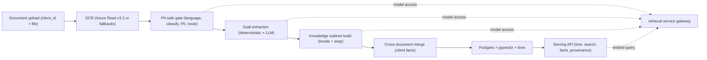
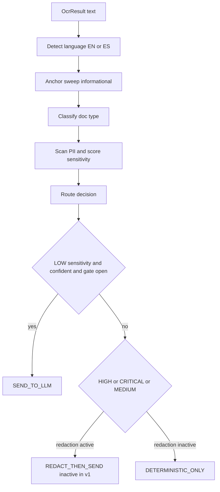
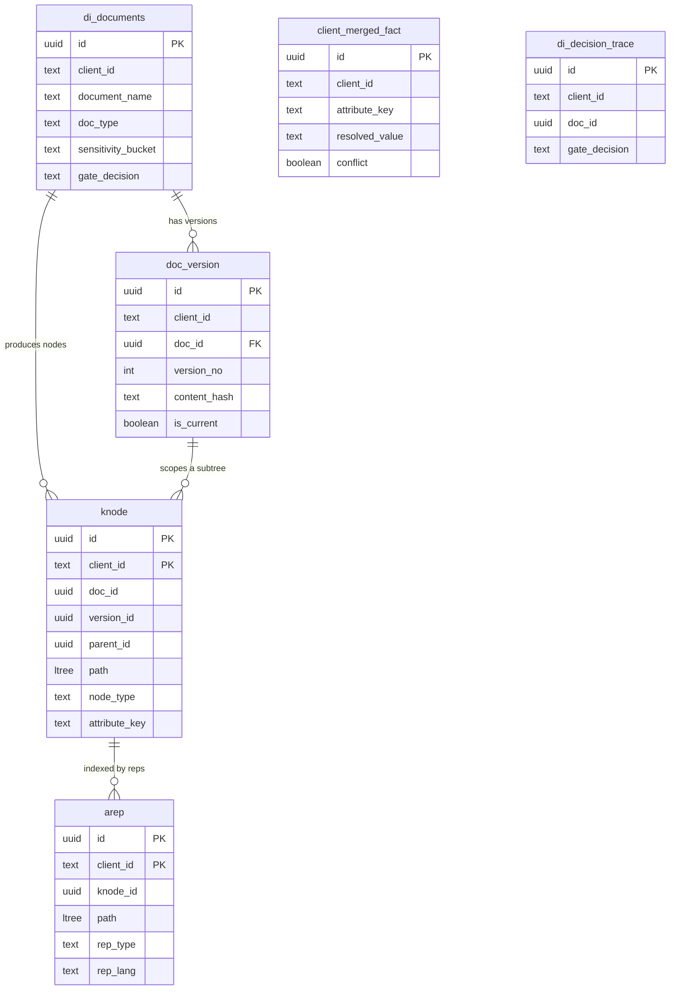
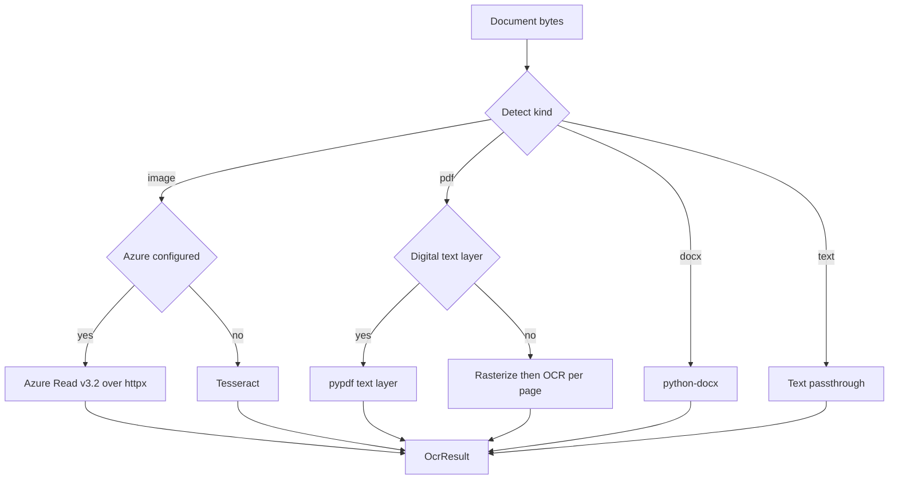

# Document Intelligence — Technical Documentation

> **Status / Last updated 2026-06-24** · Reference documentation for engineers building, running, or
> integrating with the `document_intelligence` platform.

**Related documents**

- Design spec: [../specs/2026-06-24-document-intelligence-design.md](../specs/2026-06-24-document-intelligence-design.md)
- Requirements & decision log (D1–D13): [../../reports/requirements-and-interpretation.md](../../reports/requirements-and-interpretation.md)
- Retrieval API additions (for the retrieval-repo team): [../../reports/retrieval-api-requirements.md](../../reports/retrieval-api-requirements.md)
- Project README: [../../README.md](../../README.md)

---

## 1. System overview

Document Intelligence turns a banking client's KYC documents (PDF, DOCX, JPEG, PNG, plain text)
into a **versioned, per-client knowledge tree** and serves it to downstream services for search,
single-document Q&A, structured fact retrieval, and provenance — PII-safe throughout. The
geography is US, Canada, Mexico; the languages are English and Spanish (bilingual documents
supported).

The service is a single FastAPI application with three concerns:

1. **Ingestion pipeline** — OCR, language detection, a PII-safe classification gate, dual
   (deterministic + LLM) extraction, knowledge-subtree assembly, accessibility-representation
   generation, cross-document merge, and versioning.
2. **Storage** — one `ltree` forest in Postgres with `pgvector`, HASH-partitioned and RLS-isolated
   by `client_id`.
3. **Serving API** — per-client tree traversal, hybrid scoped search, provenance lookup, a
   self-describing capabilities manifest, an answerable-questions index, masked projections, and a
   version-delta feed.

Two principles shape every module:

- **No model credentials live here.** All embeddings, LLM completions, and reranking are delegated
  to the existing `retrieval` service over HTTP (`di/retrieval_client.py`). When the gateway is
  unavailable a deterministic in-process stub keeps the whole pipeline exercisable offline.
- **Graceful degradation.** Optional dependencies (`pgvector`, `lingua`, scikit-learn, Presidio,
  the Azure SDK-free OCR path) are all imported lazily and guarded. Missing a capability downgrades
  behaviour (FTS-only search, anchor-based classification, regex PII sweep) rather than crashing.

The `client_id` is supplied with each document; entity resolution for the primary key is a non-goal.



---

## 2. Repository layout

Annotated tree of the source-bearing directories. Generated artefacts, the `.venv`, and
`reports/local-flow-test-report.md` (written by the flow harness) are omitted.

```text
document_intelligence/
├── di/                              # application package
│   ├── app.py                       # FastAPI factory + lifespan (pool, migrations, dim handshake)
│   ├── config.py                    # pydantic-settings; single source of env-driven config
│   ├── db.py                        # asyncpg pool, RLS GUC binding, migrations, pgvector bootstrap
│   ├── models.py                    # pydantic domain models + enums (dependency-free contracts)
│   ├── ontology.py                  # doc taxonomy, classifier anchors, canonical attribute keys
│   ├── retrieval_client.py          # async client + offline stub for the model gateway
│   ├── store.py                     # repository SQL: documents, versions, knode/arep, hybrid search
│   ├── serving.py                   # pure transforms: nest tree, mask, manifest, answerable
│   ├── pipeline.py                  # ingest_document driver, yields SSE stage events
│   ├── migrations/                  # idempotent startup SQL (NNN_*.sql)
│   │   ├── 001_extensions.sql       #   ltree + pgcrypto (pgvector added at runtime)
│   │   ├── 002_core_tables.sql      #   documents, versions, entities, merged facts, decision trace
│   │   ├── 003_knode_arep.sql       #   the knowledge subtree (HASH-partitioned parents)
│   │   └── 004_rls.sql              #   FORCEd row-level security by client_id
│   ├── ocr/
│   │   └── vision.py                # multi-format OCR; Azure Read v3.2 over httpx + fallbacks
│   ├── gate/                        # PII-safe classification gate (local-only, no network/DB)
│   │   ├── language.py              #   EN/ES dominant + bilingual span detection (lingua/heuristic)
│   │   ├── anchors.py               #   anchor-keyword scoring + checksummed ID regex sweep
│   │   ├── classifier.py            #   doc-type classifier (trained model or anchor fallback)
│   │   ├── pii.py                   #   Presidio or deterministic regex+stdnum PII + sensitivity
│   │   ├── routing.py               #   pure egress decision table (fail-safe)
│   │   └── pipeline.py              #   run_gate(): collapses sub-stages into one GateResult
│   ├── extract/
│   │   ├── base.py                  #   extractor Protocol + doc_type registry
│   │   ├── llm_extract.py           #   LLM classify + adaptive attribute extraction
│   │   └── deterministic/           #   offline, checksum-verified extractors
│   │       ├── mrz.py               #     ICAO 9303 TD3 passport MRZ
│   │       ├── us.py                #     SSN/EIN/ITIN + anchored KV (W-2/1099/DL/SSN/EIN)
│   │       ├── canada.py            #     SIN/BN + T4/NOA/DL
│   │       ├── mexico.py            #     CURP/RFC/INE
│   │       └── anchored_kv.py       #     generic label-anchored KV (geometry + text fallback)
│   ├── subtree/
│   │   ├── build.py                 #   assemble the in-memory knode tree from OCR + facts
│   │   ├── chunk.py                 #   paragraph-aware, token-budgeted chunking
│   │   ├── context.py               #   contextual-retrieval situating prefixes (LLM)
│   │   ├── arep.py                  #   accessibility-representation generation (LLM, multi-vector)
│   │   ├── merge.py                 #   confidence-weighted cross-document fact merge
│   │   └── versioning.py            #   content-hash versioning + node diff
│   └── routers/                     # FastAPI routers (REST surface, all /api/v1/*)
│       ├── ingest.py                #   POST /ingest (multipart upload -> SSE stage stream)
│       ├── clients.py               #   tree, facts, documents, changes, manifest, answerable
│       ├── search.py                #   POST /clients/{id}/search (hybrid retrieval)
│       └── nodes.py                 #   GET /nodes/{id}/provenance
├── mock_azure_ocr/                  # local Azure Read v3.2 mock (no SDK)
│   ├── app.py                       #   serves the v3.2 contract; OCR via Tesseract
│   └── Dockerfile
├── tests/                           # pytest suite (pure-logic + mark-gated db/pgvector/ml/network)
│   ├── conftest.py                  #   forces the offline stub; DB-reachability fixture
│   ├── test_foundation.py           #   config / db helpers
│   ├── test_gate_*.py               #   language, anchors, classifier, pii, routing, pipeline
│   ├── test_det_*.py                #   deterministic extractors (us, canada, mexico, mrz)
│   ├── test_subtree_*.py            #   build, chunk, context, arep, merge, versioning
│   ├── test_ocr_*.py                #   vision engine, format detection, text passthrough
│   ├── test_store_db.py             #   repository SQL (marked: db)
│   ├── test_serving.py              #   tree nesting, masking, manifest, answerable
│   ├── test_routers.py              #   router wiring
│   └── test_llm_extract.py          #   tolerant JSON parsing + classify/extract
├── docs/                            # documentation
│   ├── specs/                       #   approved design spec
│   └── technical/                   #   this document
├── reports/                         # requirements log + retrieval-API requirements + flow report
├── tools/                           # make_samples.py (fixtures), flow_report.py (e2e harness)
├── frontend/dist/                   # pre-built static console (served by di/app.py; no build step)
├── docker/entrypoint.sh             # waits for Postgres, then starts uvicorn
├── docker-compose.yml               # db (pgvector) + app + azure-ocr-mock
├── Dockerfile                       # lean app image (core + [extract]; no [ml])
└── pyproject.toml                   # deps, optional groups, ruff/mypy/pytest config
```

---

## 3. Module reference

One short subsection per package. Each entry states the module's responsibility and the contract it
exposes to the rest of the system.

### `config` (`di/config.py`)

The single source of truth for configuration. `Settings` is a `pydantic-settings` `BaseSettings`
model read once through the `lru_cache`-d `get_settings()`; it reads the environment and an optional
`.env` file (`extra="ignore"`, case-insensitive). No secrets are hard-coded. Two derived
properties: `has_azure_vision` (both endpoint and key present) and `qualified_schema` (double-quoted
schema identifier for safe SQL interpolation). See [§4](#4-configuration-reference) for every field.

### `db` (`di/db.py`)

The async Postgres data layer. Owns a single shared `asyncpg` pool with a per-connection
`search_path` and JSONB codec; binds the Row-Level-Security GUC `app.current_client_id` per
checkout via `acquire(client_id)`; applies idempotent startup migrations (rewriting the `__SCHEMA__`
token); creates HASH partitions programmatically; and adds the `pgvector` embedding columns plus
per-partition HNSW indexes at runtime once the embedding dimension is known. Discovers whether the
`vector` extension exists (`pgvector_available()`), degrading cleanly to FTS-only when absent. Helper
`vec_to_pg()` formats a Python float list into a pgvector text literal. Detailed conventions in
[§6](#6-data-layer-conventions).

### `models` (`di/models.py`)

Dependency-free pydantic models and `StrEnum`s that define every shape flowing through the pipeline
and API: `NodeType`, `RepType`, `VerificationStatus`, `SensitivityBucket`, `GateDecision`,
`ExtractionSource`; the `BBox` / `Provenance` / `ExtractedField` extraction contracts;
`OcrResult` / `OcrLine` / `LangProfile`; `Classification` / `PiiEntity` / `GateResult`; the
`KNode` / `ARep` / `ClientFact` knowledge shapes; `DocumentMeta`; and the `IngestEvent` SSE payload.
No DB or network imports, so any module can depend on it.

### `ontology` (`di/ontology.py`)

Data, not logic. Holds the canonical `ATTRIBUTE_KEYS` catalog (dotted namespaces such as
`identity.date_of_birth`, `id.ssn`, `id.curp`), the `DocTypeSpec` taxonomy of supported document
types (US/CA/MX), and the EN/ES anchor strings the gate's anchor classifier sweeps. Lookups:
`DOC_TYPE_BY_CODE`, `anchors_for(lang)`, `deterministic_doc_types()`. Required-document lists are
intentionally config-driven so regulatory drift is an ontology edit, not a code change.

### `ocr` (`di/ocr/vision.py`)

A never-raises OCR entrypoint, `extract_pages(content, filename, mime)`, returning an `OcrResult`.
Detects the upload kind (PDF / DOCX / image / text / unknown) and routes accordingly. Images and
scanned PDFs go through the Azure Computer Vision Read v3.2 REST API over `httpx` (no SDK); digital
PDFs use the `pypdf` text layer; DOCX uses `python-docx`; plain text passes through; Tesseract is the
local image fallback. See [§8](#8-ocr-azure-read-v32-mock-and-fallbacks).

### `gate` (`di/gate/`)

The PII-safe classification gate — the single chokepoint deciding whether a document may leave the
deterministic path. `pipeline.run_gate(ocr)` is the synchronous, local-only (no network, no DB)
entry point that collapses four sub-stages into one `GateResult`:

- `language.py` — dominant EN/ES language and bilingual spans (`lingua` when present, stopword
  heuristic otherwise).
- `anchors.py` — score each doc-type by high-specificity anchor hits, plus a checksummed ID regex
  sweep validated with `python-stdnum`.
- `classifier.py` — `DocTypeClassifier`: a calibrated TF-IDF + LinearSVC model when a joblib file is
  present, otherwise the anchor fallback, otherwise `UNKNOWN`.
- `pii.py` — multilingual Presidio analyzer when available, otherwise a deterministic regex + stdnum
  sweep; maps detected entities to a `SensitivityBucket`.
- `routing.py` — a pure decision table producing `SEND_TO_LLM`, `REDACT_THEN_SEND`, or
  `DETERMINISTIC_ONLY`, fail-safe to `DETERMINISTIC_ONLY`.



Note: `REDACT_THEN_SEND` is reachable only when redaction is wired up; in v1 redaction is inactive
(`route()` is called with the default `redact_active=False` from `run_gate`), so sensitive documents
stay `DETERMINISTIC_ONLY`.

### `extract` (`di/extract/`)

Dual extraction. `base.py` defines the `DeterministicExtractor` Protocol, the `ExtractionInput`
container, and a `doc_type -> extractor` registry. The `deterministic/` package registers one
extractor per jurisdiction on import (`mrz`, `us`, `canada`, `mexico`) plus the shared `anchored_kv`
helper; these run offline and emit `checksum_verified` fields for IDs whose checksums pass (via
`python-stdnum` and the `mrz` library). `llm_extract.py` is the open path: two gateway round-trips
(classify, then choose-and-extract attributes) returning `(Classification, list[ExtractedField])`,
with tolerant JSON parsing that degrades to `UNKNOWN` / empty on malformed output. The pipeline runs
deterministic extraction always; LLM extraction only when the gate decided `SEND_TO_LLM`.

### `subtree` (`di/subtree/`)

Assembly of the per-document knowledge subtree, all pure in-memory transforms (except where they
call the gateway for text generation):

- `build.py` — `build_subtree(...)` assembles the `KNode` tree (`document -> section -> chunk`, plus
  a `facts` section of `fact` nodes), stamping `ltree` paths, `parent_id` links, `seq`, and `depth`.
- `chunk.py` — paragraph-aware chunking to the configured token budgets, hard-splitting oversized
  paragraphs with overlap and merging slivers.
- `context.py` — `add_context_prefixes(...)` generates Anthropic-style situating prefixes for
  content-bearing nodes (bounded concurrency, individually guarded).
- `arep.py` — `generate_areps(...)` expands each content node into a family of accessibility
  representations (hypothetical question, proposition, summary, paraphrase, media descriptions,
  EN<->ES translation). Embeddings are computed elsewhere.
- `merge.py` — `merge_facts(...)` collapses candidate facts per `attribute_key` into one resolved
  `ClientFact` (highest-confidence winner; conflict flagged when comparable values disagree).
- `versioning.py` — `content_hash`, `decide_version`, and `diff_nodes` for content-hash versioning
  and subtree diffs.

### `store` (`di/store.py`)

The repository layer. Every call goes through `db.acquire(client_id)` so the RLS GUC is bound.
Handles documents (UPSERT by `client_id` + `document_name`), the version chain (one current per
doc), bulk `knode` / `arep` inserts (casting `path::ltree` and embeddings `::vector`, omitting the
vector column when `pgvector` is absent), merged-fact UPSERT, decision-trace audit rows, and the
read surface (`fetch_subtree`, `fetch_node`, `fetch_merged_facts`, `fetch_areps`,
`list_version_changes`). `hybrid_search(...)` implements the index-many / return-parent pattern:
lexical legs over `knode.content_tsv` and `arep.rep_tsv`, optional vector legs over the embedding
columns, mapped back to parent `knode`s and fused with Reciprocal Rank Fusion.

### `serving` (`di/serving.py`)

Pure transforms over stored rows (no DB, no network). Nests flat `knode` rows into a tree
(`nest_tree`), applies the toggleable access-aware masking projection (`_project_node`,
`project_facts`, `project_nodes`), derives node and fact sensitivity from the canonical attribute
key (`sensitivity_for_key`: `id.*` -> CRITICAL, `identity.*`/`address.*`/`income.*`/`account.*` ->
HIGH), and builds the per-document capabilities manifest (`build_manifest`) and answerable-questions
index (`answerable_questions`).

### `routers` (`di/routers/`)

The REST surface, all under `/api/v1`:

- `ingest.py` — `POST /api/v1/ingest` (multipart `client_id` + `file`) streams `IngestEvent` stages
  as Server-Sent Events via `sse-starlette`.
- `clients.py` — `GET /api/v1/clients/{client_id}/{tree,facts,documents,changes}` and
  `/docs/{doc_id}/{manifest,answerable}`.
- `search.py` — `POST /api/v1/clients/{client_id}/search` (embeds the query through the gateway when
  pgvector is present, then hybrid search).
- `nodes.py` — `GET /api/v1/nodes/{node_id}/provenance?client_id=...`.

Each router also exposes a `/health` sub-route.

### `pipeline` (`di/pipeline.py`)

The end-to-end ingestion driver. `ingest_document(client_id, file_bytes, filename, ...)` is an async
generator yielding `IngestEvent`s for each stage (`ocr`, `version`, `gate`, `extract`, `subtree`,
`arep`, `merge`, `done`). It orchestrates OCR, versioning (no-op short-circuit on identical content),
the gate, dual extraction, subtree build, context prefixes and embeddings (only for `SEND_TO_LLM`),
accessibility-rep generation (synchronous when `AREP_ASYNC=false`), persistence, and the
client-level re-merge. The retrieval client is closed in a `finally` block.

### `app` (`di/app.py`)

The FastAPI application factory and lifespan. On startup it opens the pool, best-effort fetches the
embedding dimension from the retrieval service's `/api/models` (locking the runtime vector-column
dim), and applies migrations idempotently — each step degrades gracefully so the app still boots for
health and diagnostics. It mounts the static console from `frontend/dist` (with an SPA fallback that
404s `/api/*`) and includes the four routers. A top-level `/health` returns `{"status": "ok"}`.

---

## 4. Configuration reference

All configuration is environment-driven via `di/config.py` (`Settings`). Names are case-insensitive;
an optional `.env` file is read at startup (`cp .env.example .env`). The table lists every field with
its code default and meaning, grouped by concern. Defaults in `docker-compose.yml` (which override
several of these for the local stack) are noted where they differ.

### App

| Env var | Default | Meaning |
|---|---|---|
| `APP_NAME` | `document-intelligence` | Service name (FastAPI title, health payload). |
| `DI_LOG_LEVEL` | `INFO` | Root log level (`logging.basicConfig`). Compose sets `INFO`. |
| `DI_EXECUTOR_WORKERS` | `32` | Worker budget for offloaded sync work. |

### Postgres

| Env var | Default | Meaning |
|---|---|---|
| `PG_HOST` | `localhost` | Postgres host. Compose: `db`. |
| `PG_PORT` | `5432` | Postgres port (compose maps host `5433` -> container `5432`). |
| `PG_USER` | `postgres` | Connection user. Compose: `di`. |
| `PG_PASSWORD` | `` (empty) | Connection password (passed as `None` when empty). Compose: `di`. |
| `PG_DATABASE` | `document_intelligence` | Database name. |
| `PG_SCHEMA` | `di` | Schema; rewritten into the `__SCHEMA__` migration token and the `search_path`. |
| `PG_POOL_MIN` | `2` | asyncpg pool minimum size. |
| `PG_POOL_MAX` | `16` | asyncpg pool maximum size. |
| `PG_HASH_PARTITIONS` | `64` | Number of HASH partitions per partitioned table. Compose: `8`. |
| `RLS_ENABLED` | `true` | Bind the per-checkout RLS GUC. Compose: `false` (demo connects as the owner); tests: `false`. |

### Retrieval service (model gateway)

| Env var | Default | Meaning |
|---|---|---|
| `RETRIEVAL_BASE_URL` | `http://localhost:8000` | Base URL of the retrieval gateway. Compose: empty (forces the stub). |
| `RETRIEVAL_API_KEY` | `` (empty) | Sent as `X-API-KEY` when set. |
| `RETRIEVAL_TIMEOUT` | `120.0` | httpx client timeout (seconds). |
| `DI_RETRIEVAL_STUB` | `false` | Use the offline in-process stub instead of HTTP. Compose & tests: `true`. |

When `DI_RETRIEVAL_STUB=true` **or** `RETRIEVAL_BASE_URL` is empty, the `StubRetrievalClient`
(deterministic seeded-hash vectors + echo completions) is used so the pipeline runs without the live
service.

### Azure AI Vision Read (OCR)

| Env var | Default | Meaning |
|---|---|---|
| `AZURE_VISION_ENDPOINT` | `` (empty) | Read v3.2 endpoint. Compose: `http://azure-ocr-mock:5000` (local mock). |
| `AZURE_VISION_KEY` | `` (empty) | `Ocp-Apim-Subscription-Key`. Compose: `mock-key`. |

`has_azure_vision` is true only when both are set. If unset, OCR falls back to the local
`pypdf`/Tesseract path.

### Gate / pipeline

| Env var | Default | Meaning |
|---|---|---|
| `GATE_DEFAULT_OPEN` | `true` | Operator master switch; when false nothing goes to the LLM. |
| `CLASSIFIER_CONFIDENCE_FLOOR` | `0.55` | Minimum classifier confidence to trust a doc-type label for egress. |
| `MASKING_ENABLED_DEFAULT` | `false` | Default for the serving masking projection (overridable per request via `mask`). |

### Chunking / embeddings

| Env var | Default | Meaning |
|---|---|---|
| `CHUNK_MAX_TOKENS` | `512` | Soft per-chunk token ceiling (estimate = `len // 4`). |
| `CHUNK_OVERLAP_TOKENS` | `64` | Approximate token overlap on hard-split paragraphs. |
| `EMBEDDING_DIM_DEFAULT` | `768` | Fallback embedding dimension when `/api/models` is unreachable. Compose: `768`. |
| `EMBEDDING_BATCH_SIZE` | `32` | Embedding batch size for node/rep embedding. |
| `AREP_ASYNC` | `true` | Defer accessibility-rep generation. Compose: `false` (synchronous for the demo). |

The embedding dimension is locked at startup from the retrieval service's `/api/models`
(`set_embedding_dim`) when reachable, otherwise `EMBEDDING_DIM_DEFAULT`.

### Languages / jurisdictions

| Env var | Default | Meaning |
|---|---|---|
| `SUPPORTED_LANGUAGES` | `("en", "es")` | Languages the pipeline distinguishes (drives translation reps). |
| `SUPPORTED_JURISDICTIONS` | `("US", "CA", "MX")` | Supported jurisdictions. |

### Object storage (optional)

| Env var | Default | Meaning |
|---|---|---|
| `S3_ENABLED` | `false` | Enable source-file object storage. |
| `S3_ENDPOINT` | `` (empty) | S3/MinIO endpoint. |
| `S3_BUCKET` | `document-intelligence` | Bucket name. |
| `S3_ACCESS_KEY` | `` (empty) | Access key (store via a secret manager in production). |
| `S3_SECRET_KEY` | `` (empty) | Secret key (store via a secret manager in production). |

A classifier model path is read directly from the environment (not `Settings`) by `di/gate/classifier.py`:

| Env var | Default | Meaning |
|---|---|---|
| `DI_CLASSIFIER_MODEL` | unset | Path to a joblib-serialised trained TF-IDF + LinearSVC pipeline. When unset/absent the gate uses the anchor fallback. |

---

## 5. Dependencies

Dependencies are declared in `pyproject.toml`. The runtime is intentionally light: heavy ML libraries
live in an optional group and are lazy-imported, so the app boots and pure-logic tests run without
them. Python `>= 3.11`; `uv` is the recommended installer.

### Core (`[project.dependencies]`) — always installed

| Package | Why |
|---|---|
| `fastapi`, `uvicorn[standard]` | The web framework and ASGI server. |
| `python-multipart` | Multipart file uploads on `/api/v1/ingest`. |
| `pydantic`, `pydantic-settings` | Domain models and env-driven configuration. |
| `asyncpg` | Async Postgres driver (pool, RLS GUC, ltree/vector casts). |
| `httpx` | Transport for the retrieval gateway and the Azure Read v3.2 REST calls (no SDK). |
| `sse-starlette` | Server-Sent Events for the ingest stage stream. |
| `structlog` | Structured logging. |
| `python-stdnum` | CURP / RFC / SSN / SIN / EIN / ITIN checksum and structure validation. |
| `rapidfuzz` | Fuzzy label matching in the anchored-KV extractor. |
| `dateparser`, `python-dateutil` | Locale-aware date parsing in extractors. |
| `pycountry` | ISO country validation for MRZ nationality codes. |

### `[extract]` — document parsing / OCR / deterministic extraction

| Package | Why |
|---|---|
| `mrz` | ICAO 9303 MRZ parsing and check-digit validation (passports). |
| `pypdf` | Digital-PDF text-layer extraction. |
| `python-docx` | DOCX text and table-cell extraction. |
| `pillow` | Image loading for OCR. |
| `pytesseract` | Tesseract bindings for images and scanned PDFs (needs the `tesseract` binary). |
| `pdf2image` | Rasterize scanned PDFs for OCR (needs `poppler`). |

This is the group baked into the application `Dockerfile` (`uv pip install --system -e ".[extract]"`),
along with the system `tesseract-ocr` and `poppler-utils` packages.

### `[ml]` — local classifier + PII gate (heavy, lazy-imported)

| Package | Why |
|---|---|
| `lingua-language-detector` | High-accuracy EN/ES language and bilingual-span detection. |
| `scikit-learn` | The calibrated TF-IDF + LinearSVC doc-type classifier (and `train`). |
| `presidio-analyzer`, `presidio-anonymizer` | Multilingual PII detection / anonymization. |
| `spacy` | NLP engine backing Presidio (`en_core_web_lg`, `es_core_news_lg`). |
| `setfit`, `sentence-transformers` | Few-shot classification / local embeddings (optional paths). |

The `[ml]` group is **not** installed in the application image. Without it the gate runs on the
anchor classifier and the deterministic regex + stdnum PII sweep — both fully functional.

### `dev` — tooling and fixtures

| Package | Why |
|---|---|
| `pytest`, `pytest-asyncio` | Test runner (`asyncio_mode = "auto"`). |
| `ruff` | Linting (`E`, `F`, `I`, `UP`, `B`; `E501` ignored). |
| `mypy` | Type checking (`ignore_missing_imports = true`). |
| `fpdf2` | Generate digital-PDF test fixtures (`tools/make_samples.py`). |

---

## 6. Data layer conventions

The persistence layer (`di/db.py`, `di/store.py`, `di/migrations/`) follows a small set of
deliberate conventions.

**asyncpg pool.** A single process-wide pool is created lazily by `init_pool()` and closed on
shutdown. Each connection's `init` hook sets the `search_path` (configured schema, then the pgvector
schema if discovered, then `public`) and registers a JSONB codec (`json.dumps`/`json.loads`). Pool
sizing is `PG_POOL_MIN`/`PG_POOL_MAX`; `command_timeout=60` and a 300s inactive-connection lifetime
are fixed.

**RLS GUC binding.** Tenant isolation is enforced by Postgres Row-Level Security. Every repository
call uses `async with acquire(client_id) as conn`. When `RLS_ENABLED` is true and a `client_id` is
supplied, the checkout runs `set_config('app.current_client_id', client_id, false)` and resets it to
empty on release. Migration `004_rls.sql` `ENABLE`s and `FORCE`s RLS on all seven tables with a
`tenant_isolation` policy comparing `client_id` to `current_setting('app.current_client_id')`.
Caveat: superusers and `BYPASSRLS` roles bypass RLS even under `FORCE` — production connects as a
non-superuser; local dev as a superuser relies on the app always passing `client_id`.

**ltree paths.** Knowledge nodes form a forest keyed by an `ltree` `path` (e.g.
`client_42.doctype_us_passport.v1.s0.c0`). Labels are sanitized to the ltree-safe alphabet
(`build.sanitize_label`), `depth` equals `nlevel(path)`, and reads use ltree containment
(`path <@ $n::ltree`). A GiST index on `path` and a `(client_id, path)` btree back traversal.

**pgvector runtime columns.** The vector columns are deliberately **not** in the SQL migrations.
`db._ensure_vector_columns()` adds `knode.content_embedding` and `arep.rep_embedding` as
`vector(dim)` at runtime — once the dimension is known — and creates an HNSW
(`vector_cosine_ops`) index **per partition** (pgvector does not support HNSW on a partitioned
parent). When the `vector` extension is absent the whole step is skipped, inserts omit the embedding
column, and `hybrid_search` runs lexical-only. Migration `001_extensions.sql` documents that pgvector
is created at runtime, not in SQL.

**Idempotent migrations.** Each `NNN_*.sql` uses `CREATE ... IF NOT EXISTS` and `DO`-block guards so
`run_migrations()` can be applied on every startup. The `__SCHEMA__` token is rewritten to the
quoted configured schema before execution. Files apply in sorted filename order; HASH partitions and
vector columns are created after the SQL.

**HASH partitioning.** `knode` and `arep` are declared `PARTITION BY HASH (client_id)` with a
composite primary key `(client_id, id)`. `db._create_hash_partitions()` creates
`<table>_p{0..N-1}` partitions for `PG_HASH_PARTITIONS` modulus/remainder pairs. Indexes declared on
the partitioned parent (GiST on `path`, GIN on the generated `tsvector`, the btree access indexes)
propagate to all current and future partitions; HNSW indexes are created per partition explicitly.

**Generated full-text columns.** `knode.content_tsv` and `arep.rep_tsv` are `GENERATED ALWAYS AS`
`tsvector` columns (`simple` config) with GIN indexes, so lexical search needs no separate
maintenance.



---

## 7. Retrieval-gateway integration

Document Intelligence holds **no** Stellar / COIN / VDI credentials. All model access is delegated to
the `retrieval` service through `di/retrieval_client.py`. The endpoints required from retrieval are
specified in [../../reports/retrieval-api-requirements.md](../../reports/retrieval-api-requirements.md).

| Endpoint | Method | Used by | Purpose |
|---|---|---|---|
| `/api/embed` | POST | `pipeline` (node/rep embeddings), `search` router (query embedding) | Batch text embeddings. Returns `vectors`, `dim`, `model`. |
| `/api/llm/complete` | POST | `llm_extract`, `subtree/context`, `subtree/arep` | LLM completion (classify, extract, context prefixes, accessibility reps). JSON-mode supported. |
| `/api/rerank` | POST | available via the client (not on the default search path) | Listwise / cross-encoder rerank. |
| `/api/models` | GET | `app` startup | Capability discovery; reports `embedding_dim` so the vector columns lock to a stable dim. |

`RetrievalClient` sends `X-API-KEY` when `RETRIEVAL_API_KEY` is set and wraps transport errors in
`RetrievalError`. The `StubRetrievalClient` (selected when `DI_RETRIEVAL_STUB=true` or no base URL)
returns deterministic seeded-hash vectors of the configured dimension and echo completions, so the
full pipeline runs offline. Tasks used by callers: `embedding`, `final_gen` (classify/extract),
`fast` (accessibility reps), `contextual` (context prefixes).

The embedding dimension contract is load-bearing: `app._startup` calls `client.models()` and, if
`embedding_dim` is returned, calls `db.set_embedding_dim()` so the runtime `vector(dim)` columns match
the gateway's embeddings. A dimension change requires a column migration — never silently switch
providers within a deployment.

---

## 8. OCR: Azure Read v3.2, mock, and fallbacks

`di/ocr/vision.py` exposes a single never-raises entrypoint, `extract_pages(content, filename, mime)`,
returning an `OcrResult` whose `engine` is one of `azure-vision-read`, `pypdf`, `docx`, `tesseract`,
`text`, or `none`. The kind is detected from magic bytes, MIME, and extension.

**Azure Computer Vision Read v3.2 — REST, no SDK.** `_azure_read` drives the asynchronous v3.2
contract directly over `httpx`:

1. `POST {endpoint}/vision/v3.2/read/analyze` with the raw bytes and
   `Ocp-Apim-Subscription-Key` -> `202` with an `Operation-Location` header.
2. Poll `GET <Operation-Location>` until `status` is `succeeded` (map the result) or `failed` (return
   `None`), up to ~120 polls at 0.5s.

The v3.2 `analyzeResult.readResults[].lines[]` payload is mapped to `OcrLine`s, collapsing each flat
8-number `boundingBox` polygon into an axis-aligned `BBox` and averaging per-word confidences. Because
the client speaks the v3.2 contract, the same code path works unchanged against real Azure or the
local mock.

**Local mock.** `mock_azure_ocr/app.py` is a plain Python (FastAPI + Tesseract + Pillow, no Azure SDK)
service that serves the identical v3.2 contract (`POST …/analyze` -> `Operation-Location` ->
`GET …/analyzeResults/{id}`), so the Azure code path runs end-to-end offline. The compose stack
points the app's `AZURE_VISION_ENDPOINT` at this mock by default; images report
`engine: azure-vision-read`.

**Pointing at real Azure** — override the env, no code change:

```bash
AZURE_VISION_ENDPOINT=https://<resource>.cognitiveservices.azure.com/ \
AZURE_VISION_KEY=<key> docker compose up -d app
```

**Fallbacks.** Digital PDFs use the `pypdf` text layer (selectable text, no OCR). Scanned PDFs are
rasterized with `pdf2image`/poppler and OCR'd page by page (Azure when configured, else Tesseract).
DOCX uses `python-docx`. Plain/decodable-UTF-8 text passes through as `engine: text`. If
`AZURE_VISION_*` is unset entirely, images fall back to local Tesseract. Every heavy/optional import is
lazy and guarded, so missing capabilities degrade rather than raise.



---

## 9. Local development

The development install is core + tests, with the `[extract]` group for the OCR/parsing paths. Add
`[ml]` only when you need the trained classifier or the Presidio PII stack.

```bash
uv venv && source .venv/bin/activate
uv pip install -e ".[dev,extract]"      # add ",ml" for the classifier / PII stack
cp .env.example .env                     # fill PG_*, RETRIEVAL_*, AZURE_VISION_* as needed
ruff check di tests
pytest -q
```

`DI_RETRIEVAL_STUB=true` runs against the in-process fake model gateway, so the pipeline is fully
exercisable without the live service. The local Homebrew Postgres lacks pgvector, so a bare
`pytest`/uvicorn run degrades to FTS-only search — use the compose stack (which ships the
`pgvector/pgvector:pg16` image) to exercise the vector path.

Useful tools:

- `python tools/make_samples.py` generates real fixtures under `samples/generated/`
  (`passport.pdf`, `ssn_card.docx`, `ine_credencial.png`, `utility_bill.jpg`).
- `DI_BASE_URL=http://localhost:8080 python tools/flow_report.py` exercises every flow end-to-end and
  writes `reports/local-flow-test-report.md`.

---

## 10. Running the stack

The full local stack is Postgres-with-pgvector, the application, and the Azure OCR mock:

```bash
docker compose up --build        # app on http://localhost:8080
```

- The `db` service uses `pgvector/pgvector:pg16`, exposed on host `5433` (to avoid clashing with a
  host Postgres on `5432`).
- The `app` applies migrations on startup and — because pgvector is present — creates the embedding
  columns and HNSW indexes. `RLS_ENABLED=false` (demo connects as the DB owner),
  `DI_RETRIEVAL_STUB=true`, and `AREP_ASYNC=false` are set for the demo. Code and the static console
  are live-mounted (`./di`, `./frontend/dist`) so restarts pick up edits without a rebuild.
- The `azure-ocr-mock` service builds from `mock_azure_ocr/`, exposed on host `5005` (macOS AirPlay
  squats on `5000`); the app reaches it internally on `:5000`.

Point at the **real** model gateway by setting `RETRIEVAL_BASE_URL` (e.g.
`http://host.docker.internal:8000`) and `DI_RETRIEVAL_STUB=false`. Point at **real Azure** with the
`AZURE_VISION_*` overrides shown in [§8](#8-ocr-azure-read-v32-mock-and-fallbacks). Tear down with
`docker compose down -v`.

The container entrypoint (`docker/entrypoint.sh`) waits for Postgres to be reachable, then execs
`uvicorn di.app:app --host 0.0.0.0 --port 8080`; migrations run inside the app's startup lifespan.

---

## 11. Testing strategy

Tests live in `tests/` and run with `pytest -q` (`asyncio_mode = "auto"`). `conftest.py` forces the
offline gateway (`DI_RETRIEVAL_STUB=true`) and disables RLS (`RLS_ENABLED=false`) **before** config is
cached, so nothing reaches the network by default.

Most of the suite is pure logic and runs anywhere: the gate sub-stages, deterministic extractors,
chunking, build/merge/versioning, the tolerant LLM-JSON parser, the serving transforms, and OCR
format detection / text passthrough. The retrieval stub backs anything that needs a model.

Capability markers (declared in `pyproject.toml`) gate the rest:

| Marker | Requires | Behaviour when unavailable |
|---|---|---|
| `db` | A live Postgres with `ltree` (`test_store_db.py` is `pytestmark = pytest.mark.db`). | Skipped via the `db_available` reachability fixture. |
| `pgvector` | The `vector` extension. | Skipped when absent. |
| `ml` | The optional `[ml]` group. | Skipped without the deps. |
| `network` | The retrieval service or Azure Vision. | Skipped without the service. |

To exercise the DB and vector paths, run the suite against the compose Postgres (point `PG_*` at host
`5433`). Lint and type-check with `ruff check di tests` and `mypy di`.

---

## 12. Security & compliance

- **Tenant isolation by `client_id`.** Every table carries `client_id`; `knode`/`arep` are
  HASH-partitioned by it; RLS is `FORCE`d on all tables and bound per asyncpg checkout. The serving
  and provenance routes require `client_id`, which scopes the RLS GUC.
- **PII-safe egress.** The gate is the single chokepoint for sending content to an external model.
  Routing is fail-safe: anything not confidently classified and plainly LOW sensitivity stays
  `DETERMINISTIC_ONLY`. National identifiers (SSN/SIN/CURP/RFC/INE/passport/EIN) force CRITICAL
  sensitivity. `REDACT_THEN_SEND` is inactive in v1.
- **No model credentials in this service.** Stellar/COIN/Vertex access lives entirely behind the
  retrieval gateway; only a `RETRIEVAL_API_KEY` (sent as `X-API-KEY`) is held here.
- **No SDK secrets for OCR.** Azure Read is reached over plain HTTP with the
  `Ocp-Apim-Subscription-Key`; the local mock needs no real key.
- **Access-aware masking.** The serving layer can redact HIGH/CRITICAL values (`mask=true`) while
  preserving structure, provenance, type, and confidence. Sensitivity is derived from the canonical
  attribute key so masking does not depend on which extractor produced a field.
- **Audit trail.** `di_decision_trace` records the classification, detected PII entities,
  sensitivity, gate decision, and language profile per document for compliance review.
- **Secrets handling.** Credentials are env-driven (no hard-coded secrets); `.env`, `*.pem`, `*.key`,
  and `service-account.json` are git-ignored (`.env.example` is the committed template). Store S3 and
  gateway secrets in a secret manager in production.
- **Verification status.** Facts carry `checksum_verified`, `gov_verified`, `llm_unverified`, or
  `unverified`, so consumers can distinguish a checksum-validated ID from an LLM-extracted value.

---

## 13. Operations & observability

- **Health.** `GET /health` returns `{"status": "ok", "service": ...}`; each router also exposes a
  `/health` sub-route. The container healthcheck for Postgres uses `pg_isready`; the OCR mock has its
  own HTTP healthcheck.
- **Startup behaviour.** The lifespan opens the pool, fetches the embedding dim from `/api/models`,
  and applies migrations — each step is guarded so the app boots in a degraded mode (logging a
  warning) rather than crashing if the gateway is down or migrations partially fail.
- **Graceful degradation signals.** OCR `engine`, the `pgvector not installed` warning, and the gate
  fallbacks (anchor classifier, regex PII sweep) are all logged, making it clear when an optional
  capability is missing in a given environment.
- **Logging.** `logging.basicConfig(level=DI_LOG_LEVEL)`; `structlog` is available for structured
  JSON logs (picked up automatically by cloud log collectors when emitted to stdout).
- **Ingest observability.** `POST /api/v1/ingest` streams `IngestEvent` stages over SSE (`ocr`,
  `gate`, `extract`, `subtree`, `arep`, `merge`, `done`), giving real-time progress and a
  per-document processing trace. Identical re-uploads short-circuit with a `version` `skip` event.
- **Scaling.** The asyncpg pool is sized by `PG_POOL_MIN`/`PG_POOL_MAX`. Embedding and rep generation
  are batched (`EMBEDDING_BATCH_SIZE`) and bounded by an `asyncio.Semaphore`; set `AREP_ASYNC=true` in
  production to defer accessibility-rep generation off the ingest hot path. Run amd64 images in
  production (Mac builds arm64).
- **Cost attribution.** When deploying to managed runtimes, apply labels for cost attribution and
  alert on error rate, latency p99, and instance count for the ingest and serving paths.
