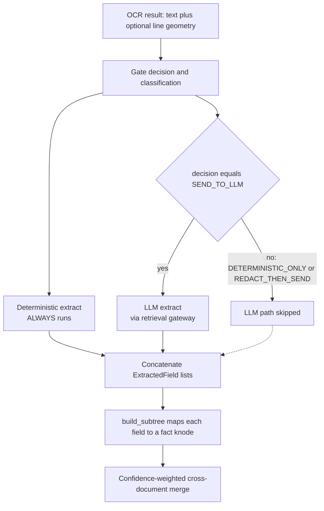

```mermaid
flowchart TD
    ocr["OCR result: text plus optional line geometry"]
    gate["Gate decision and classification"]
    ocr --> gate

    det["Deterministic extract<br/>ALWAYS runs"]
    gate --> det

    decision{"decision equals SEND_TO_LLM"}
    gate --> decision

    decision -->|"yes"| llm["LLM extract<br/>via retrieval gateway"]
    decision -->|"no: DETERMINISTIC_ONLY or REDACT_THEN_SEND"| skip["LLM path skipped"]

    merge_lists["Concatenate ExtractedField lists"]
    det --> merge_lists
    llm --> merge_lists
    skip -.-> merge_lists

    build["build_subtree maps each field to a fact knode"]
    merge_lists --> build

    clientmerge["Confidence-weighted cross-document merge"]
    build --> clientmerge
```
